# //unused-css-rules/samples/pages

[→ Parent](../..)


## Raw


```yaml
p90min: 0
p90max: 230
p90range: 230
p90mean: 76.27659574468085
p90median: 55
p90stdev: 65.19992237551169
p90skewness: 0.46793517310964267
p90eccentricity: 1.0000000000000002
p90discretization: 4.7
outlandishness: 1.097263554754138
confidence: 28.67445395117131
p90confidence: 26.36096099772525

```

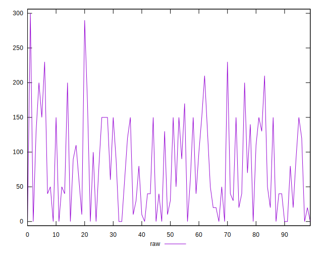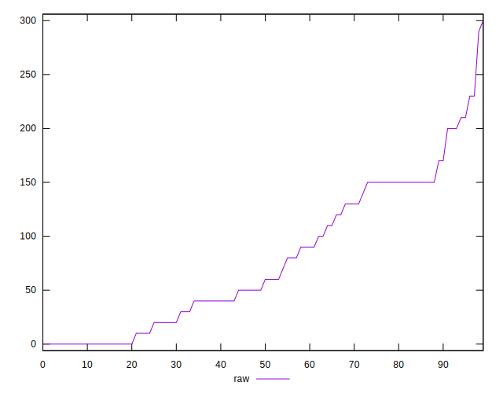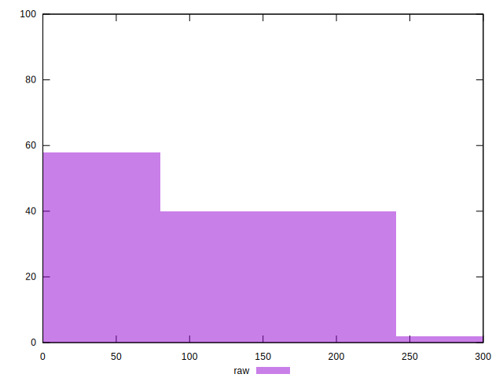
## Score


```yaml
p90min: 0.81
p90max: 1
p90range: 0.18999999999999995
p90mean: 0.9377659574468085
p90median: 0.955
p90stdev: 0.053438257379361365
p90skewness: -0.4996274256513785
p90eccentricity: 0.9999999999999997
p90discretization: 5.875
outlandishness: 0.993471834927895
confidence: 0.02359428708486947
p90confidence: 0.02160560576208344

```

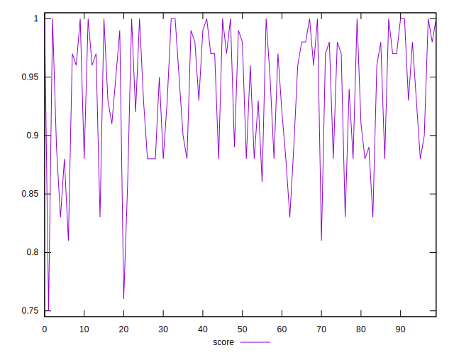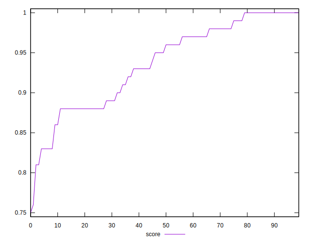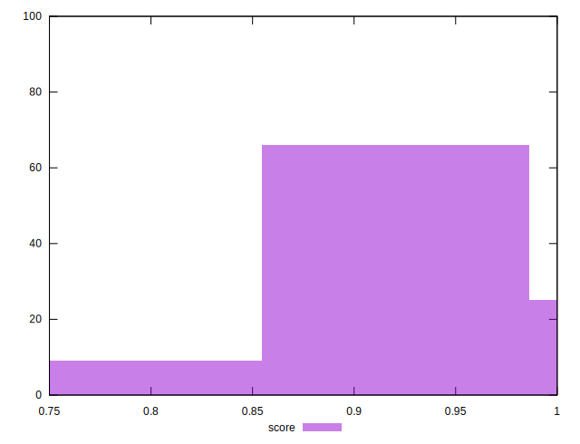
## Raw Estimate

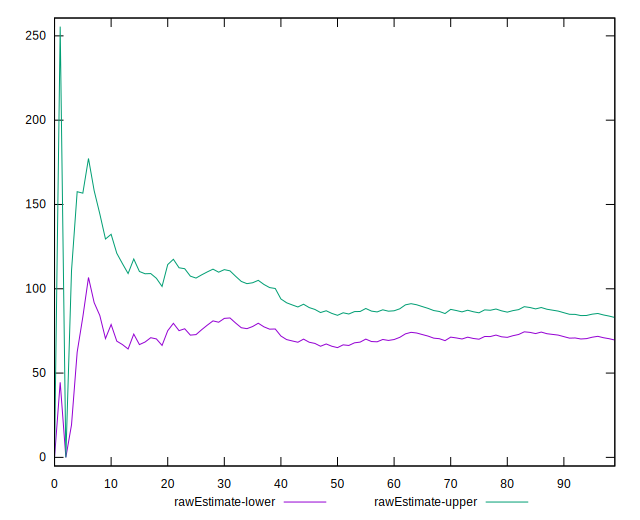
## Score Estimate

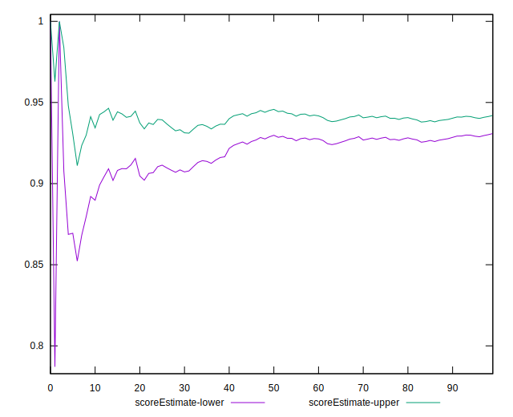
## P Score


```yaml
p90min: 0.8083333333333333
p90max: 1
p90range: 0.19166666666666665
p90mean: 0.9364361702127664
p90median: 0.9541666666666666
p90stdev: 0.05433326864625973
p90skewness: -0.4679351731096484
p90eccentricity: 0.9999999999999997
p90discretization: 4.7
outlandishness: 0.9935614716653576
confidence: 0.023895378292642735
p90confidence: 0.02196746749810437

```

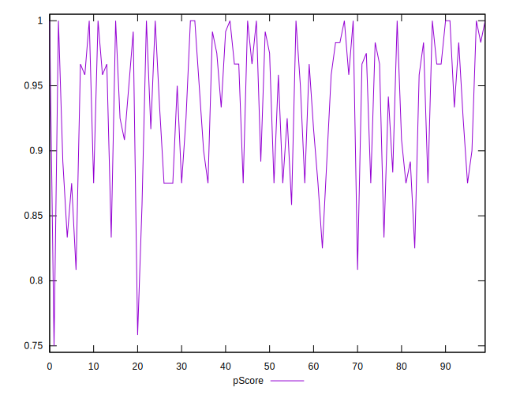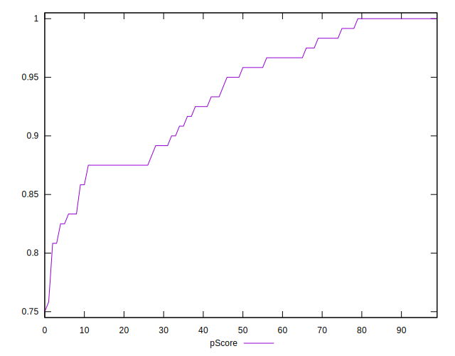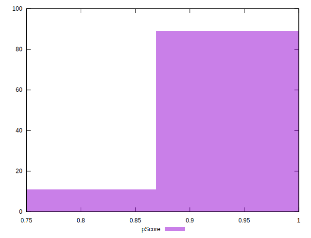
## Score Difference


```yaml
p90min: 0
p90max: 1.1102230246251565e-16
p90range: 1.1102230246251565e-16
p90mean: 8.267618268485208e-18
p90median: 0
p90stdev: 2.914680950318571e-17
p90skewness: 3.2417635938924185
p90eccentricity: 0.9999999999999968
p90discretization: 47
outlandishness: 1.8032653061224493
confidence: 1.3055982858434588e-17
p90confidence: 1.178433778028829e-17

```

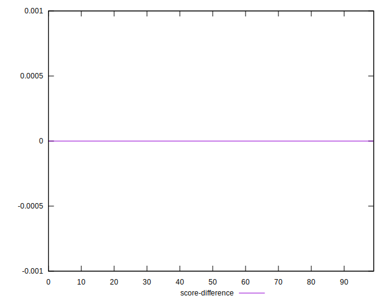
## P Score Difference


```yaml
p90min: -0.0050000000000000044
p90max: 0.0033333333333332993
p90range: 0.008333333333333304
p90mean: -0.001312056737588652
p90median: -0.0008333333333332971
p90stdev: 0.002716645351105639
p90skewness: 0.05326491271978308
p90eccentricity: 0.9999999999999992
p90discretization: 10.444444444444445
outlandishness: 0.9566954711468241
confidence: 0.001108164707624428
p90confidence: 0.0010983660644977163

```

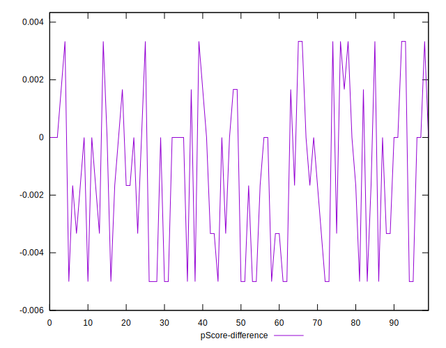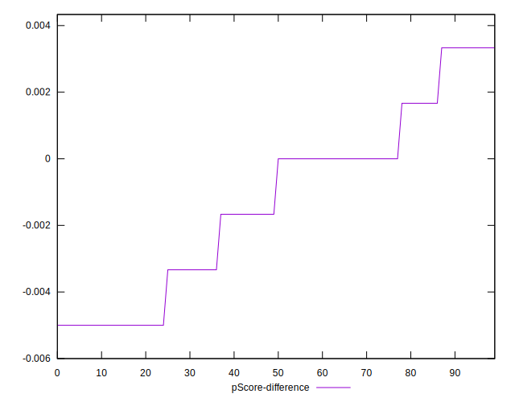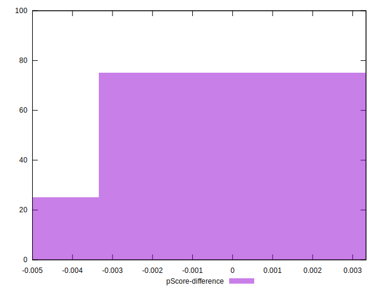