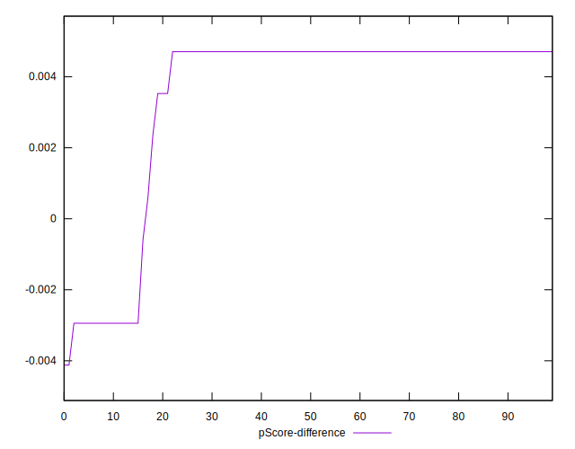
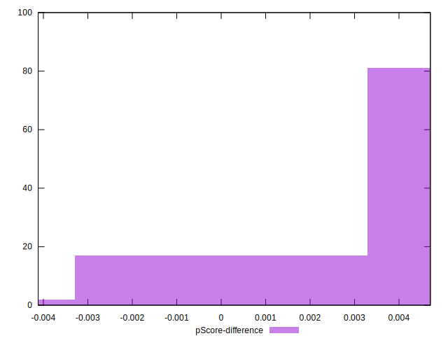

# //unused-javascript/samples/pages+cached+noadtech+nomedia+nocss

[→ Parent](../..)


## Raw


```yaml
p90min: 1050
p90max: 1200
p90range: 150
p90mean: 1073.936170212766
p90median: 1050
p90stdev: 53.658060113276235
p90skewness: 1.8652372230812992
p90eccentricity: 1.0000000000000004
p90discretization: 15.666666666666666
outlandishness: 1.006087492863365
confidence: 22.320057464174834
p90confidence: 21.69447413929641

```


## Score


```yaml
p90min: 0.45
p90max: 0.46
p90range: 0.010000000000000009
p90mean: 0.4584042553191495
p90median: 0.46
p90stdev: 0.0036621094634167075
p90skewness: -1.8591772600777563
p90eccentricity: 1.0000000000000018
p90discretization: 47
outlandishness: 0.9991090404993552
confidence: 0.0015059871472684675
p90confidence: 0.0014806263752667657

```


## Raw Estimate


## Score Estimate


## P Score


```yaml
p90min: 0.4470588235294118
p90max: 0.4647058823529412
p90range: 0.017647058823529405
p90mean: 0.461889862327909
p90median: 0.4647058823529412
p90stdev: 0.006312712954503086
p90skewness: -1.8652372230809589
p90eccentricity: 0.9999999999999987
p90discretization: 15.666666666666666
outlandishness: 0.9983380437612828
confidence: 0.0026258891134323323
p90confidence: 0.0025522910752113423

```


## Score Difference


```yaml
p90min: 0
p90max: 0
p90range: 0
p90mean: 0
p90median: 0
p90stdev: 0
p90skewness: .nan
p90eccentricity: .nan
p90discretization: 94
outlandishness: .nan
confidence: 0
p90confidence: 0

```


## P Score Difference


```yaml
p90min: -0.002941176470588225
p90max: 0.004705882352941171
p90range: 0.007647058823529396
p90mean: 0.003485607008760946
p90median: 0.004705882352941171
p90stdev: 0.002679524673364364
p90skewness: -1.8844775988733995
p90eccentricity: 1.0000000000000002
p90discretization: 15.666666666666666
outlandishness: 0.8995347556317662
confidence: 0.0011314040392882167
p90confidence: 0.0010833578144493327

```

