# //unused-javascript/samples/pages+cached+noadtech+nomedia

[→ Parent](../..)


## Raw


```yaml
p90min: 2010
p90max: 2290
p90range: 280
p90mean: 2244.148936170213
p90median: 2250
p90stdev: 50.89433305551945
p90skewness: -3.108840659747863
p90eccentricity: 1.0000000000000007
p90discretization: 7.230769230769231
outlandishness: 0.9945275359648259
confidence: 26.266442549318803
p90confidence: 20.577072484148925

```

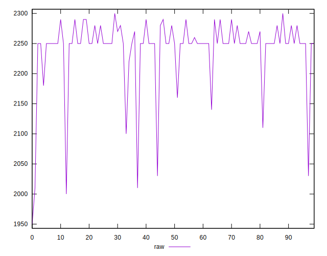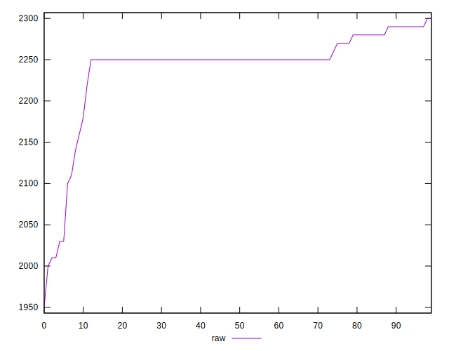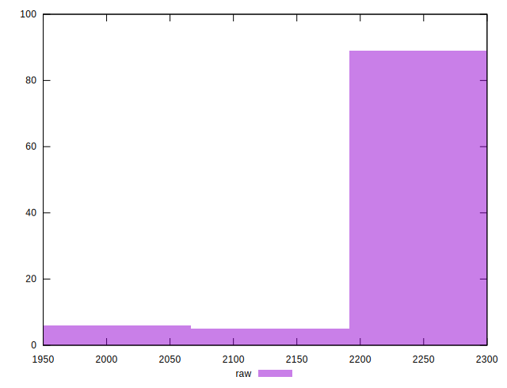
## Score


```yaml
p90min: 0.32
p90max: 0.35
p90range: 0.02999999999999997
p90mean: 0.32191489361702147
p90median: 0.32
p90stdev: 0.006404219975869107
p90skewness: 3.4504381746879105
p90eccentricity: 0.9999999999999992
p90discretization: 23.5
outlandishness: 1.0055065683660749
confidence: 0.0032362560666208823
p90confidence: 0.0025892882514864123

```

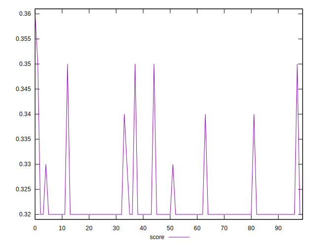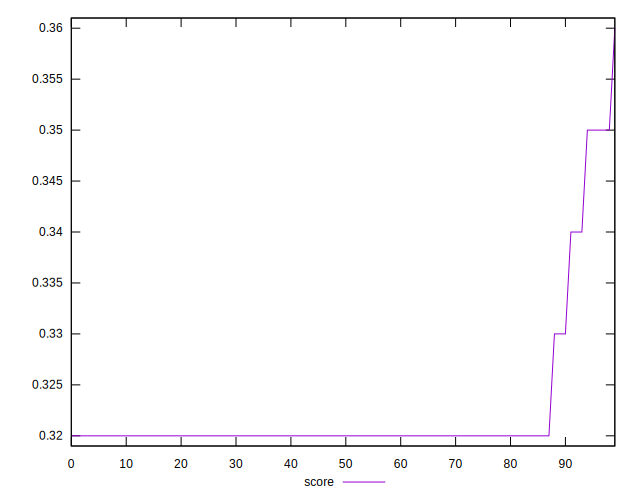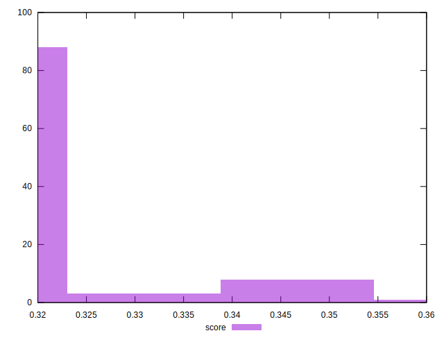
## Raw Estimate

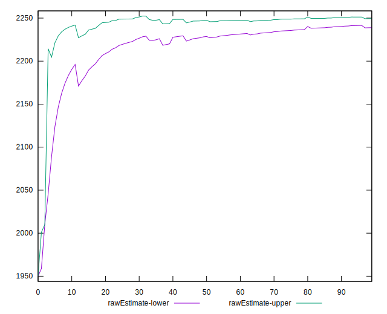
## Score Estimate

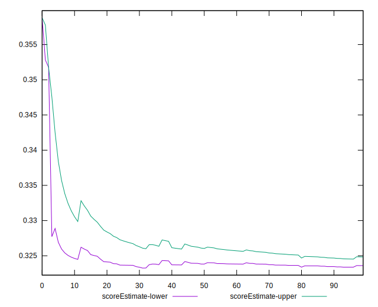
## P Score


```yaml
p90min: 0.31882352941176473
p90max: 0.3517647058823529
p90range: 0.032941176470588196
p90mean: 0.3242177722152694
p90median: 0.32352941176470584
p90stdev: 0.005987568594766986
p90skewness: 3.1088406597477176
p90eccentricity: 1.0000000000000013
p90discretization: 7.230769230769231
outlandishness: 1.0044674373697993
confidence: 0.003090169711684563
p90confidence: 0.0024208320569586933

```

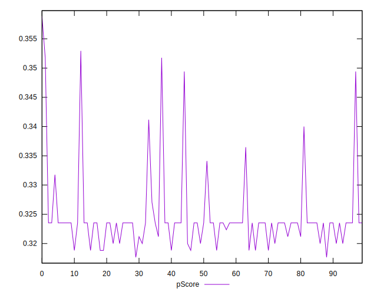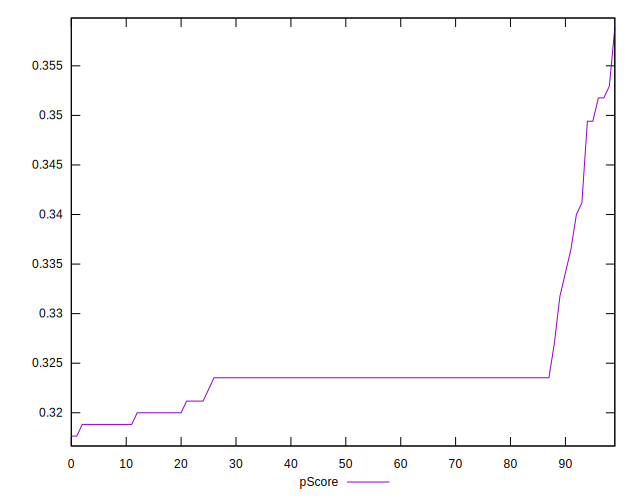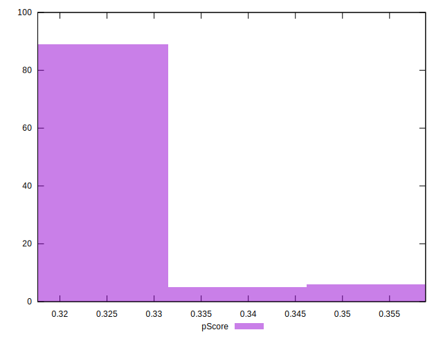
## Score Difference


```yaml
p90min: 0
p90max: 5.551115123125783e-17
p90range: 5.551115123125783e-17
p90mean: 1.1810883240693154e-18
p90median: 0
p90stdev: 8.010530753054493e-18
p90skewness: 6.634888026970372
p90eccentricity: 0.9999999999999988
p90discretization: 47
outlandishness: 5.522500000000001
confidence: 4.7424758240429744e-18
p90confidence: 3.2387352784895233e-18

```

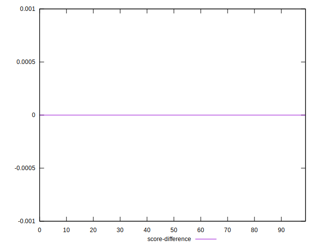
## P Score Difference


```yaml
p90min: -0.002352941176470613
p90max: 0.0035294117647058365
p90range: 0.00588235294117645
p90mean: 0.002252816020025002
p90median: 0.0035294117647058365
p90stdev: 0.0018515118508760755
p90skewness: -0.9770516770166683
p90eccentricity: 0.999999999999998
p90discretization: 9.4
outlandishness: 0.903344641975307
confidence: 0.0007931016981206046
p90confidence: 0.0007485841993287691

```

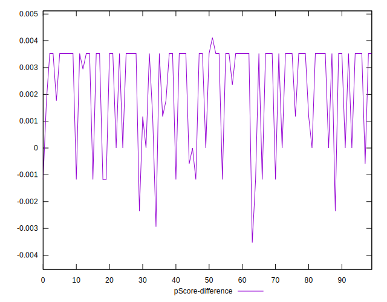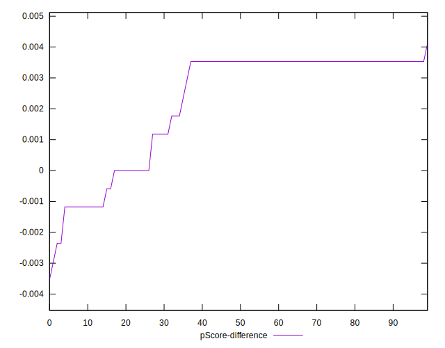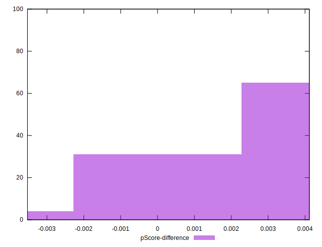