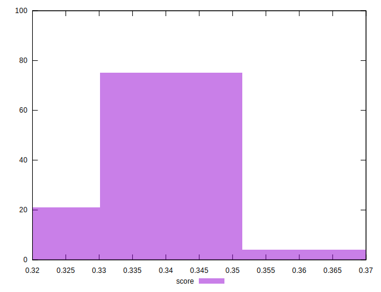
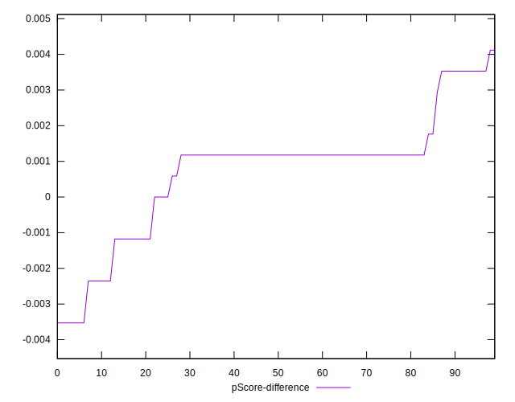

# //unused-javascript/samples/pages+cached+noadtech

[→ Parent](../..)


## Raw


```yaml
p90min: 1970
p90max: 2290
p90range: 320
p90mean: 2130.6382978723404
p90median: 2100
p90stdev: 70.48175425036715
p90skewness: 0.8710363921766001
p90eccentricity: 1.0000000000000007
p90discretization: 7.230769230769231
outlandishness: 0.9964939911455699
confidence: 34.90142818887639
p90confidence: 28.496456853804695

```


## Score


```yaml
p90min: 0.32
p90max: 0.36
p90range: 0.03999999999999998
p90mean: 0.3368085106382978
p90median: 0.34
p90stdev: 0.008655678981620422
p90skewness: -1.0091462574521473
p90eccentricity: 0.9999999999999992
p90discretization: 23.5
outlandishness: 1.0029206385837532
confidence: 0.00414308756779164
p90confidence: 0.0034995749646632222

```


## Raw Estimate


## Score Estimate


## P Score


```yaml
p90min: 0.31882352941176473
p90max: 0.3564705882352941
p90range: 0.03764705882352937
p90mean: 0.3375719649561949
p90median: 0.3411764705882353
p90stdev: 0.008291971088278494
p90skewness: -0.8710363921765387
p90eccentricity: 0.9999999999999987
p90discretization: 7.230769230769231
outlandishness: 1.0026073625069127
confidence: 0.004106050375161932
p90confidence: 0.0033525243357417317

```


## Score Difference


```yaml
p90min: 0
p90max: 5.551115123125783e-17
p90range: 5.551115123125783e-17
p90mean: 5.905441620346577e-19
p90median: 0
p90stdev: 5.695001657605475e-18
p90skewness: 9.539955591519904
p90eccentricity: 1.0000000000000002
p90discretization: 47
outlandishness: 14.137600000000003
confidence: 4.264066145825132e-18
p90confidence: 2.302544406624999e-18

```


## P Score Difference


```yaml
p90min: -0.0035294117647059475
p90max: 0.0035294117647058365
p90range: 0.007058823529411784
p90mean: 0.000744680851063811
p90median: 0.0011764705882352788
p90stdev: 0.0016663794660972341
p90skewness: -0.7424773504800182
p90eccentricity: 1.0000000000000002
p90discretization: 7.833333333333333
outlandishness: 0.9135504272297116
confidence: 0.0007293856998567231
p90confidence: 0.0006737333805430727

```

