# //unused-javascript/samples/pages

[→ Parent](../..)


## Raw


```yaml
p90min: 5550
p90max: 6060
p90range: 510
p90mean: 5901.276595744681
p90median: 5890
p90stdev: 87.09537499694143
p90skewness: -0.7436509387245559
p90eccentricity: 1.0000000000000007
p90discretization: 3.032258064516129
outlandishness: 0.9926333172357595
confidence: 73.76628521283581
p90confidence: 35.2135048590019

```

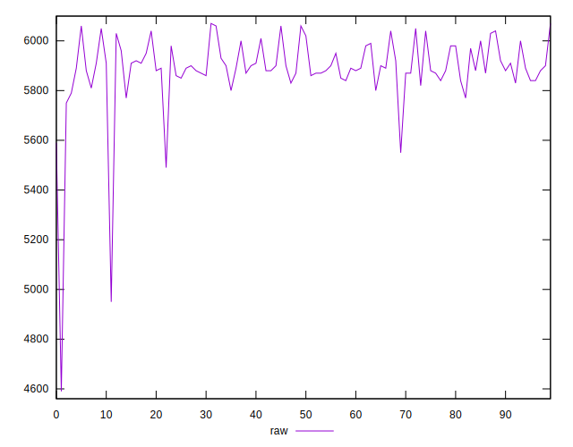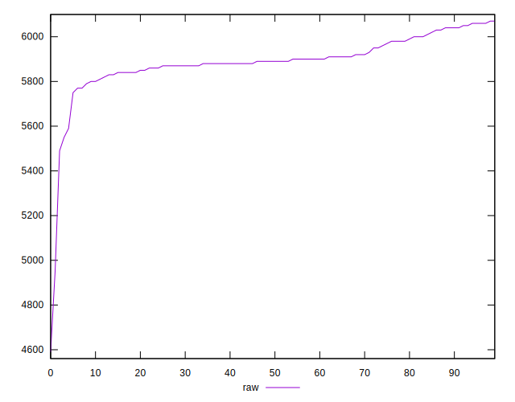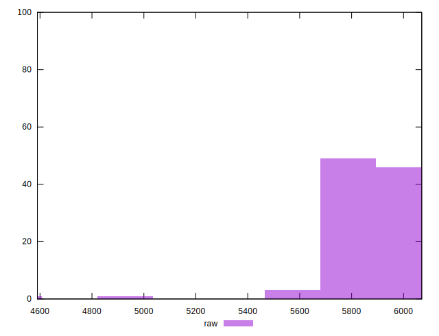
## Score


```yaml
p90min: 0
p90max: 0
p90range: 0
p90mean: 0
p90median: 0
p90stdev: 0
p90skewness: .nan
p90eccentricity: .nan
p90discretization: 94
outlandishness: .inf
confidence: 0.0019848929861591776
p90confidence: 0

```

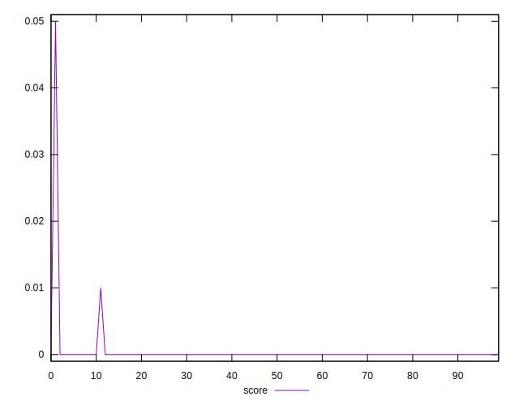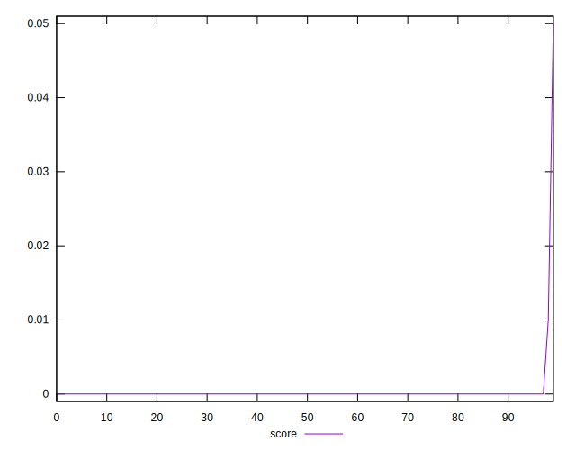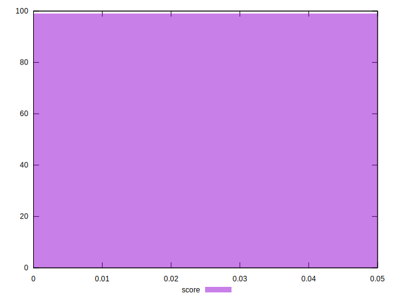
## Raw Estimate

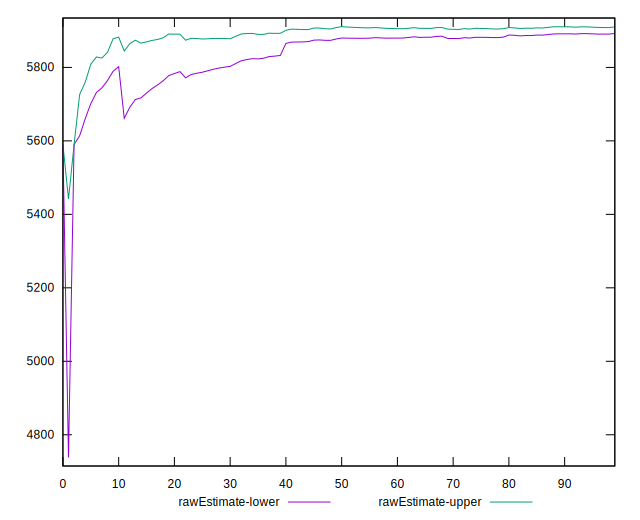
## Score Estimate

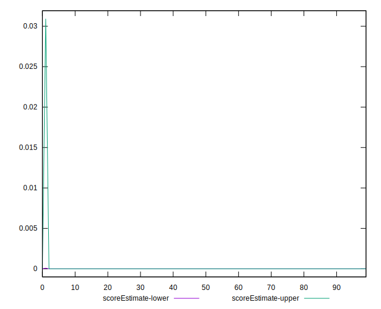
## P Score


```yaml
p90min: 0
p90max: 0
p90range: 0
p90mean: 0
p90median: 0
p90stdev: 0
p90skewness: .nan
p90eccentricity: .nan
p90discretization: 94
outlandishness: .inf
confidence: 0.0018929471691431908
p90confidence: 0

```

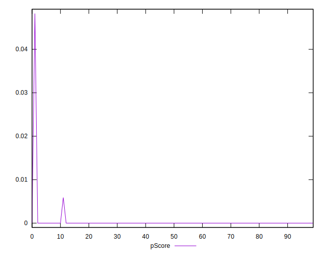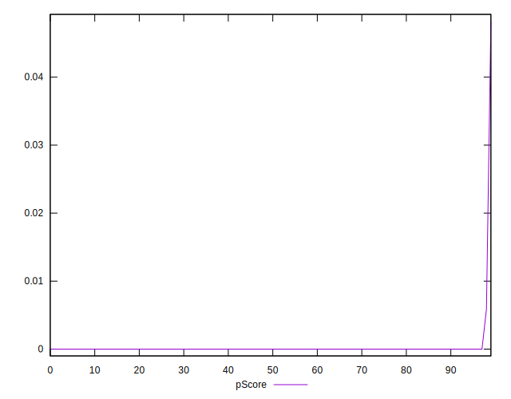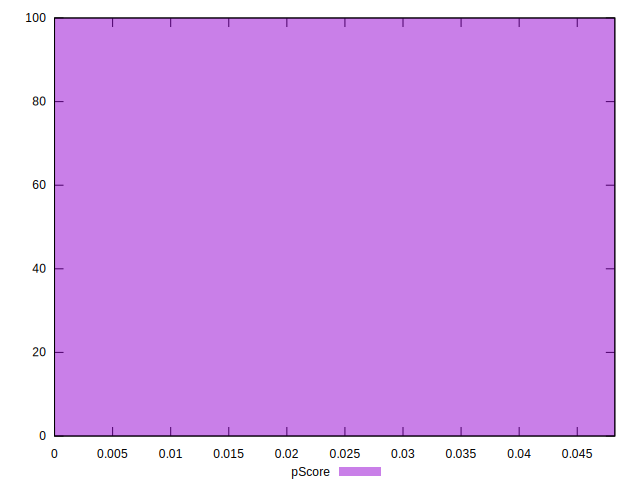
## Score Difference


```yaml
p90min: 0
p90max: 0
p90range: 0
p90mean: 0
p90median: 0
p90stdev: 0
p90skewness: .nan
p90eccentricity: .nan
p90discretization: 94
outlandishness: .nan
confidence: 0
p90confidence: 0

```


## P Score Difference


```yaml
p90min: 0
p90max: 0
p90range: 0
p90mean: 0
p90median: 0
p90stdev: 0
p90skewness: .nan
p90eccentricity: .nan
p90discretization: 94
outlandishness: .inf
confidence: 0.00017408710096907125
p90confidence: 0

```

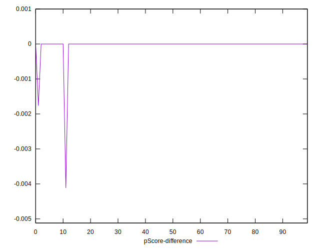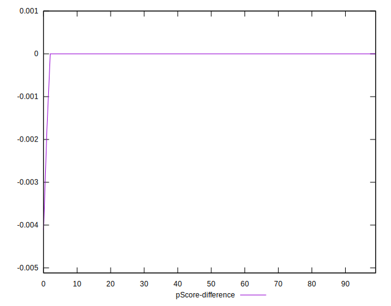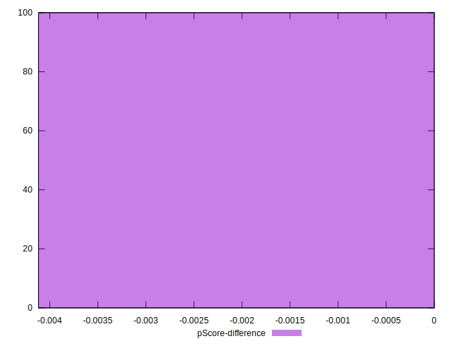