# //uses-http2/samples/pages+cached+noadtech+nomedia+nocss

[→ Parent](../..)


## Raw


```yaml
p90min: 0
p90max: 150
p90range: 150
p90mean: 11.170212765957446
p90median: 0
p90stdev: 39.379668125275785
p90skewness: 3.2417635938924234
p90eccentricity: 0.9999999999999976
p90discretization: 47
outlandishness: 1.8032653061224493
confidence: 17.639675860860493
p90confidence: 15.921581770834313

```

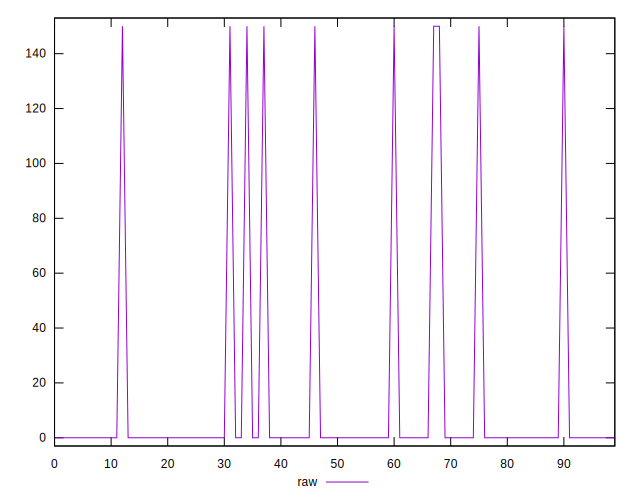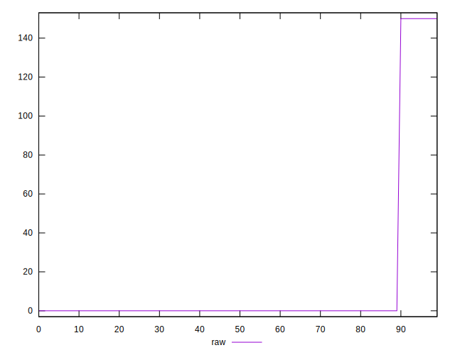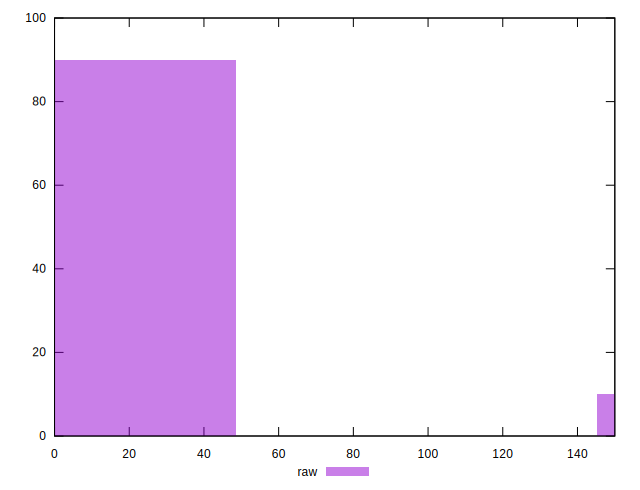
## Score


```yaml
p90min: 0.88
p90max: 1
p90range: 0.12
p90mean: 0.9910638297872342
p90median: 1
p90stdev: 0.031503734500220607
p90skewness: -3.241763593892426
p90eccentricity: 1
p90discretization: 47
outlandishness: 0.9938266459768287
confidence: 0.014111740688688408
p90confidence: 0.012737265416667443

```

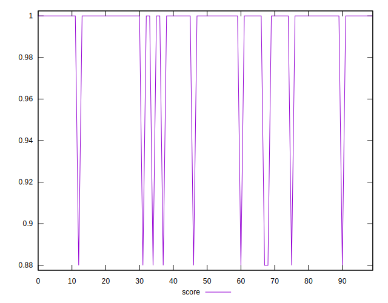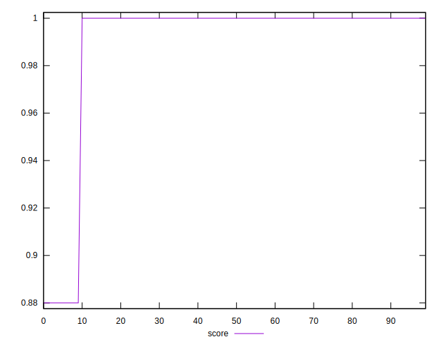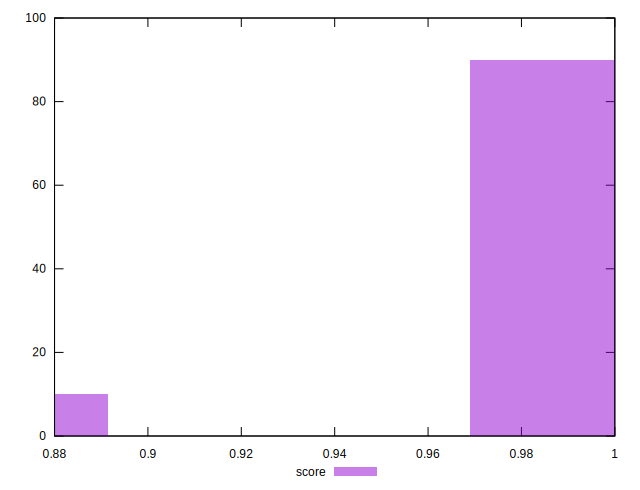
## Raw Estimate

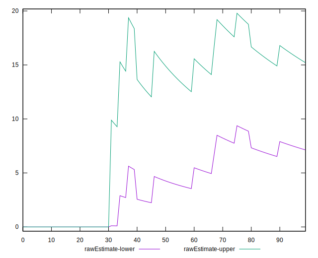
## Score Estimate

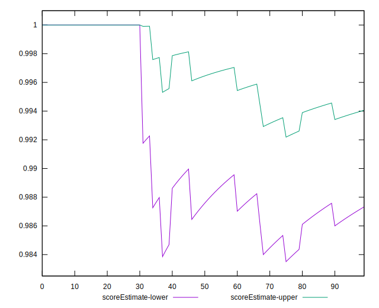
## P Score


```yaml
p90min: 0.875
p90max: 1
p90range: 0.125
p90mean: 0.9906914893617021
p90median: 1
p90stdev: 0.03281639010439648
p90skewness: -3.241763593892432
p90eccentricity: 0.9999999999999984
p90discretization: 47
outlandishness: 0.9935674248907708
confidence: 0.014699729884050404
p90confidence: 0.013267984809028592

```

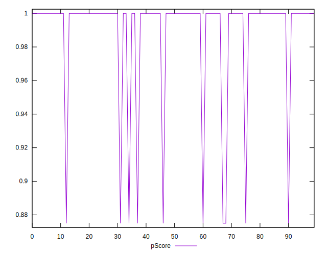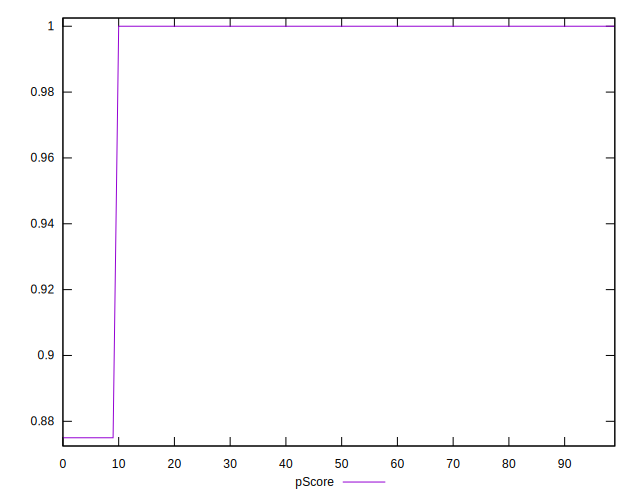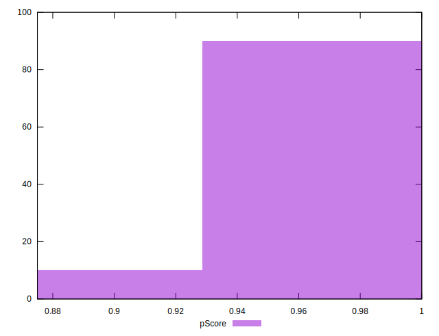
## Score Difference


```yaml
p90min: 0
p90max: 0
p90range: 0
p90mean: 0
p90median: 0
p90stdev: 0
p90skewness: .nan
p90eccentricity: .nan
p90discretization: 94
outlandishness: .nan
confidence: 0
p90confidence: 0

```


## P Score Difference


```yaml
p90min: -0.0050000000000000044
p90max: 0
p90range: 0.0050000000000000044
p90mean: -0.00037234042553191524
p90median: 0
p90stdev: 0.001312655604175859
p90skewness: -3.2417635938924403
p90eccentricity: 0.9999999999999999
p90discretization: 47
outlandishness: 1.8032653061224486
confidence: 0.0005879891953620173
p90confidence: 0.0005307193923611436

```

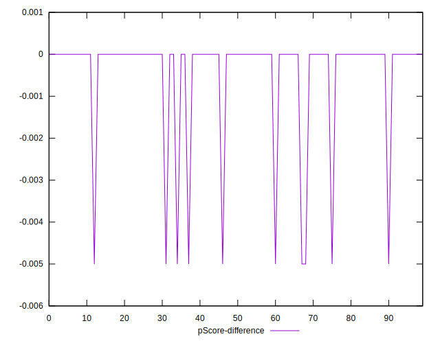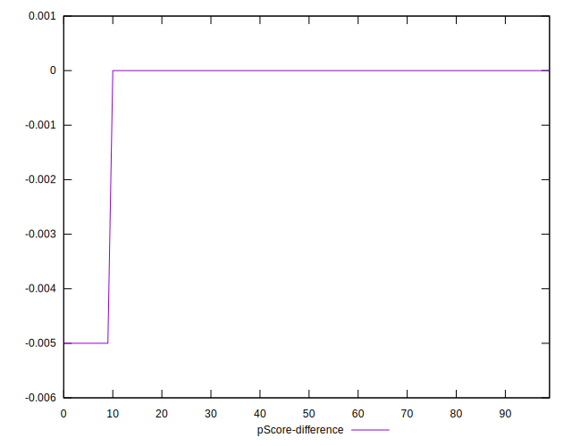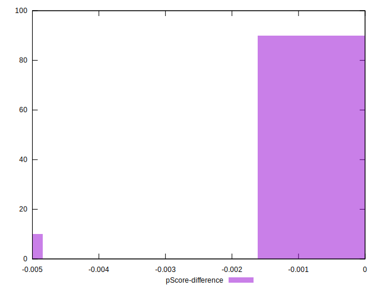