# //uses-http2/samples/pages+cached+noadtech+nomedia

[→ Parent](../..)


## Raw


```yaml
p90min: 0
p90max: 150
p90range: 150
p90mean: 7.9787234042553195
p90median: 0
p90stdev: 33.66227091978023
p90skewness: 3.981981890375837
p90eccentricity: 1.0000000000000029
p90discretization: 47
outlandishness: 5.2606009600000005
confidence: 33.547141137947406
p90confidence: 13.609982626980441

```

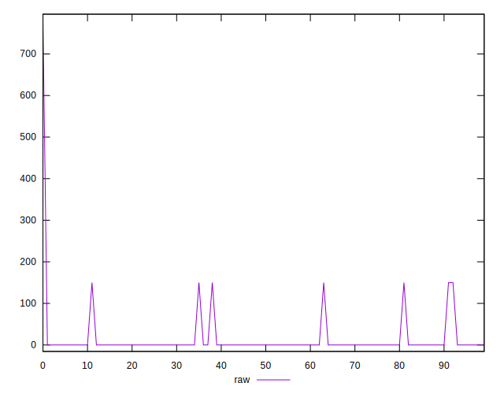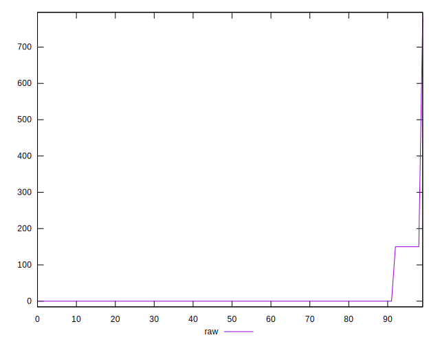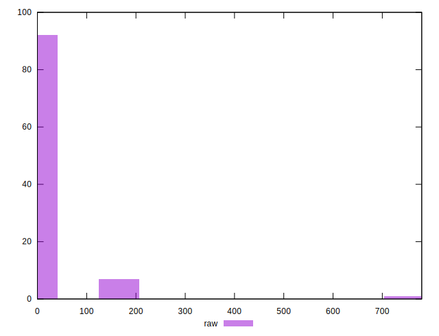
## Score


```yaml
p90min: 0.88
p90max: 1
p90range: 0.12
p90mean: 0.9936170212765958
p90median: 1
p90stdev: 0.026929816735824227
p90skewness: -3.981981890375826
p90eccentricity: 0.9999999999999996
p90discretization: 47
outlandishness: 0.9859256762330973
confidence: 0.02261509690198223
p90confidence: 0.010887986101584372

```

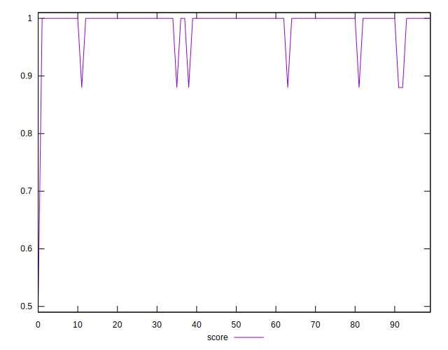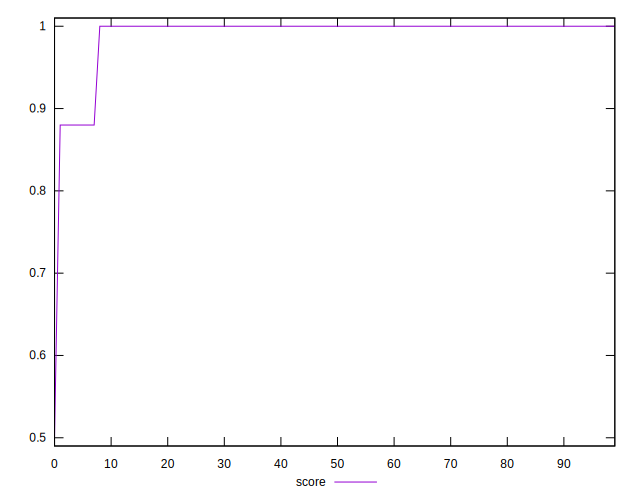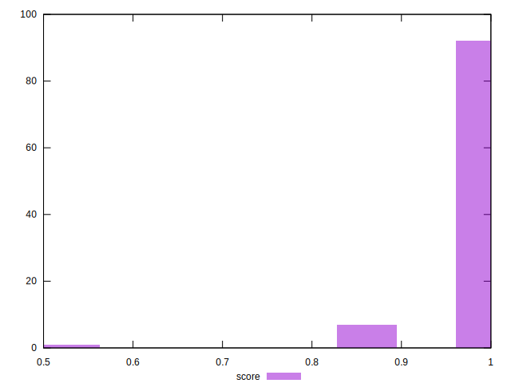
## Raw Estimate

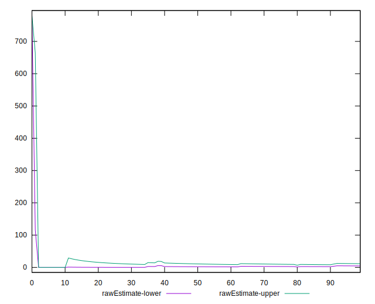
## Score Estimate

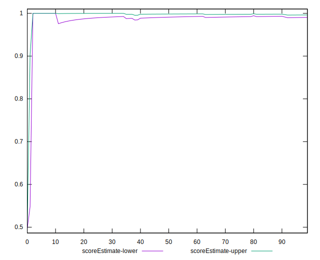
## P Score


```yaml
p90min: 0.875
p90max: 1
p90range: 0.125
p90mean: 0.9933510638297872
p90median: 1
p90stdev: 0.028051892433150243
p90skewness: -3.9819818903758164
p90eccentricity: 0.999999999999998
p90discretization: 47
outlandishness: 0.985683362179735
confidence: 0.022988077770019787
p90confidence: 0.01134165218915039

```

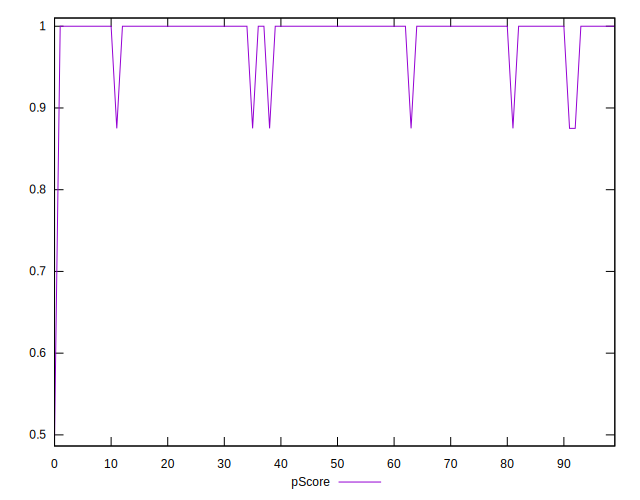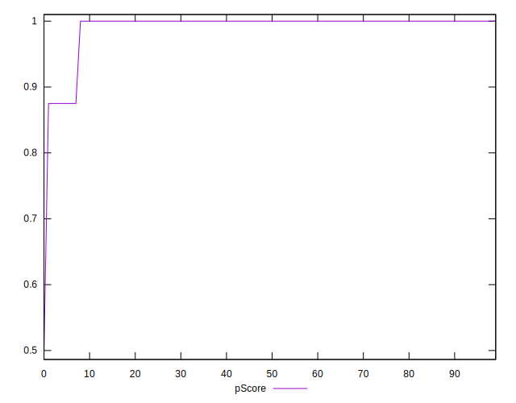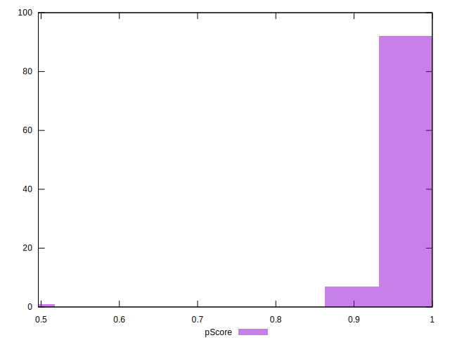
## Score Difference


```yaml
p90min: 0
p90max: 0
p90range: 0
p90mean: 0
p90median: 0
p90stdev: 0
p90skewness: .nan
p90eccentricity: .nan
p90discretization: 94
outlandishness: .nan
confidence: 0
p90confidence: 0

```


## P Score Difference


```yaml
p90min: -0.0050000000000000044
p90max: 0
p90range: 0.0050000000000000044
p90mean: -0.0002503128911138927
p90median: 0
p90stdev: 0.0010647496575202488
p90skewness: -4.075762580286259
p90eccentricity: 0.9999999999999968
p90discretization: 31.333333333333332
outlandishness: 2.3692905624999994
confidence: 0.0005150069209137827
p90confidence: 0.00043048861366090424

```

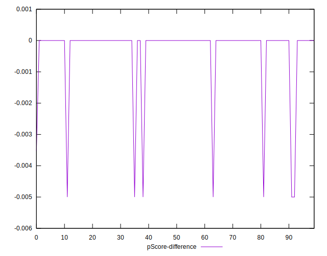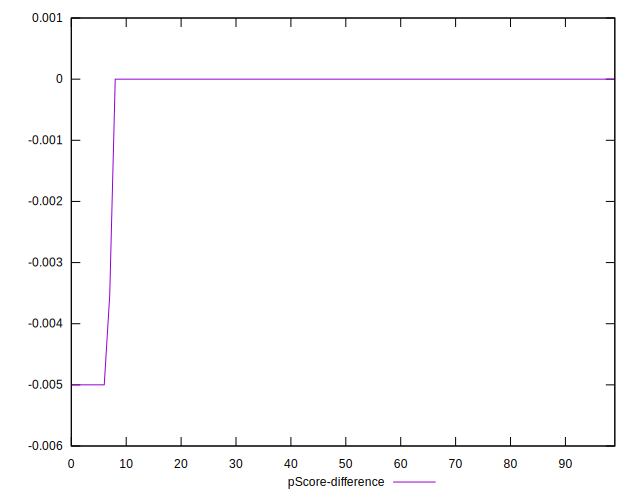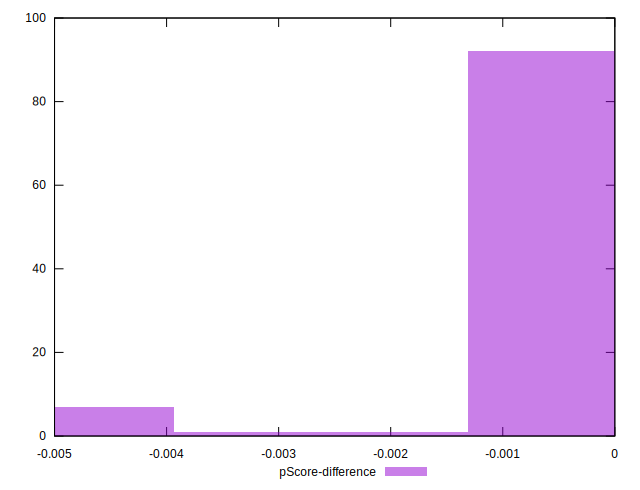