# //uses-http2/samples/pages+cached+noadtech

[→ Parent](../..)


## Raw


```yaml
p90min: 0
p90max: 300
p90range: 300
p90mean: 102.23404255319149
p90median: 150
p90stdev: 85.40459720696121
p90skewness: 0.12372366812462826
p90eccentricity: 1.0000000000000022
p90discretization: 23.5
outlandishness: 1.1367420556760488
confidence: 39.91980432287654
p90confidence: 34.52990699947088

```

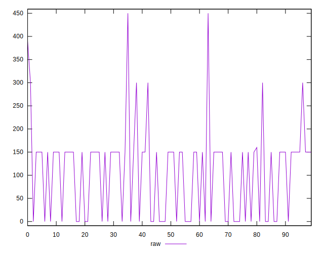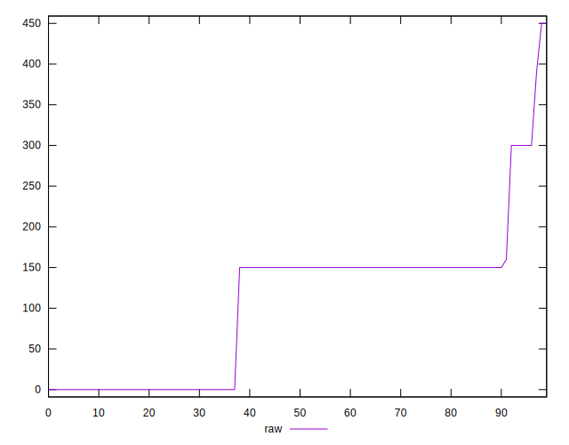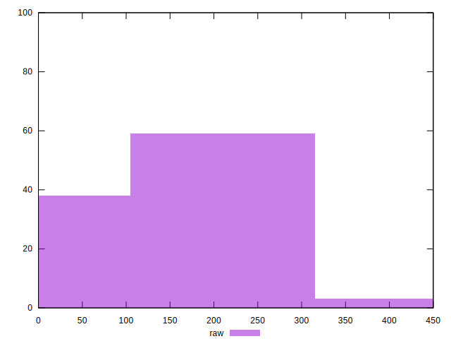
## Score


```yaml
p90min: 0.75
p90max: 1
p90range: 0.25
p90mean: 0.9176595744680849
p90median: 0.88
p90stdev: 0.06959496087032692
p90skewness: -0.21978827736404488
p90eccentricity: 0.9999999999999976
p90discretization: 23.5
outlandishness: 0.9898704384465965
confidence: 0.03144505526226131
p90confidence: 0.02813791768914671

```

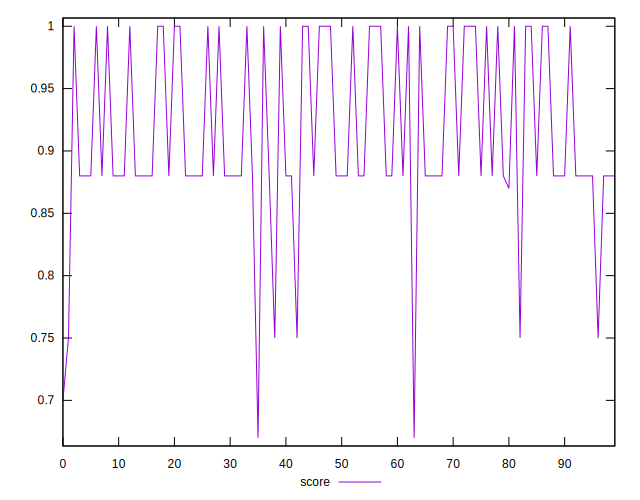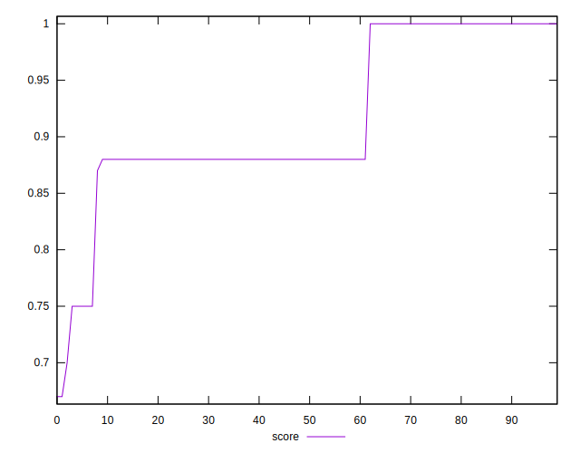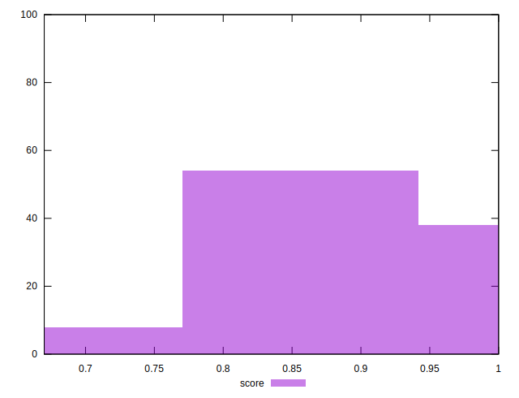
## Raw Estimate

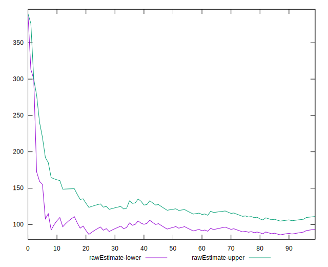
## Score Estimate

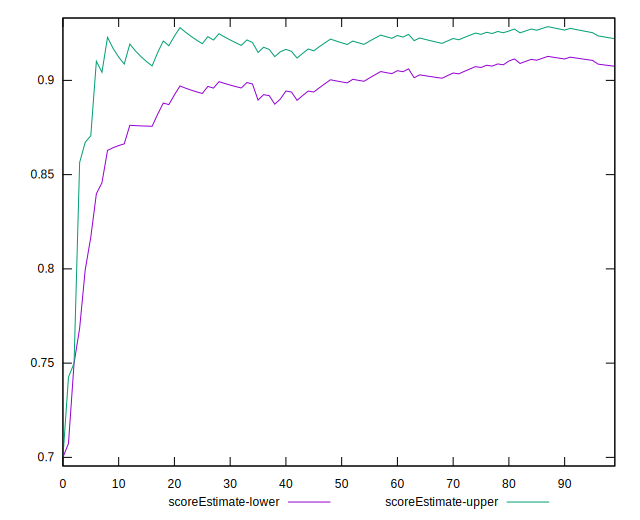
## P Score


```yaml
p90min: 0.75
p90max: 1
p90range: 0.25
p90mean: 0.9148049645390071
p90median: 0.875
p90stdev: 0.07117049767246775
p90skewness: -0.12372366812463104
p90eccentricity: 0.9999999999999989
p90discretization: 23.5
outlandishness: 0.9900664627851147
confidence: 0.031968899192787684
p90confidence: 0.0287749224995591

```

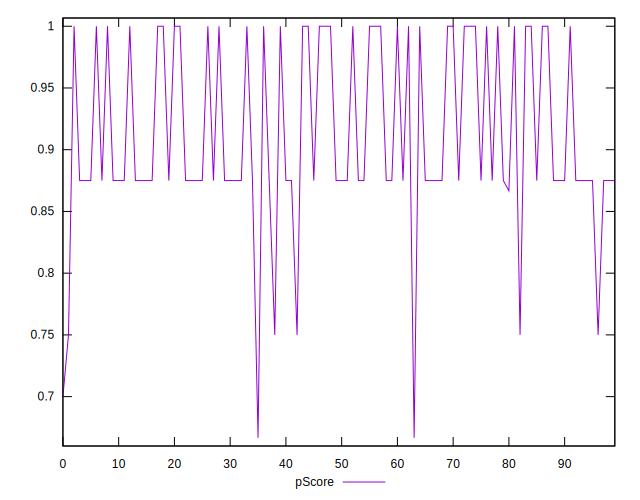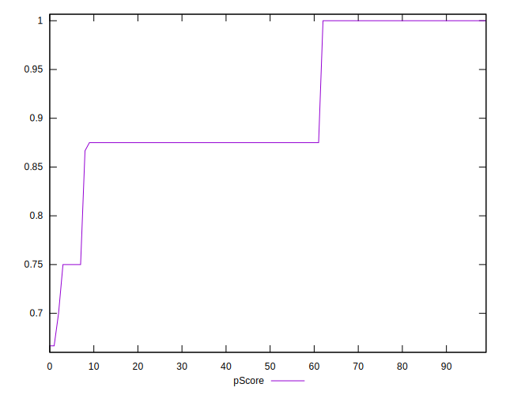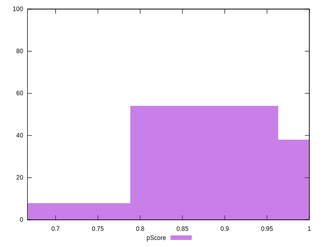
## Score Difference


```yaml
p90min: 0
p90max: 0
p90range: 0
p90mean: 0
p90median: 0
p90stdev: 0
p90skewness: .nan
p90eccentricity: .nan
p90discretization: 94
outlandishness: .inf
confidence: 4.330179641073934e-18
p90confidence: 0

```


## P Score Difference


```yaml
p90min: -0.0050000000000000044
p90max: 0
p90range: 0.0050000000000000044
p90mean: -0.002765957446808514
p90median: -0.0050000000000000044
p90stdev: 0.00244989013466892
p90skewness: 0.2239593657062827
p90eccentricity: 1.000000000000001
p90discretization: 23.5
outlandishness: 0.9884948224852074
confidence: 0.0009618478739647472
p90confidence: 0.0009905143432038085

```

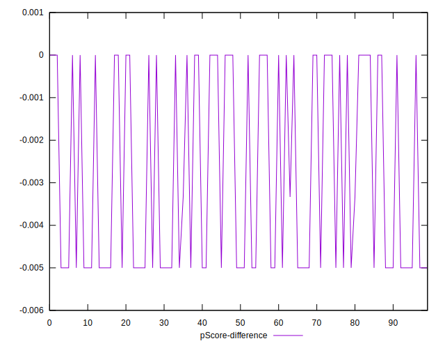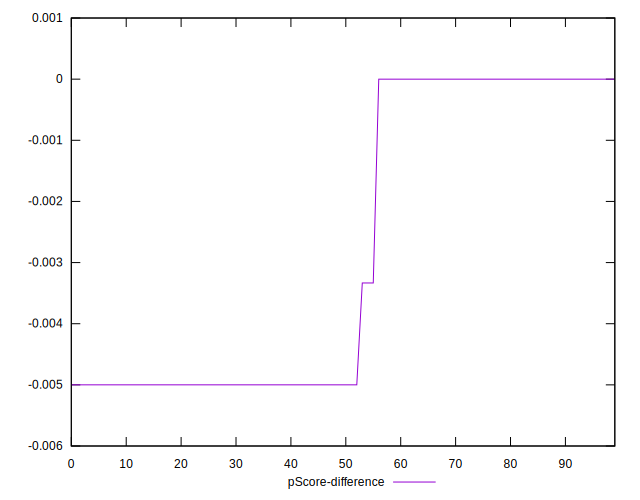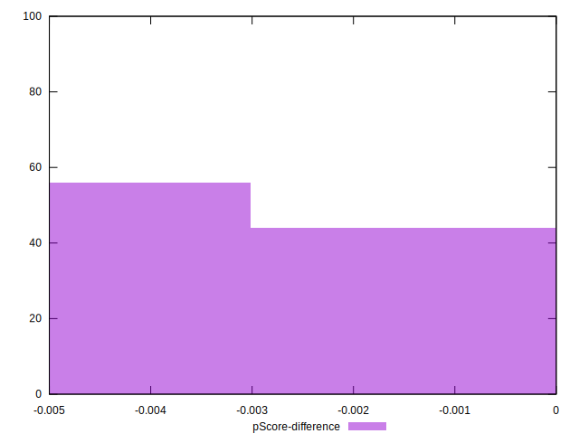