# //uses-http2/samples/pages+cached

[→ Parent](../..)


## Raw


```yaml
p90min: 0
p90max: 300
p90range: 300
p90mean: 82.02127659574468
p90median: 150
p90stdev: 81.53552661569043
p90skewness: 0.23380123689799187
p90eccentricity: 0.9999999999999991
p90discretization: 18.8
outlandishness: 1.1199184551536652
confidence: 35.51324938675164
p90confidence: 32.965604232873694

```

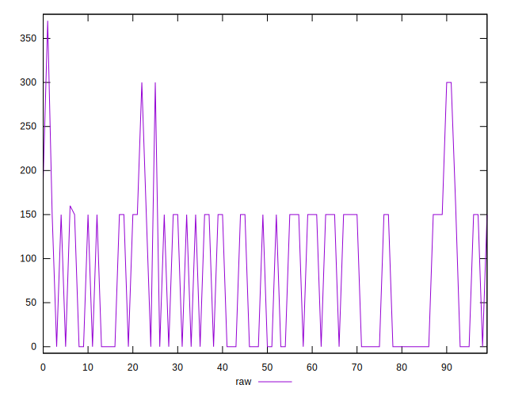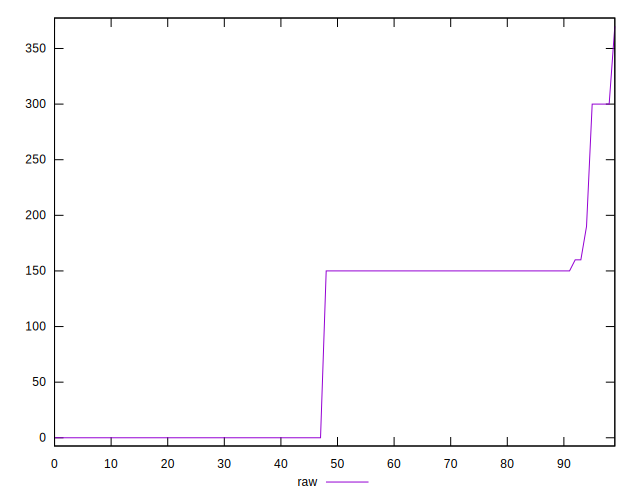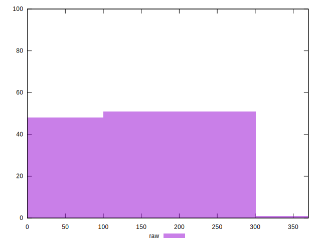
## Score


```yaml
p90min: 0.75
p90max: 1
p90range: 0.25
p90mean: 0.9340425531914894
p90median: 0.88
p90stdev: 0.06596774113213938
p90skewness: -0.2911688723858997
p90eccentricity: 1.000000000000001
p90discretization: 18.8
outlandishness: 0.991575903035995
confidence: 0.0287654079302552
p90confidence: 0.02667139756818943

```

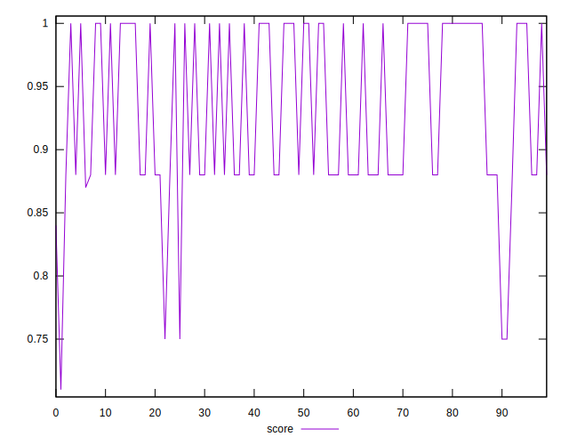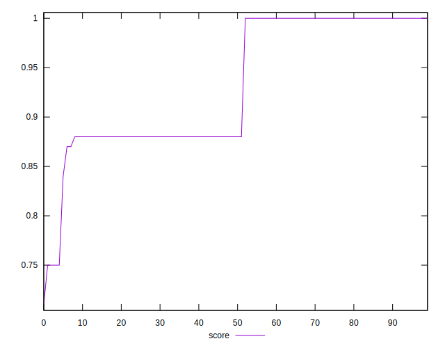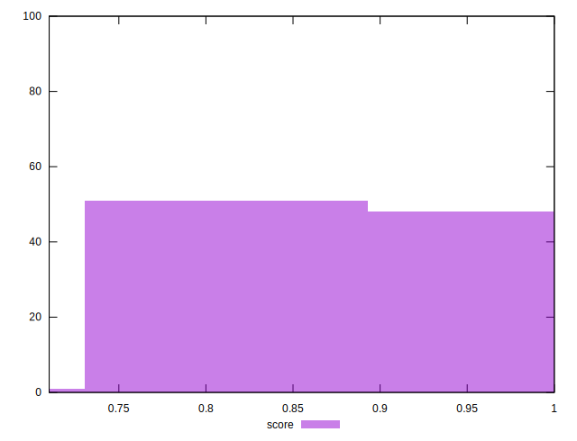
## Raw Estimate

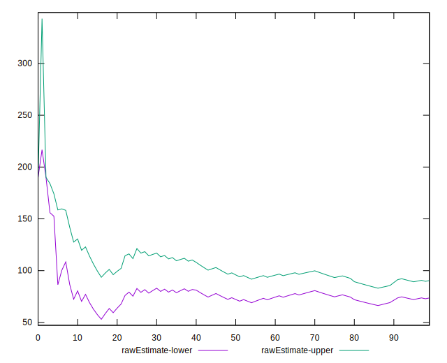
## Score Estimate

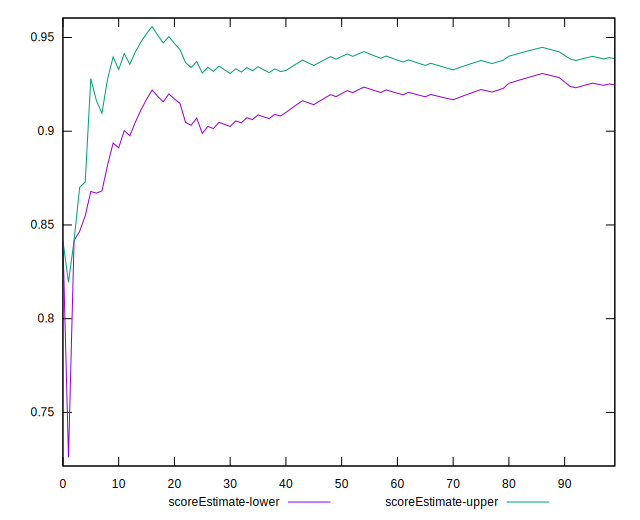
## P Score


```yaml
p90min: 0.75
p90max: 1
p90range: 0.25
p90mean: 0.9316489361702128
p90median: 0.875
p90stdev: 0.06794627217974201
p90skewness: -0.23380123689799415
p90eccentricity: 1.000000000000001
p90discretization: 18.8
outlandishness: 0.9918850872006482
confidence: 0.02936494050708213
p90confidence: 0.027471336860728075

```

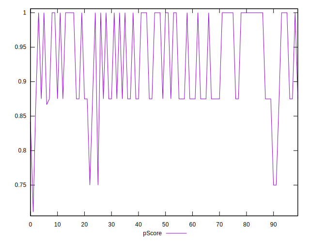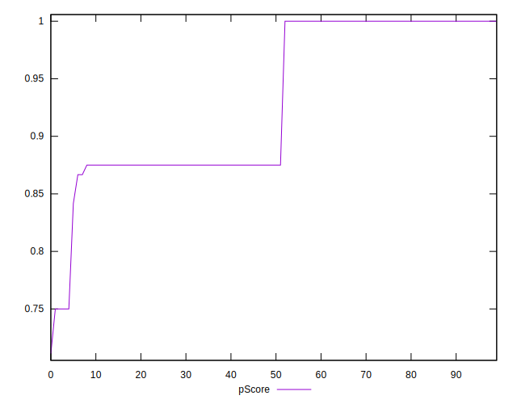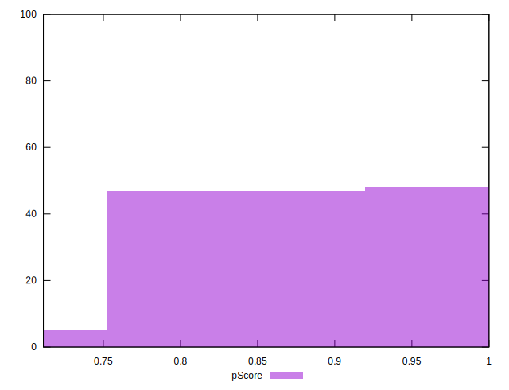
## Score Difference


```yaml
p90min: 0
p90max: 0
p90range: 0
p90mean: 0
p90median: 0
p90stdev: 0
p90skewness: .nan
p90eccentricity: .nan
p90discretization: 94
outlandishness: .nan
confidence: 0
p90confidence: 0

```


## P Score Difference


```yaml
p90min: -0.0050000000000000044
p90max: 0
p90range: 0.0050000000000000044
p90mean: -0.0022517730496453914
p90median: 0
p90stdev: 0.002463773543048344
p90skewness: -0.19295316791329506
p90eccentricity: 0.9999999999999982
p90discretization: 31.333333333333332
outlandishness: 0.9885891692672265
confidence: 0.0009799602146504463
p90confidence: 0.0009961275398683333

```

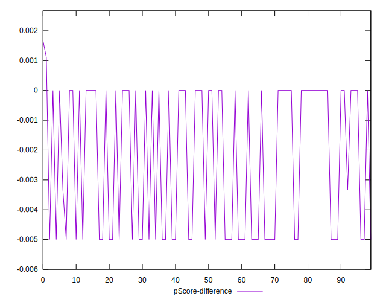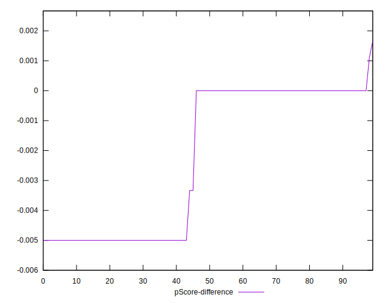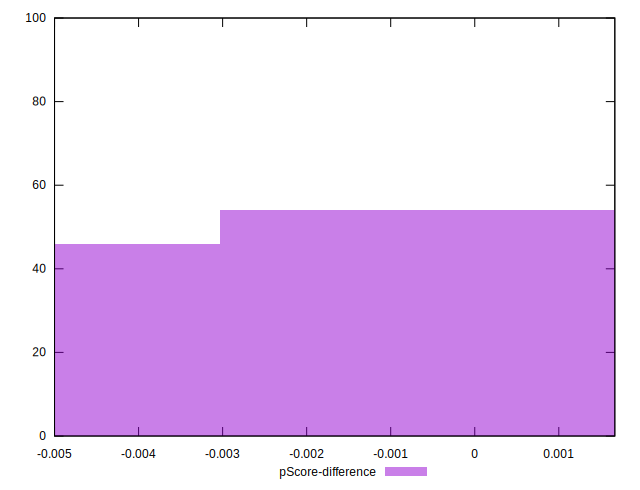