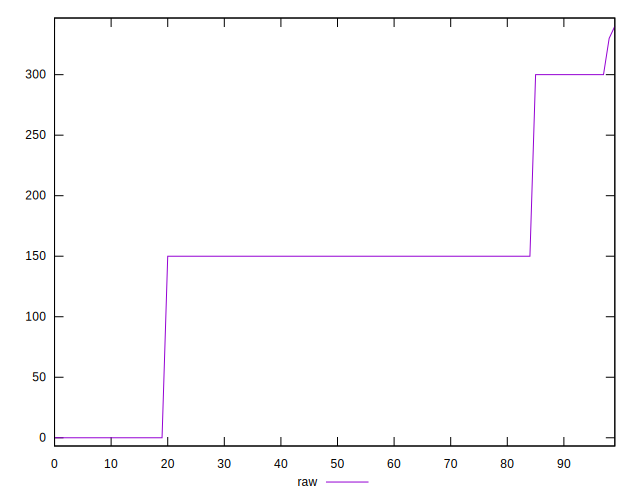

# //uses-http2/samples/pages

[→ Parent](../..)


## Raw


```yaml
p90min: 0
p90max: 300
p90range: 300
p90mean: 142.0212765957447
p90median: 150
p90stdev: 82.93267953310388
p90skewness: -0.025218333615416186
p90eccentricity: 0.9999999999999989
p90discretization: 31.333333333333332
outlandishness: 1.016668134719241
confidence: 35.2003420324067
p90confidence: 33.53048670852564

```


## Score


```yaml
p90min: 0.75
p90max: 1
p90range: 0.25
p90mean: 0.8851063829787231
p90median: 0.88
p90stdev: 0.06881589191846733
p90skewness: -0.12469490045576152
p90eccentricity: 1.0000000000000009
p90discretization: 31.333333333333332
outlandishness: 0.9977272543511919
confidence: 0.029097881695546536
p90confidence: 0.02782293255563338

```


## Raw Estimate


## Score Estimate


## P Score


```yaml
p90min: 0.75
p90max: 1
p90range: 0.25
p90mean: 0.8816489361702128
p90median: 0.875
p90stdev: 0.06911056627758658
p90skewness: 0.0252183336154151
p90eccentricity: 0.9999999999999987
p90discretization: 31.333333333333332
outlandishness: 0.9982136357593152
confidence: 0.029174735499307713
p90confidence: 0.02794207225710471

```


## Score Difference


```yaml
p90min: 0
p90max: 0
p90range: 0
p90mean: 0
p90median: 0
p90stdev: 0
p90skewness: .nan
p90eccentricity: .nan
p90discretization: 94
outlandishness: .nan
confidence: 0
p90confidence: 0

```


## P Score Difference


```yaml
p90min: -0.0050000000000000044
p90max: 0
p90range: 0.0050000000000000044
p90mean: -0.0033215130023640693
p90median: -0.0050000000000000044
p90stdev: 0.002347221310733603
p90skewness: 0.6944054537626201
p90eccentricity: 1.0000000000000009
p90discretization: 31.333333333333332
outlandishness: 0.9508678980762656
confidence: 0.0009537670975482597
p90confidence: 0.0009490043418904063

```

