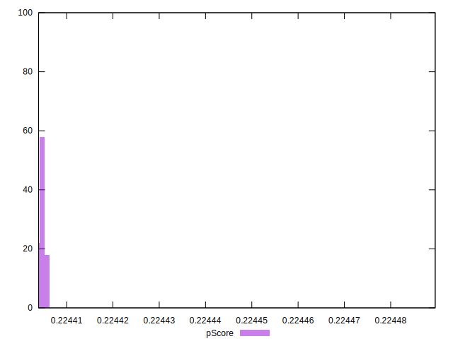

# //uses-long-cache-ttl/samples/pages+cached+noadtech+nomedia+nocss

[→ Parent](../..)


## Raw


```yaml
p90min: 321811.61666666664
p90max: 321813.3833333333
p90range: 1.7666666666627862
p90mean: 321812.51879432617
p90median: 321812.5
p90stdev: 0.5463300838624929
p90skewness: -0.013312594146460197
p90eccentricity: 0.9999999999999982
p90discretization: 31.333333333333332
outlandishness: 0.9999866457205558
confidence: 5.947560794540749
p90confidence: 0.2208865518219126

```


## Score


```yaml
p90min: 0.22
p90max: 0.22
p90range: 0
p90mean: 0.21999999999999995
p90median: 0.22
p90stdev: 5.551115123125783e-17
p90skewness: 1
p90eccentricity: 1
p90discretization: 94
outlandishness: 0.9999999999999996
confidence: 4.3519942861448666e-17
p90confidence: 2.244369685163343e-17

```


## Raw Estimate


## Score Estimate


## P Score


```yaml
p90min: 0.22440394367358502
p90max: 0.22440532990545403
p90range: 0.0000013862318690160969
p90mean: 0.22440462204140998
p90median: 0.22440463678796074
p90stdev: 4.2868308385046974e-7
p90skewness: 0.01331932120280761
p90eccentricity: 0.9999999999999994
p90discretization: 31.333333333333332
outlandishness: 1.0000150313018272
confidence: 0.000004668094874318613
p90confidence: 1.7332072864570077e-7

```


## Score Difference


```yaml
p90min: 0
p90max: 0
p90range: 0
p90mean: 0
p90median: 0
p90stdev: 0
p90skewness: .nan
p90eccentricity: .nan
p90discretization: 94
outlandishness: .nan
confidence: 0
p90confidence: 0

```


## P Score Difference


```yaml
p90min: 0.004403943673585015
p90max: 0.004405329905454031
p90range: 0.0000013862318690160969
p90mean: 0.0044046220414101864
p90median: 0.004404636787960742
p90stdev: 4.286830838504699e-7
p90skewness: 0.013319319988817727
p90eccentricity: 0.9999999999999989
p90discretization: 31.333333333333332
outlandishness: 1.000765951466116
confidence: 0.000004668094874318613
p90confidence: 1.7332072864570085e-7

```

