# //uses-long-cache-ttl/samples/pages+cached+noadtech+nomedia

[→ Parent](../..)


## Raw


```yaml
p90min: 654230.8666666667
p90max: 654232.6333333333
p90range: 1.7666666666045785
p90mean: 654231.8721631205
p90median: 654231.75
p90stdev: 0.4573822388157074
p90skewness: 0.17588158063499973
p90eccentricity: 0.9999999999999978
p90discretization: 31.333333333333332
outlandishness: 0.9999909252671852
confidence: 11.660225596037789
p90confidence: 0.18492407535444544

```

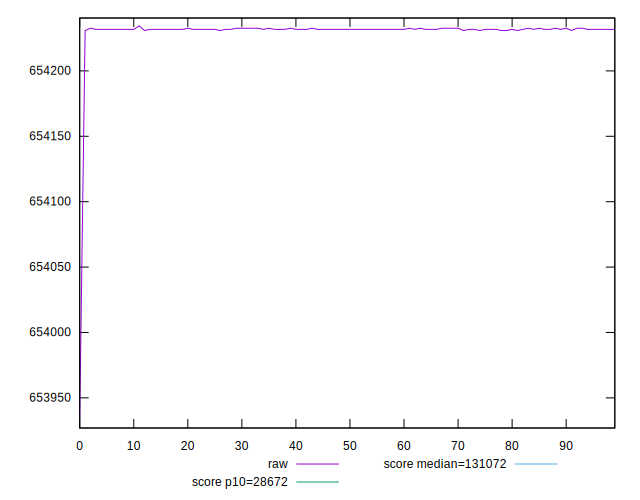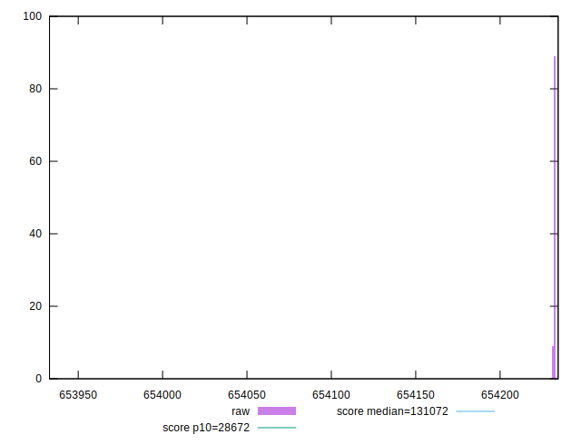
## Score


```yaml
p90min: 0.09
p90max: 0.09
p90range: 0
p90mean: 0.08999999999999991
p90median: 0.09
p90stdev: 8.326672684688674e-17
p90skewness: 1
p90eccentricity: 1
p90discretization: 94
outlandishness: 1
confidence: 3.26399571460865e-17
p90confidence: 3.366554527745014e-17

```

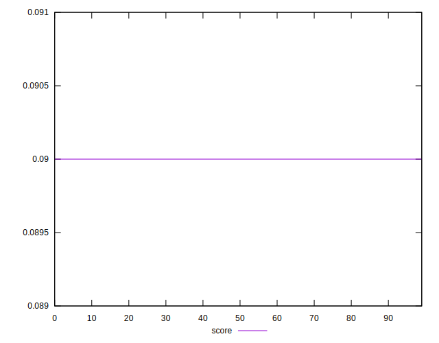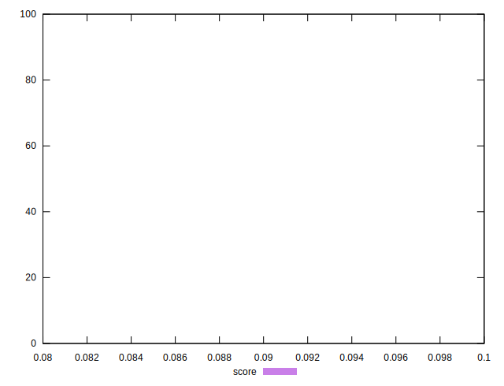
## Raw Estimate

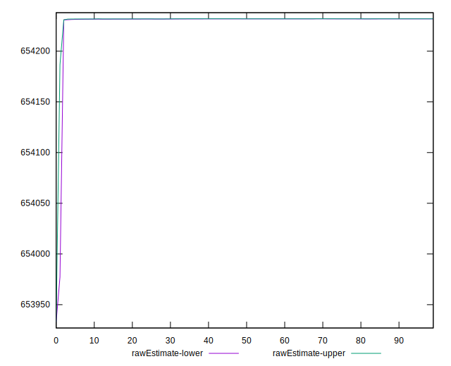
## Score Estimate

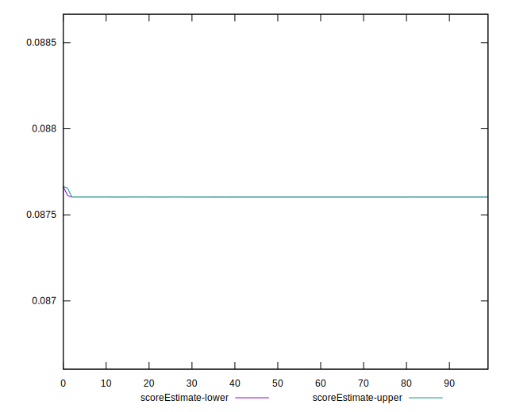
## P Score


```yaml
p90min: 0.08760330417736384
p90max: 0.08760366658598523
p90range: 3.6240862139047536e-7
p90mean: 0.08760346032131697
p90median: 0.08760348538141233
p90stdev: 9.382595005823976e-8
p90skewness: -0.17587630941114515
p90eccentricity: 1.0000000000000042
p90discretization: 31.333333333333332
outlandishness: 1.0000139092796139
confidence: 0.0000023931132180218563
p90confidence: 3.7934741636881666e-8

```

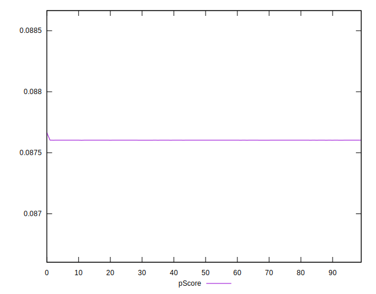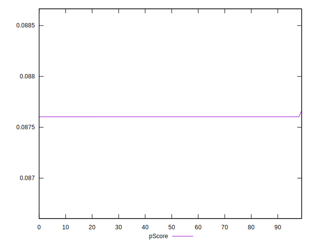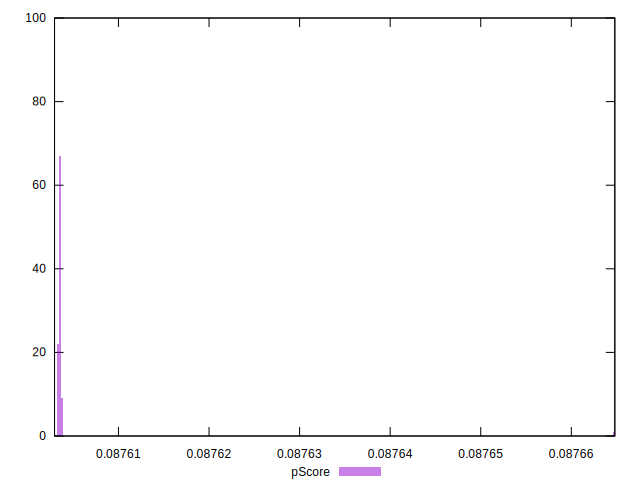
## Score Difference


```yaml
p90min: 0
p90max: 0
p90range: 0
p90mean: 0
p90median: 0
p90stdev: 0
p90skewness: .nan
p90eccentricity: .nan
p90discretization: 94
outlandishness: .nan
confidence: 0
p90confidence: 0

```


## P Score Difference


```yaml
p90min: -0.002396695822636158
p90max: -0.0023963334140147674
p90range: 3.6240862139047536e-7
p90mean: -0.0023965396786829827
p90median: -0.0023965146185876696
p90stdev: 9.382595005823991e-8
p90skewness: -0.17587631179619198
p90eccentricity: 0.9999999999999992
p90discretization: 31.333333333333332
outlandishness: 0.9994916245638177
confidence: 0.0000023931132180218563
p90confidence: 3.793474163688172e-8

```

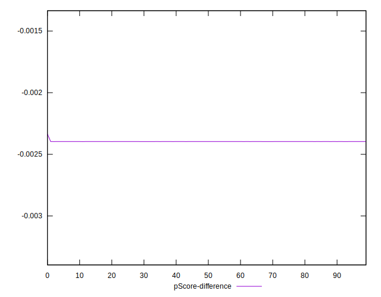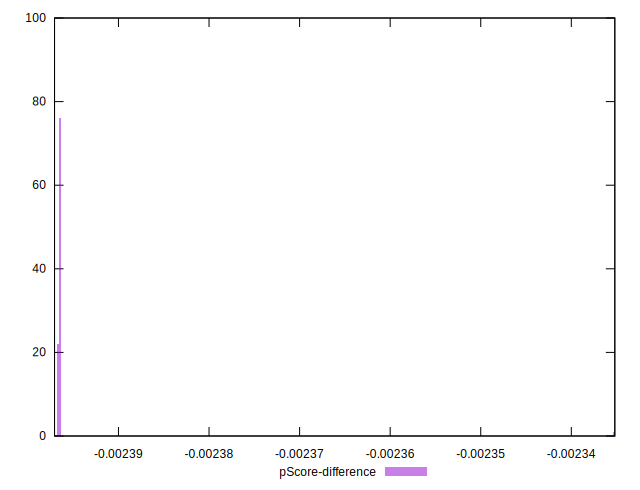