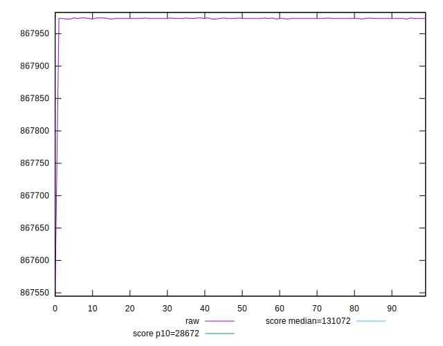
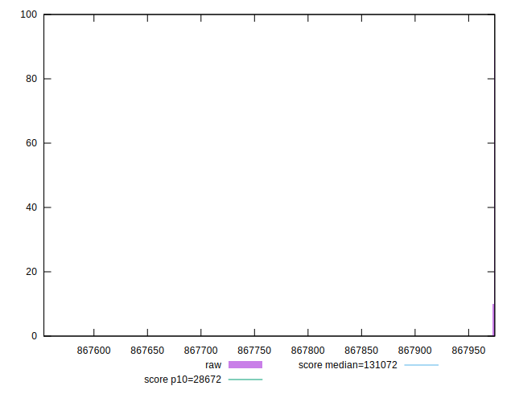
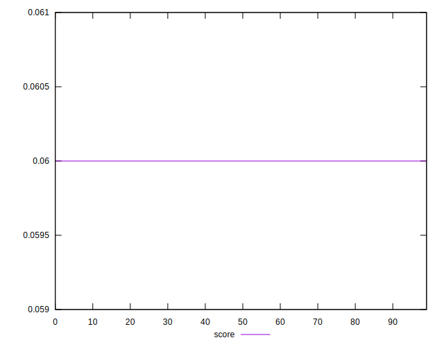
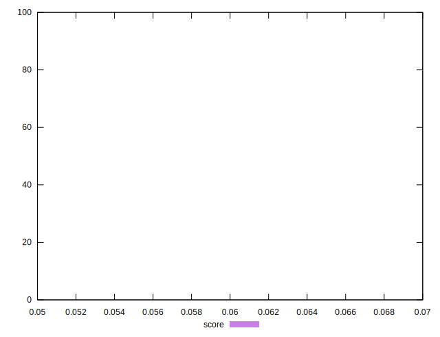
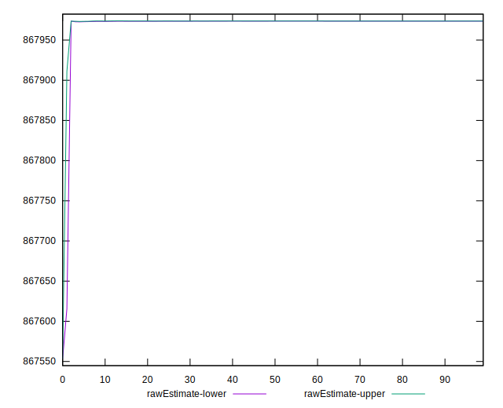
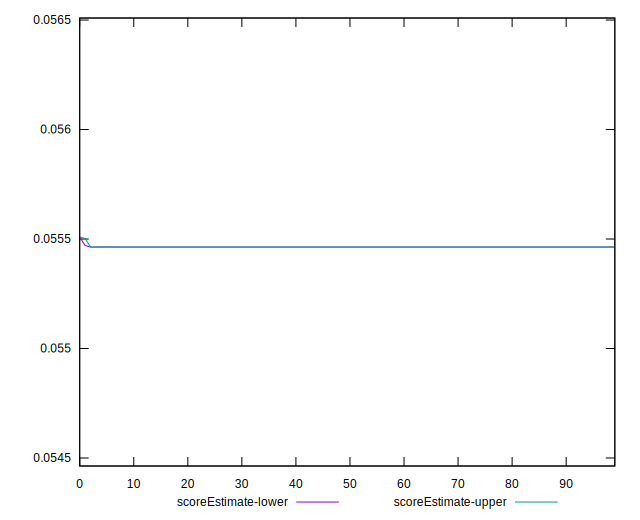
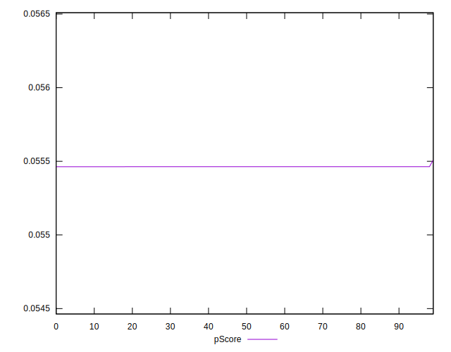
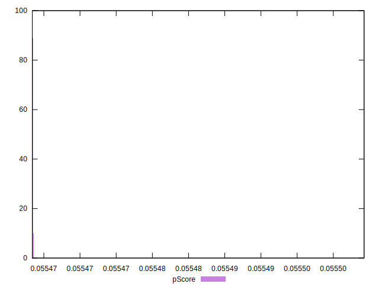
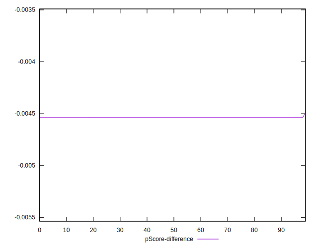
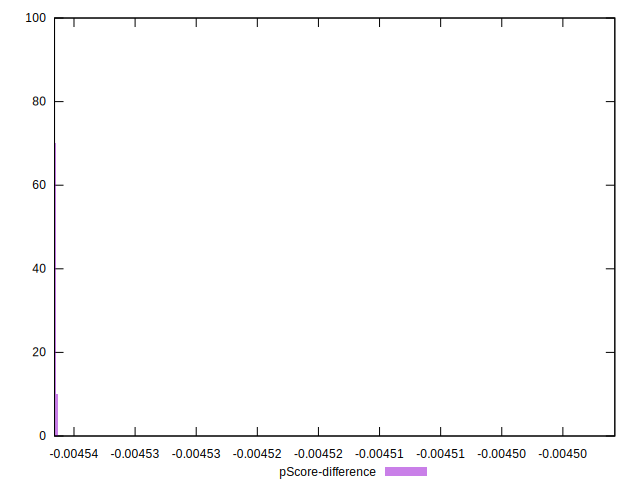

# //uses-long-cache-ttl/samples/pages+cached+noadtech

[→ Parent](../..)


## Raw


```yaml
p90min: 867972.6166666667
p90max: 867974.3833333333
p90range: 1.7666666666045785
p90mean: 867973.575177305
p90median: 867973.5
p90stdev: 0.4399638973378288
p90skewness: 0.171183342039078
p90eccentricity: 1.0000000000000009
p90discretization: 31.333333333333332
outlandishness: 0.9999903261252691
confidence: 16.39573538821817
p90confidence: 0.17788167095250595

```


## Score


```yaml
p90min: 0.06
p90max: 0.06
p90range: 0
p90mean: 0.05999999999999992
p90median: 0.06
p90stdev: 7.632783294297951e-17
p90skewness: 1
p90eccentricity: 1
p90discretization: 94
outlandishness: 0.9999999999999993
confidence: 3.807995000376758e-17
p90confidence: 3.0860083170995966e-17

```


## Raw Estimate


## Score Estimate


## P Score


```yaml
p90min: 0.05546340791398158
p90max: 0.05546360010728457
p90range: 1.9219330299469206e-7
p90mean: 0.055463495832109216
p90median: 0.05546350401051847
p90stdev: 4.786306917067476e-8
p90skewness: -0.17117830002642892
p90eccentricity: 1.0000000000000027
p90discretization: 31.333333333333332
outlandishness: 1.0000164790803574
confidence: 0.0000017846825332461284
p90confidence: 1.935150309494032e-8

```


## Score Difference


```yaml
p90min: 0
p90max: 0
p90range: 0
p90mean: 0
p90median: 0
p90stdev: 0
p90skewness: .nan
p90eccentricity: .nan
p90discretization: 94
outlandishness: .nan
confidence: 0
p90confidence: 0

```


## P Score Difference


```yaml
p90min: -0.004536592086018421
p90max: -0.004536399892715426
p90range: 1.9219330299469206e-7
p90mean: -0.004536504167890691
p90median: -0.004536495989481526
p90stdev: 4.7863069170674765e-8
p90skewness: -0.17117830437564605
p90eccentricity: 0.9999999999999984
p90discretization: 31.333333333333332
outlandishness: 0.9997985370298963
confidence: 0.0000017846825332461284
p90confidence: 1.9351503094940324e-8

```

