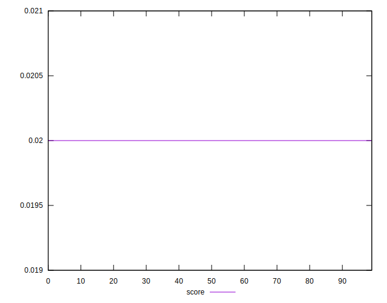

# //uses-long-cache-ttl/samples/pages+cached

[→ Parent](../..)


## Raw


```yaml
p90min: 1389787.011586515
p90max: 1389941.6927531816
p90range: 154.68116666655988
p90mean: 1389865.648453489
p90median: 1389865.2513156817
p90stdev: 45.04397145526577
p90skewness: 0.01099055347469895
p90eccentricity: 0.9999999999999997
p90discretization: 1
outlandishness: 0.9999845493646303
confidence: 38.674001118473264
p90confidence: 18.211714545857873

```


## Score


```yaml
p90min: 0.02
p90max: 0.02
p90range: 0
p90mean: 0.020000000000000014
p90median: 0.02
p90stdev: 1.3877787807814457e-17
p90skewness: -1
p90eccentricity: 1
p90discretization: 94
outlandishness: 1
confidence: 5.439992857681083e-18
p90confidence: 5.610924212908357e-18

```


## Raw Estimate


## Score Estimate


## P Score


```yaml
p90min: 0.023236159079801866
p90max: 0.023241317328752398
p90range: 0.000005158248950531963
p90mean: 0.023238694849326547
p90median: 0.02323870802770872
p90stdev: 0.0000015021048255341064
p90skewness: -0.010883232146373557
p90eccentricity: 1.0000000000000002
p90discretization: 1
outlandishness: 1.0000308376379745
confidence: 0.0000012902757218929884
p90confidence: 6.073155500453725e-7

```


## Score Difference


```yaml
p90min: 0
p90max: 0
p90range: 0
p90mean: 0
p90median: 0
p90stdev: 0
p90skewness: .nan
p90eccentricity: .nan
p90discretization: 94
outlandishness: .nan
confidence: 0
p90confidence: 0

```


## P Score Difference


```yaml
p90min: 0.0032361590798018654
p90max: 0.0032413173287523973
p90range: 0.000005158248950531963
p90mean: 0.0032386948493265495
p90median: 0.0032387080277087206
p90stdev: 0.0000015021048255341064
p90skewness: -0.01088323217235768
p90eccentricity: 1.0000000000000007
p90discretization: 1
outlandishness: 1.0002212806728714
confidence: 0.0000012902757218929884
p90confidence: 6.073155500453725e-7

```

