# //uses-long-cache-ttl/samples/pages

[→ Parent](../..)


## Raw


```yaml
p90min: 1306219.9330643232
p90max: 1390665.2305796864
p90range: 84445.2975153632
p90mean: 1347753.433969098
p90median: 1308269.709397579
p90stdev: 41412.09981289244
p90skewness: 0.04218496869454624
p90eccentricity: 0.9999999999999997
p90discretization: 1
outlandishness: 1.000055450341896
confidence: 16254.466276512532
p90confidence: 16743.313614918938

```

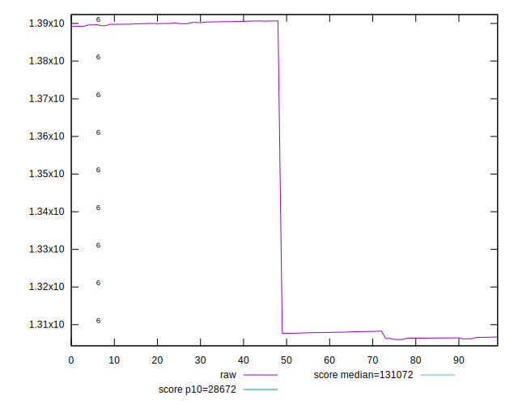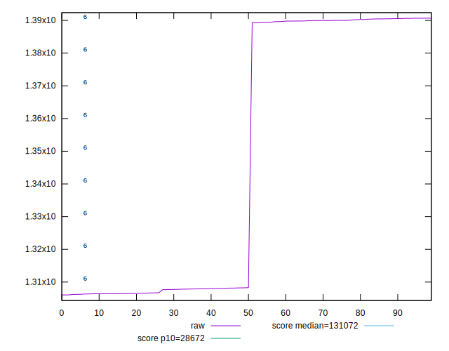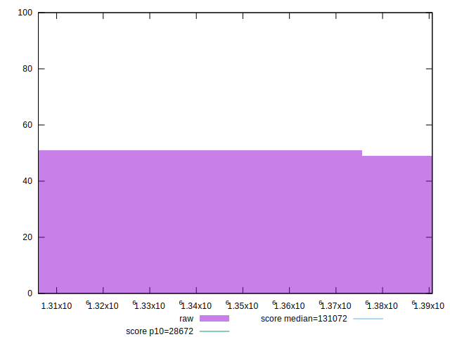
## Score


```yaml
p90min: 0.02
p90max: 0.03
p90range: 0.009999999999999998
p90mean: 0.025106382978723394
p90median: 0.03
p90stdev: 0.004998868138072654
p90skewness: -0.0425628265379483
p90eccentricity: 1.000000000000001
p90discretization: 47
outlandishness: 0.9994915900603266
confidence: 0.001959571952536025
p90confidence: 0.0020210908728013725

```

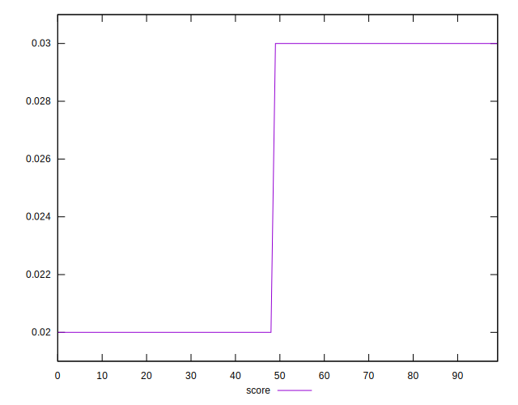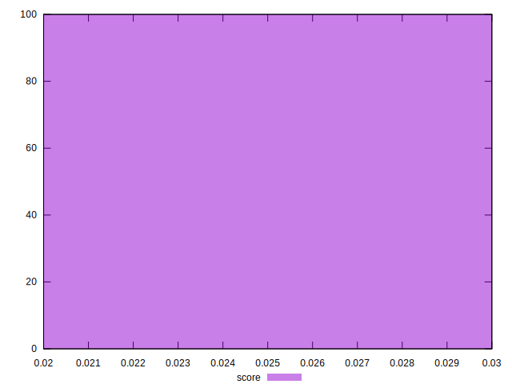
## Raw Estimate

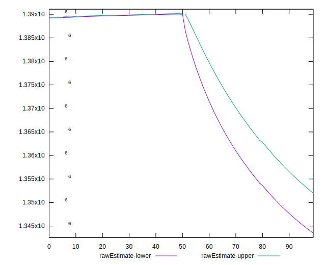
## Score Estimate

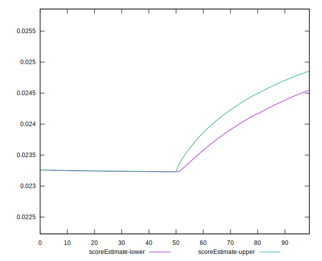
## P Score


```yaml
p90min: 0.02321205122233011
p90max: 0.026269358065080517
p90range: 0.003057306842750407
p90mean: 0.024763231412129317
p90median: 0.026188914408595693
p90stdev: 0.001498682998623811
p90skewness: -0.04206956066180208
p90eccentricity: 1.0000000000000002
p90discretization: 1
outlandishness: 0.9999036672280682
confidence: 0.0005882604343136117
p90confidence: 0.0006059320722368599

```

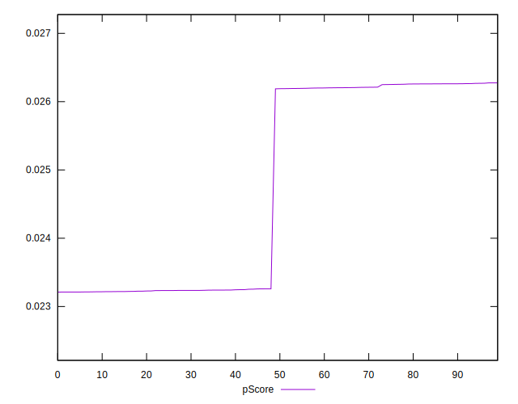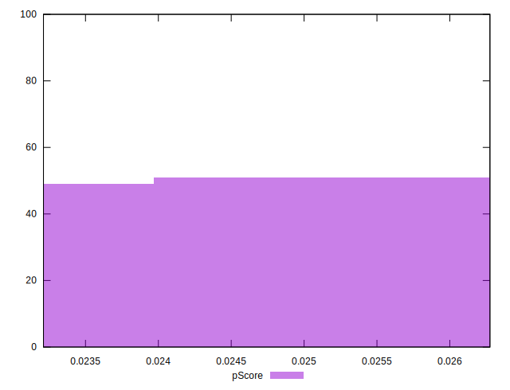
## Score Difference


```yaml
p90min: 0
p90max: 0
p90range: 0
p90mean: 0
p90median: 0
p90stdev: 0
p90skewness: .nan
p90eccentricity: .nan
p90discretization: 94
outlandishness: .nan
confidence: 0
p90confidence: 0

```


## P Score Difference


```yaml
p90min: -0.003808305497173897
p90max: 0.0032579786130704953
p90range: 0.0070662841102443925
p90mean: -0.00034193548211554434
p90median: -0.0037248574188200323
p90stdev: 0.003496226693404862
p90skewness: 0.042469612844929054
p90eccentricity: 1.0000000000000007
p90discretization: 1
outlandishness: 0.9768902847555437
confidence: 0.001371422540201207
p90confidence: 0.0014135583624355224

```

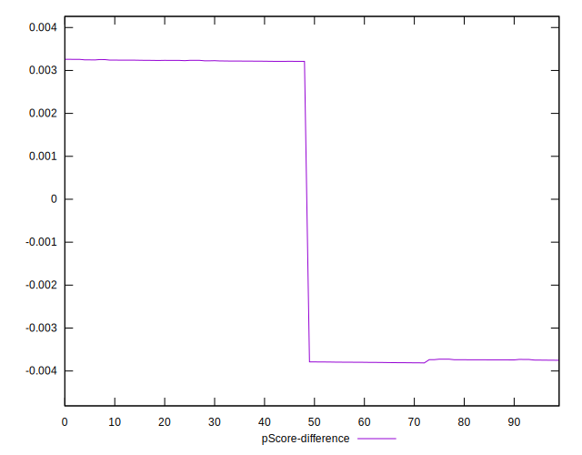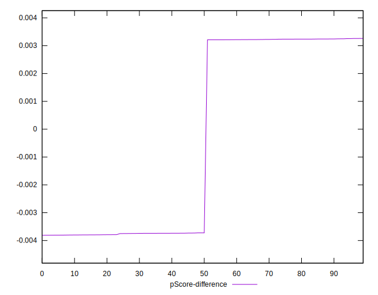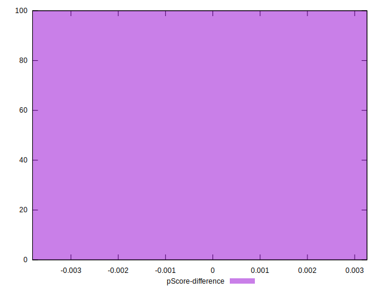