# //uses-rel-preconnect/samples/pages+cached+noadtech+nomedia+nocss

[→ Parent](../..)


## Raw


```yaml
p90min: 0
p90max: 164.87900018692017
p90range: 164.87900018692017
p90mean: 37.60123404036177
p90median: 0
p90stdev: 50.41657100711814
p90skewness: 0.7443039982443469
p90eccentricity: 0.9999999999999994
p90discretization: 2.611111111111111
outlandishness: 1.3106442067615351
confidence: 24.626912951766787
p90confidence: 20.38390865411297

```

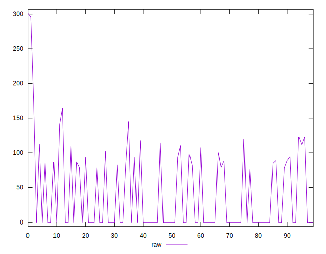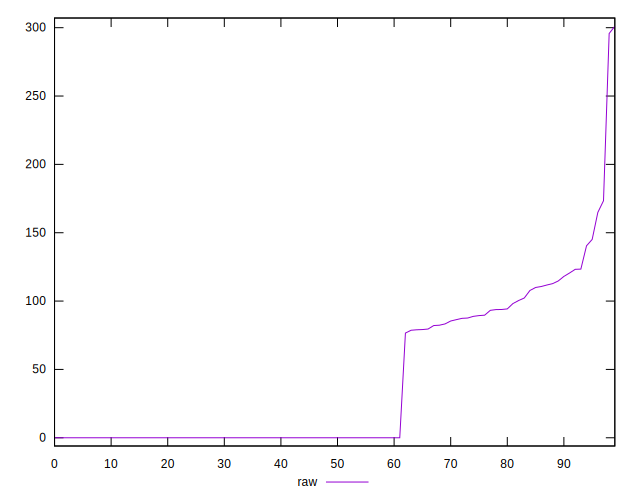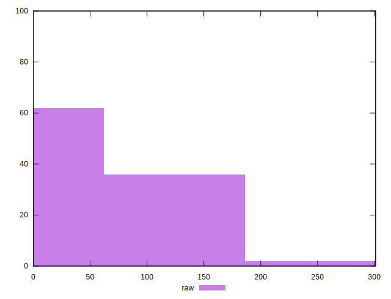
## Score


```yaml
p90min: 0.86
p90max: 1
p90range: 0.14
p90mean: 0.9687234042553197
p90median: 1
p90stdev: 0.041978567037700365
p90skewness: -0.7543431595251521
p90eccentricity: 1.000000000000001
p90discretization: 11.75
outlandishness: 0.9906829063210373
confidence: 0.020520214515328403
p90confidence: 0.01697234180813746

```

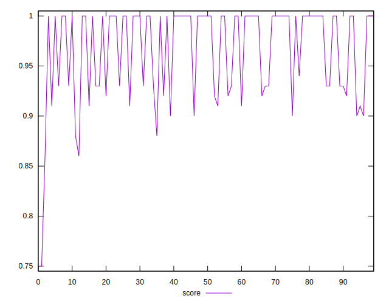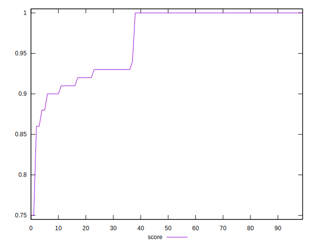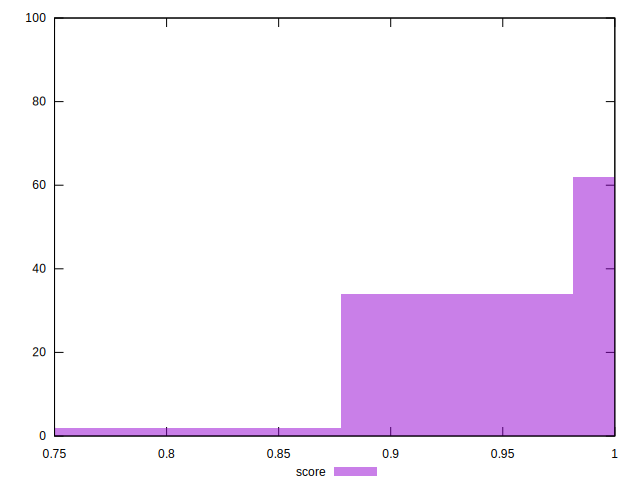
## Raw Estimate

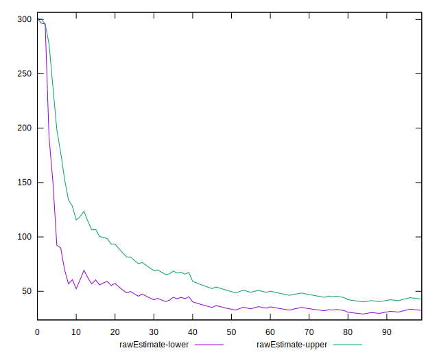
## Score Estimate

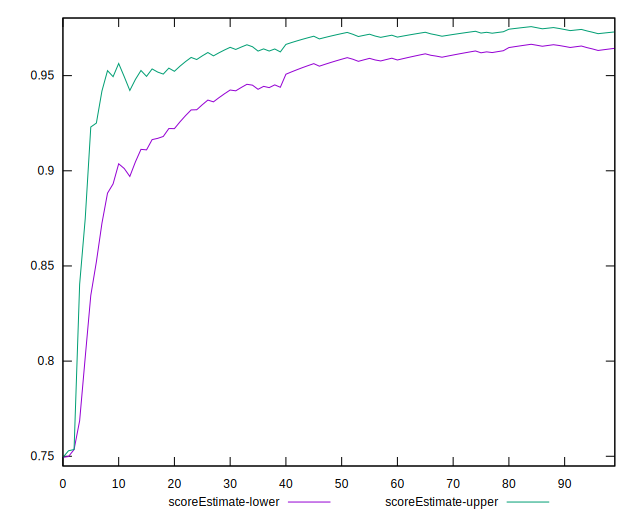
## P Score


```yaml
p90min: 0.8626008331775665
p90max: 1
p90range: 0.13739916682243347
p90mean: 0.9686656382996988
p90median: 1
p90stdev: 0.04201380917259841
p90skewness: -0.7443039982443652
p90eccentricity: 1
p90discretization: 2.611111111111111
outlandishness: 0.9906578327639157
confidence: 0.020517703446143242
p90confidence: 0.01698659054509413

```

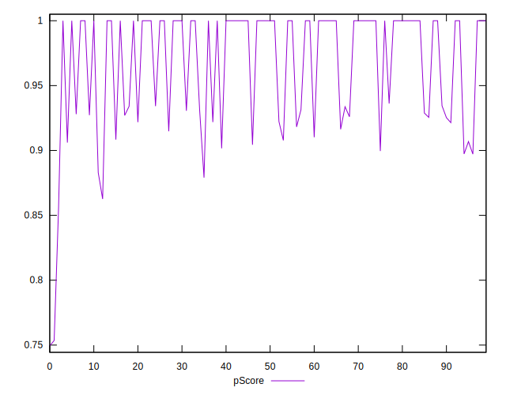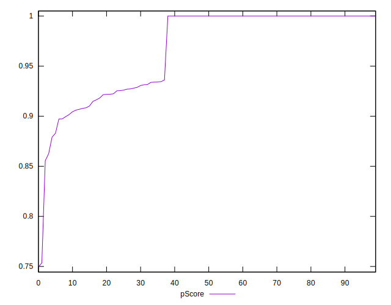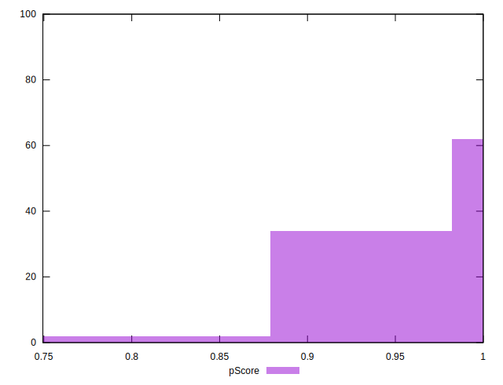
## Score Difference


```yaml
p90min: 0
p90max: 0
p90range: 0
p90mean: 0
p90median: 0
p90stdev: 0
p90skewness: .nan
p90eccentricity: .nan
p90discretization: 94
outlandishness: .inf
confidence: 4.330179641073932e-18
p90confidence: 0

```

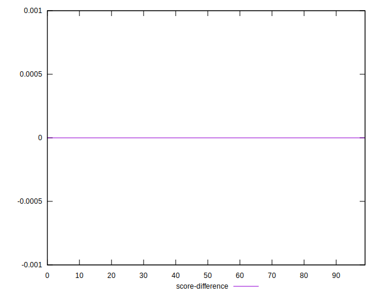
## P Score Difference


```yaml
p90min: -0.00401499986648568
p90max: 0.0041666670640309045
p90range: 0.008181666930516585
p90mean: -0.00007367610790488013
p90median: 0
p90stdev: 0.0015162629521427032
p90skewness: -0.06889250905613463
p90eccentricity: 1.0000000000000007
p90discretization: 2.8484848484848486
outlandishness: 0.8949061837056123
confidence: 0.0007240105210267512
p90confidence: 0.0006130398179544745

```

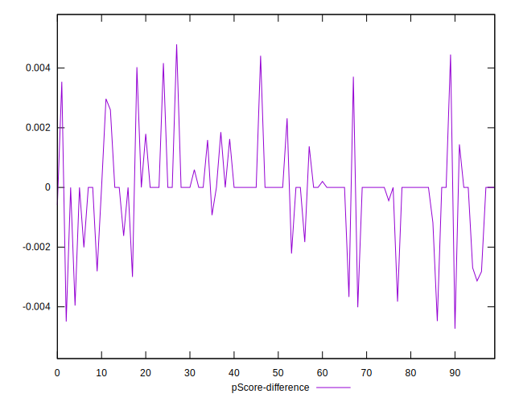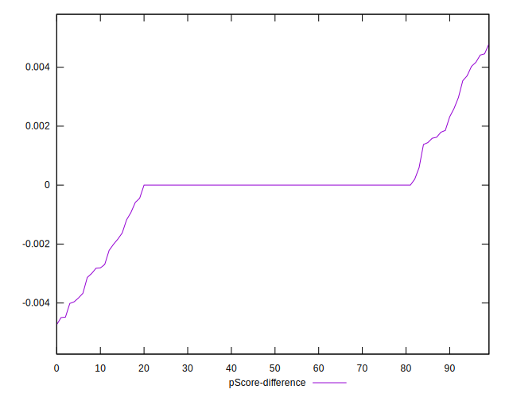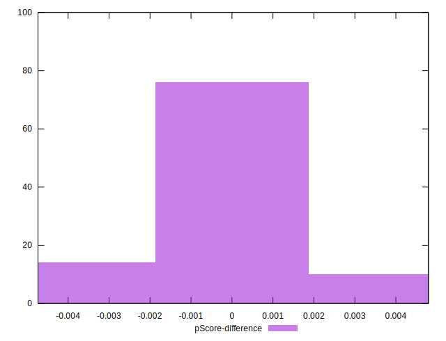