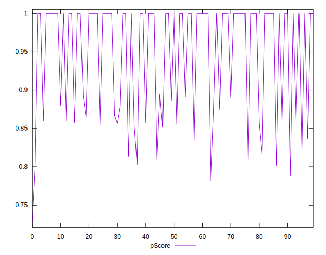

# //uses-rel-preconnect/samples/pages+cached+noadtech+nomedia

[→ Parent](../..)


## Raw


```yaml
p90min: 0
p90max: 243.65100002288818
p90range: 243.65100002288818
p90mean: 62.349638299739105
p90median: 0
p90stdev: 87.14634126183783
p90skewness: 0.7975592649824929
p90eccentricity: 0.9999999999999999
p90discretization: 2.764705882352941
outlandishness: 1.1618018480561774
confidence: 36.74513467956861
p90confidence: 35.234111014227004

```


## Score


```yaml
p90min: 0.8
p90max: 1
p90range: 0.19999999999999996
p90mean: 0.9479787234042552
p90median: 1
p90stdev: 0.07269258774637152
p90skewness: -0.7966258616177192
p90eccentricity: 0.9999999999999987
p90discretization: 8.545454545454545
outlandishness: 0.9918335965349488
confidence: 0.030465154622399987
p90confidence: 0.029390318279359475

```


## Raw Estimate


## Score Estimate


## P Score


```yaml
p90min: 0.7969574999809265
p90max: 1
p90range: 0.20304250001907354
p90mean: 0.9480419680835507
p90median: 1
p90stdev: 0.07262195105153149
p90skewness: -0.7975592649824853
p90eccentricity: 1.0000000000000016
p90discretization: 2.764705882352941
outlandishness: 0.9917313985978434
confidence: 0.030487900963472214
p90confidence: 0.029361759178522486

```


## Score Difference


```yaml
p90min: 0
p90max: 0
p90range: 0
p90mean: 0
p90median: 0
p90stdev: 0
p90skewness: .nan
p90eccentricity: .nan
p90discretization: 94
outlandishness: .inf
confidence: 7.423946114831074e-18
p90confidence: 0

```


## P Score Difference


```yaml
p90min: -0.0036599999003940065
p90max: 0.004571666320165035
p90range: 0.008231666220559042
p90mean: -0.000006914892658840171
p90median: 0
p90stdev: 0.0014553145872896545
p90skewness: 0.2699761269120536
p90eccentricity: 0.9999999999999999
p90discretization: 3.032258064516129
outlandishness: 4.301581346055775
confidence: 0.0007034167559776535
p90confidence: 0.0005883978028994106

```

