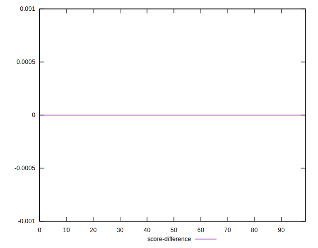

# //uses-rel-preconnect/samples/pages+cached+noadtech

[→ Parent](../..)


## Raw


```yaml
p90min: 0
p90max: 237.72300004959106
p90range: 237.72300004959106
p90mean: 49.25215957519856
p90median: 0
p90stdev: 76.83980598279811
p90skewness: 1.0556982999778326
p90eccentricity: 1
p90discretization: 3.1333333333333333
outlandishness: 1.2455162698577582
confidence: 33.652197003836406
p90confidence: 31.067078836678135

```


## Score


```yaml
p90min: 0.8
p90max: 1
p90range: 0.19999999999999996
p90mean: 0.9589361702127661
p90median: 1
p90stdev: 0.06412202604121767
p90skewness: -1.060915053985038
p90eccentricity: 1.0000000000000002
p90discretization: 7.833333333333333
outlandishness: 0.9903539711886674
confidence: 0.027923840137202147
p90confidence: 0.025925157055133628

```


## Raw Estimate


## Score Estimate


## P Score


```yaml
p90min: 0.8018974999586741
p90max: 1
p90range: 0.1981025000413259
p90mean: 0.9589565336873346
p90median: 1
p90stdev: 0.06403317165233183
p90skewness: -1.0556982999778222
p90eccentricity: 0.9999999999999989
p90discretization: 3.1333333333333333
outlandishness: 0.9903639659209834
confidence: 0.027873306089729943
p90confidence: 0.025889232363898472

```


## Score Difference


```yaml
p90min: 0
p90max: 0
p90range: 0
p90mean: 0
p90median: 0
p90stdev: 0
p90skewness: .nan
p90eccentricity: .nan
p90discretization: 94
outlandishness: .inf
confidence: 4.330179641073934e-18
p90confidence: 0

```


## P Score Difference


```yaml
p90min: -0.003989999691645263
p90max: 0.004364166259765656
p90range: 0.008354165951410919
p90mean: 0.00003407503696197824
p90median: 0
p90stdev: 0.0015406563406382332
p90skewness: 0.1953192327954746
p90eccentricity: 1.0000000000000009
p90discretization: 3.4814814814814814
outlandishness: 0.5417531324504848
confidence: 0.0007342151326859618
p90confidence: 0.0006229023015174079

```

