# //uses-rel-preconnect/samples/pages+cached

[→ Parent](../..)


## Raw


```yaml
p90min: 0
p90max: 305.124
p90range: 305.124
p90mean: 232.04045745066372
p90median: 300
p90stdev: 115.46383647460408
p90skewness: -1.4264603632171342
p90eccentricity: 0.9999999999999999
p90discretization: 1.46875
outlandishness: 0.9700996881713275
confidence: 47.303134712501944
p90confidence: 46.68314898328707

```

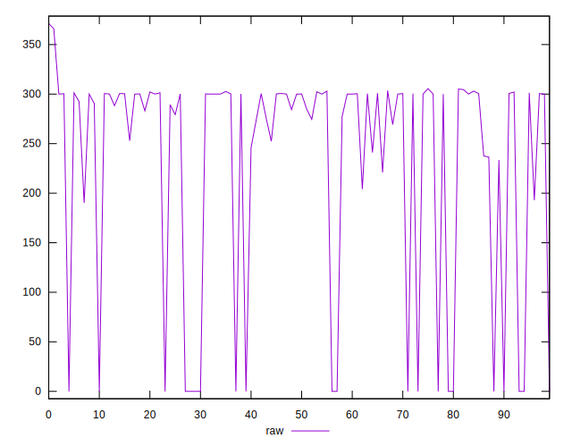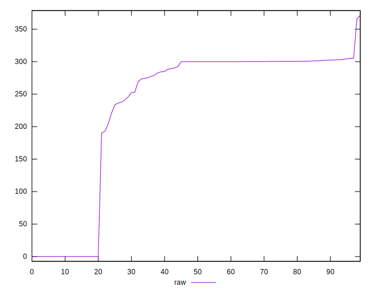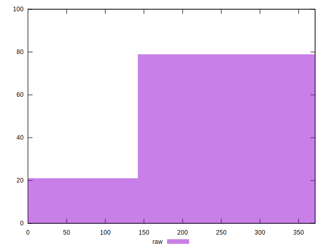
## Score


```yaml
p90min: 0.75
p90max: 1
p90range: 0.25
p90mean: 0.8071276595744681
p90median: 0.75
p90stdev: 0.09599005201588225
p90skewness: 1.425518303432554
p90eccentricity: 0.9999999999999988
p90discretization: 8.545454545454545
outlandishness: 1.0081250442036385
confidence: 0.03917543927905933
p90confidence: 0.038809709048222334

```

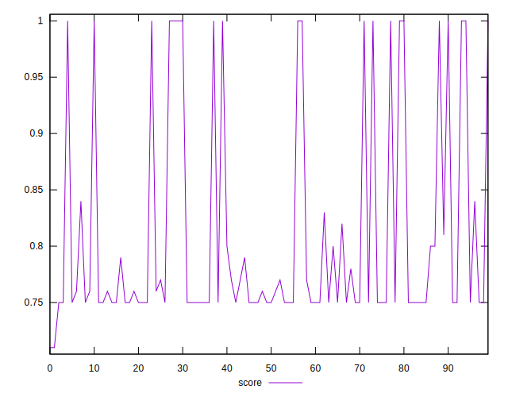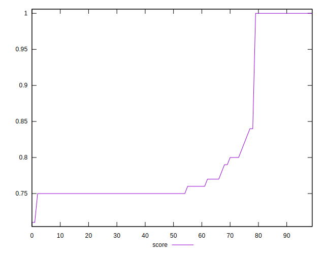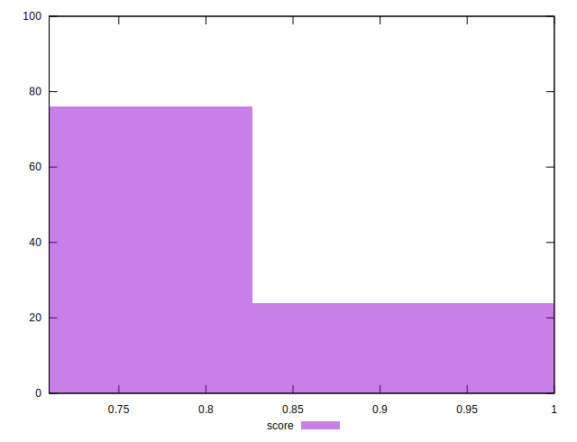
## Raw Estimate

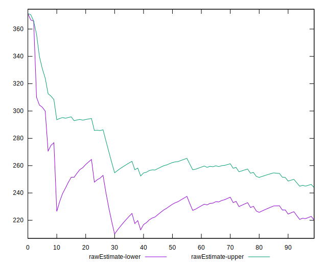
## Score Estimate

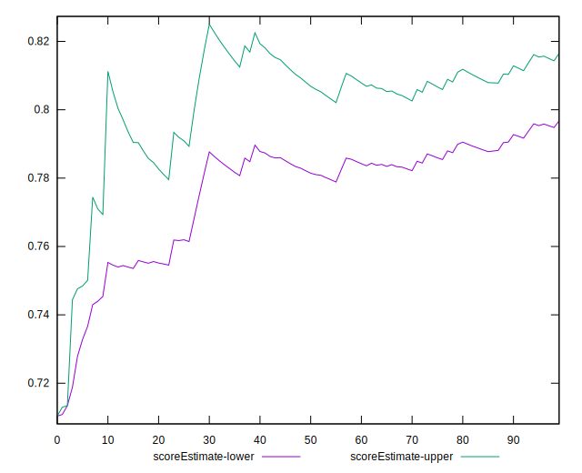
## P Score


```yaml
p90min: 0.7471533333333333
p90max: 1
p90range: 0.25284666666666666
p90mean: 0.8067572369944231
p90median: 0.75
p90stdev: 0.09614426514420923
p90skewness: 1.4273832792503187
p90eccentricity: 1.0000000000000002
p90discretization: 1.46875
outlandishness: 1.0082019991616256
confidence: 0.03922727308428676
p90confidence: 0.038872058911735244

```

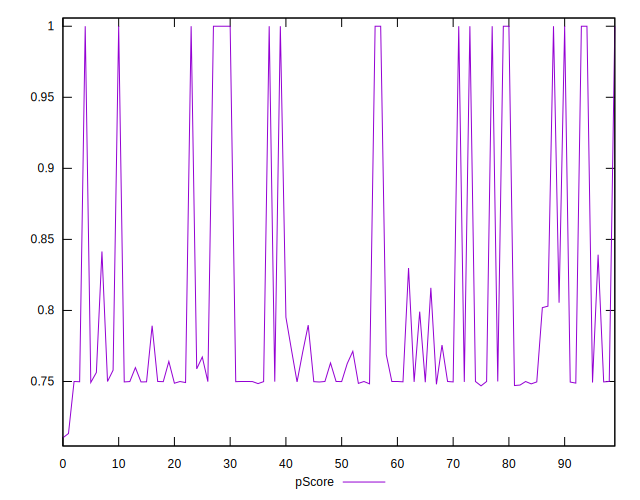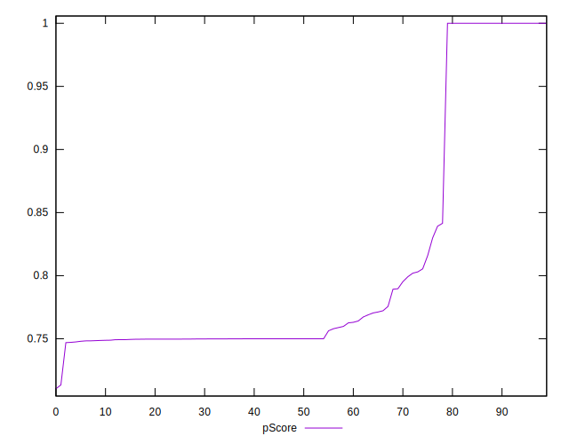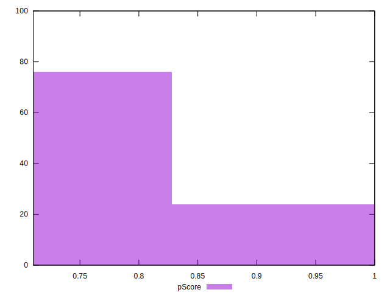
## Score Difference


```yaml
p90min: 0
p90max: 0
p90range: 0
p90mean: 0
p90median: 0
p90stdev: 0
p90skewness: .nan
p90eccentricity: .nan
p90discretization: 94
outlandishness: .inf
confidence: 6.092792000602807e-18
p90confidence: 0

```

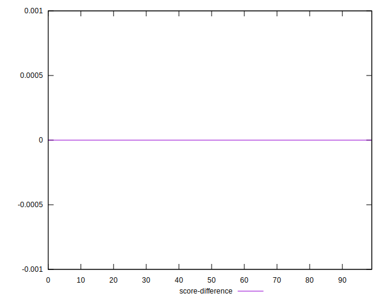
## P Score Difference


```yaml
p90min: -0.004115833441416417
p90max: 0.0029974997043609175
p90range: 0.007113333145777334
p90mean: -0.00032921099804817777
p90median: -0.000058888888888886104
p90stdev: 0.0010738883686063343
p90skewness: -0.5984549955524581
p90eccentricity: 1.0000000000000009
p90discretization: 1.5666666666666667
outlandishness: 1.072954538576815
confidence: 0.0005642152428977731
p90confidence: 0.0004341834831903848

```

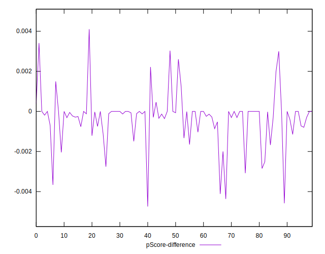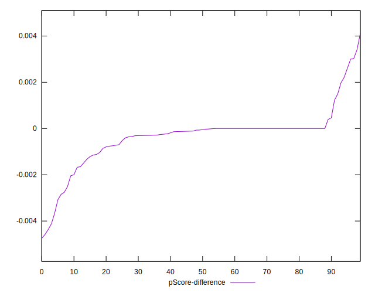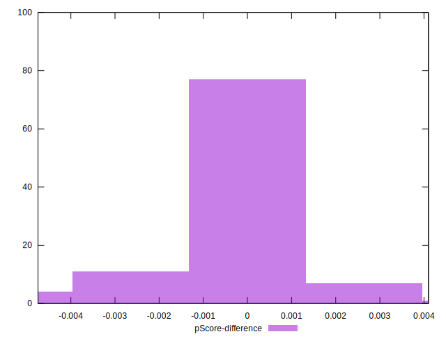