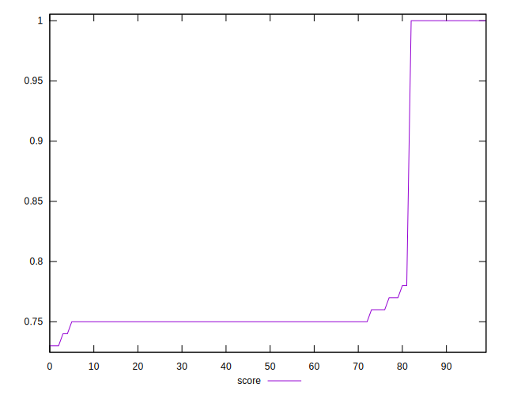

# //uses-rel-preconnect/samples/pages

[→ Parent](../..)


## Raw


```yaml
p90min: 0
p90max: 313.072
p90range: 313.072
p90mean: 250.72715957901335
p90median: 300.086
p90stdev: 109.52346735521941
p90skewness: -1.8400127638634076
p90eccentricity: 0.9999999999999996
p90discretization: 1.540983606557377
outlandishness: 0.9617598530559709
confidence: 45.33903149087358
p90confidence: 44.28140013201841

```


## Score


```yaml
p90min: 0.74
p90max: 1
p90range: 0.26
p90mean: 0.7913829787234042
p90median: 0.75
p90stdev: 0.09109967727515739
p90skewness: 1.8424719052488954
p90eccentricity: 1.0000000000000027
p90discretization: 15.666666666666666
outlandishness: 1.0111939426717151
confidence: 0.03759936386459827
p90confidence: 0.036832483108258214

```


## Raw Estimate


## Score Estimate


## P Score


```yaml
p90min: 0.7427377777777778
p90max: 1
p90range: 0.25726222222222217
p90mean: 0.7912861199735413
p90median: 0.7499522222222221
p90stdev: 0.09115795675509335
p90skewness: 1.8411832280702722
p90eccentricity: 1
p90discretization: 1.540983606557377
outlandishness: 1.011036443275122
confidence: 0.03764012674807853
p90confidence: 0.03685604606725549

```


## Score Difference


```yaml
p90min: 0
p90max: 0
p90range: 0
p90mean: 0
p90median: 0
p90stdev: 0
p90skewness: .nan
p90eccentricity: .nan
p90discretization: 94
outlandishness: .nan
confidence: 0
p90confidence: 0

```


## P Score Difference


```yaml
p90min: -0.0027658331394195823
p90max: 0.00413249969482421
p90range: 0.006898332834243792
p90mean: -0.00020349291275015575
p90median: -0.00008277777777776496
p90stdev: 0.0010424782252853228
p90skewness: 1.38947930998223
p90eccentricity: 0.9999999999999994
p90discretization: 1.6491228070175439
outlandishness: 0.6133544993015619
confidence: 0.0005605003593259777
p90confidence: 0.0004214840575952229

```

