# //uses-rel-preload/samples/pages+cached+noadtech+nomedia+nocss

[→ Parent](../..)


## Raw


```yaml
p90min: 905
p90max: 1058
p90range: 153
p90mean: 1051.2659574468084
p90median: 1054
p90stdev: 21.470006556359127
p90skewness: -6.585623581115843
p90eccentricity: 1.0000000000000009
p90discretization: 9.4
outlandishness: 0.9931325871289504
confidence: 12.963809860238973
p90confidence: 8.680531890719855

```

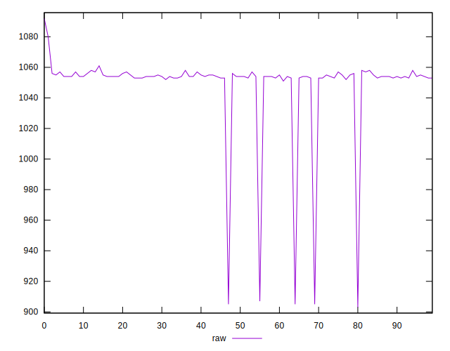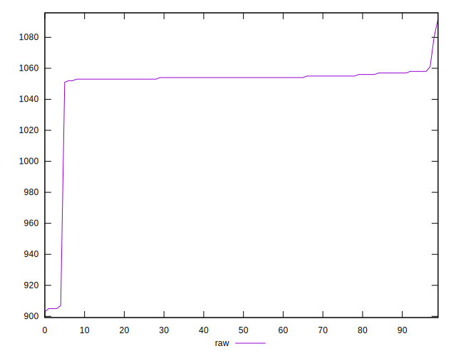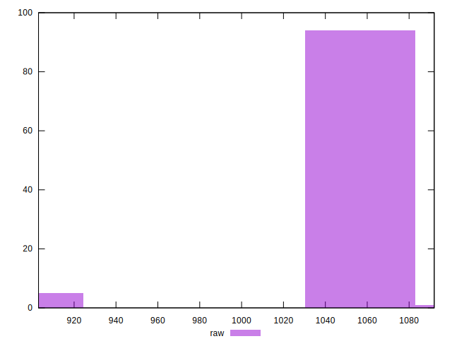
## Score


```yaml
p90min: 0.46
p90max: 0.48
p90range: 0.019999999999999962
p90mean: 0.4604255319148942
p90median: 0.46
p90stdev: 0.0028860978651596794
p90skewness: 6.634888026969688
p90eccentricity: 1.0000000000000024
p90discretization: 47
outlandishness: 1.0024969356569098
confidence: 0.0017086569883178792
p90confidence: 0.0011668773594685638

```

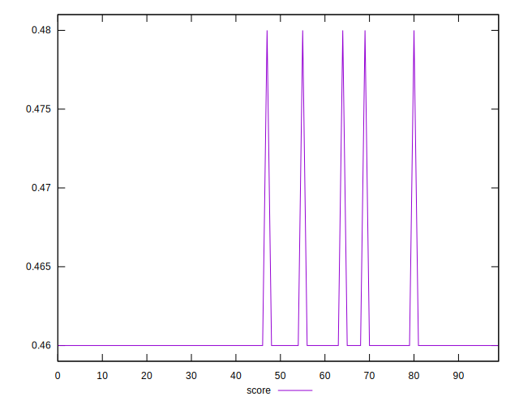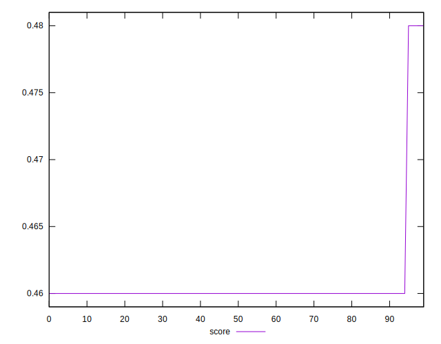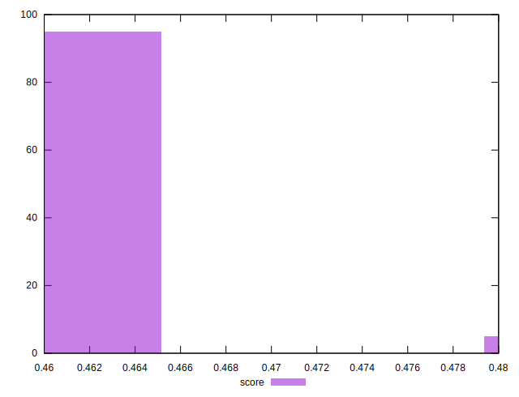
## Raw Estimate

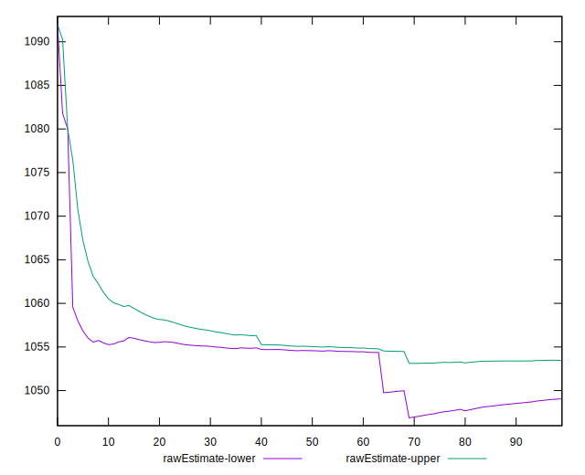
## Score Estimate

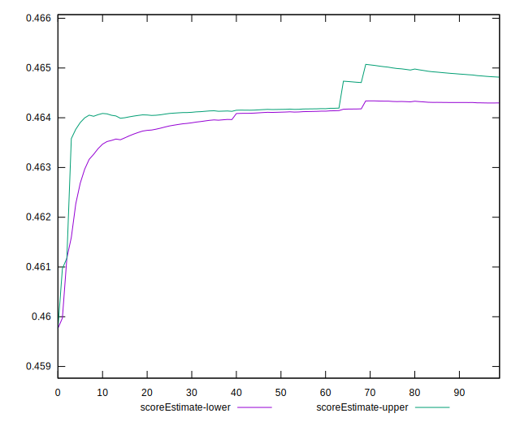
## P Score


```yaml
p90min: 0.46376470588235297
p90max: 0.48176470588235293
p90range: 0.01799999999999996
p90mean: 0.4645569461827286
p90median: 0.4642352941176471
p90stdev: 0.002525883124277542
p90skewness: 6.585623581115656
p90eccentricity: 1.0000000000000013
p90discretization: 9.4
outlandishness: 1.0018322900557484
confidence: 0.0015251541012045837
p90confidence: 0.001021239045967041

```

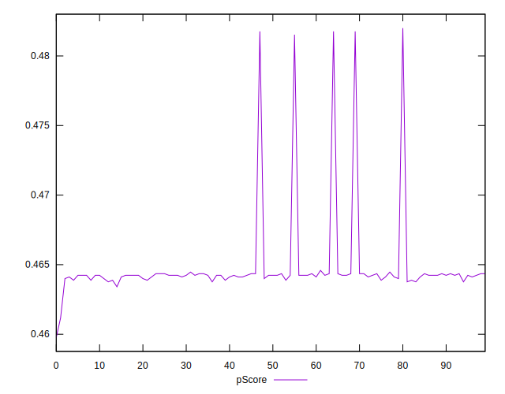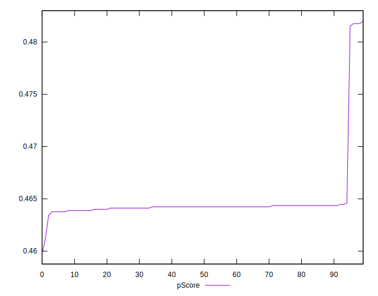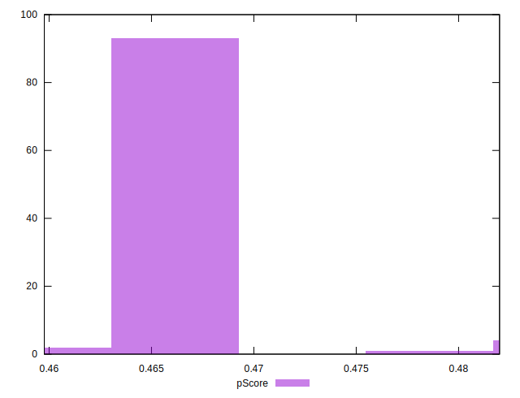
## Score Difference


```yaml
p90min: 0
p90max: 0
p90range: 0
p90mean: 0
p90median: 0
p90stdev: 0
p90skewness: .nan
p90eccentricity: .nan
p90discretization: 94
outlandishness: .nan
confidence: 0
p90confidence: 0

```


## P Score Difference


```yaml
p90min: 0.001764705882352946
p90max: 0.0043529411764705594
p90range: 0.0025882352941176134
p90mean: 0.004066332916145167
p90median: 0.004235294117647059
p90stdev: 0.000506908326163619
p90skewness: -3.69129890542397
p90eccentricity: 0.9999999999999978
p90discretization: 10.444444444444445
outlandishness: 0.9591215091775759
confidence: 0.00029682708285793915
p90confidence: 0.0002049479528282411

```

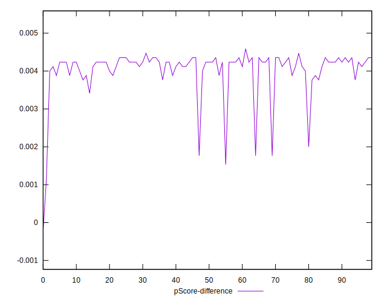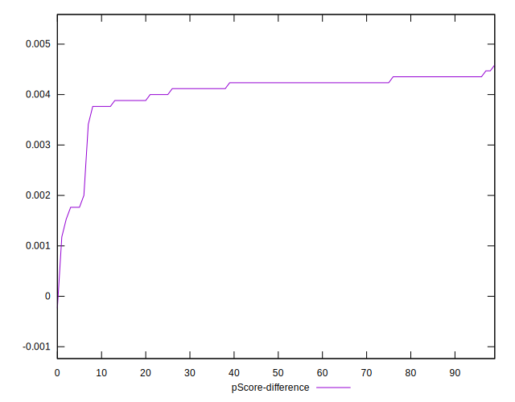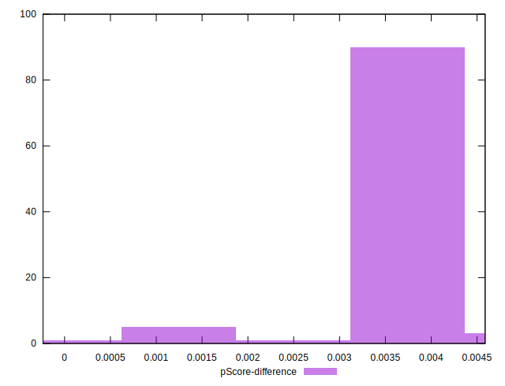