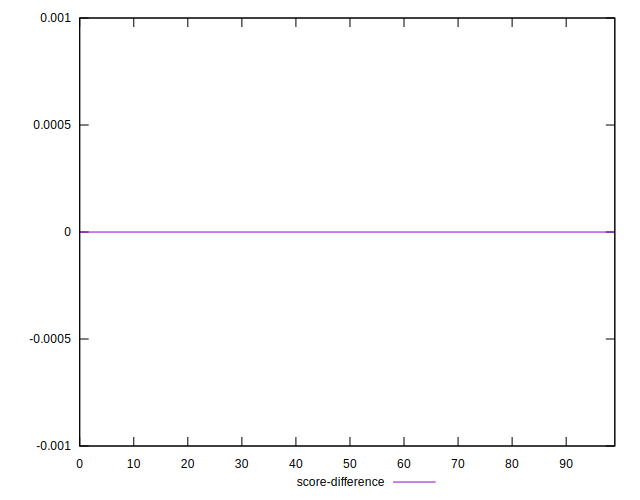

# //uses-rel-preload/samples/pages+cached+noadtech+nomedia

[→ Parent](../..)


## Raw


```yaml
p90min: 756
p90max: 779
p90range: 23
p90mean: 759.9574468085107
p90median: 759
p90stdev: 3.7838258630735493
p90skewness: 2.157302344791835
p90eccentricity: 0.9999999999999983
p90discretization: 6.266666666666667
outlandishness: 1.0097678435163333
confidence: 10.161043082714706
p90confidence: 1.529837496188938

```


## Score


```yaml
p90min: 0.5
p90max: 0.5
p90range: 0
p90mean: 0.5
p90median: 0.5
p90stdev: 0
p90skewness: .nan
p90eccentricity: .nan
p90discretization: 94
outlandishness: 0.9980009999999998
confidence: 0.0013996942518114468
p90confidence: 0

```


## Raw Estimate


## Score Estimate


## P Score


```yaml
p90min: 0.49658823529411766
p90max: 0.49929411764705883
p90range: 0.002705882352941169
p90mean: 0.4988285356695867
p90median: 0.4989411764705882
p90stdev: 0.00044515598389100494
p90skewness: -2.157302344789826
p90eccentricity: 0.9999999999999992
p90discretization: 6.266666666666667
outlandishness: 0.9982542927125356
confidence: 0.001195416833260554
p90confidence: 0.0001799808819045806

```


## Score Difference


```yaml
p90min: 0
p90max: 0
p90range: 0
p90mean: 0
p90median: 0
p90stdev: 0
p90skewness: .nan
p90eccentricity: .nan
p90discretization: 94
outlandishness: .inf
confidence: 2.165089820536967e-18
p90confidence: 0

```


## P Score Difference


```yaml
p90min: -0.0022352941176470575
p90max: -0.0007058823529411673
p90range: 0.0015294117647058902
p90mean: -0.001123904881101377
p90median: -0.0010588235294117787
p90stdev: 0.0003593973627313443
p90skewness: -1.3733088955875632
p90eccentricity: 0.9999999999999997
p90discretization: 7.230769230769231
outlandishness: 0.9702469377632047
confidence: 0.00030318735765533906
p90confidence: 0.00014530783958731562

```

