# //uses-rel-preload/samples/pages+cached+noadtech

[→ Parent](../..)


## Raw


```yaml
p90min: 756
p90max: 906
p90range: 150
p90mean: 761.5
p90median: 758
p90stdev: 15.98786108670136
p90skewness: 7.970749168635959
p90eccentricity: 1
p90discretization: 5.222222222222222
outlandishness: 1.0133337131805635
confidence: 13.47113573916649
p90confidence: 6.46404730539798

```

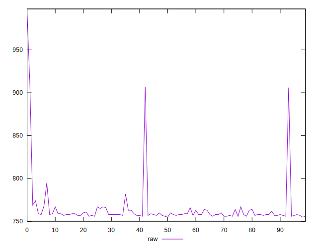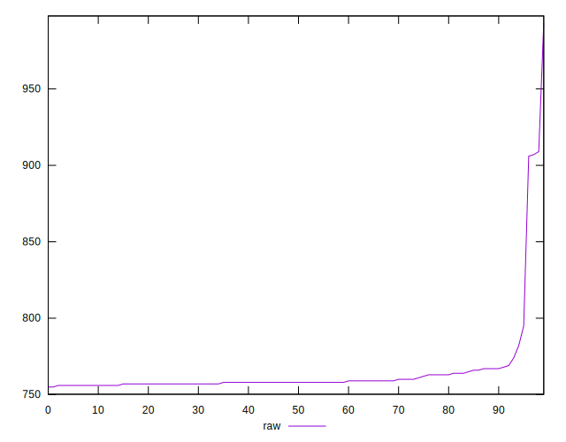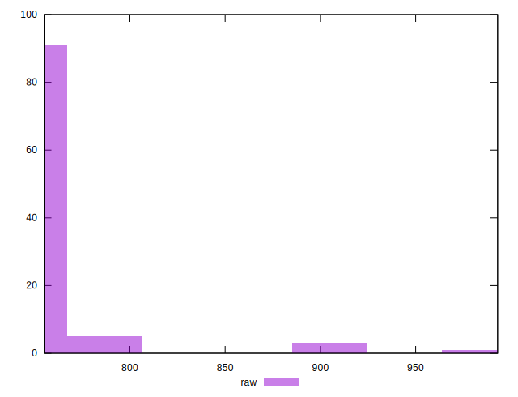
## Score


```yaml
p90min: 0.48
p90max: 0.5
p90range: 0.020000000000000018
p90mean: 0.49968085106382976
p90median: 0.5
p90stdev: 0.002284139420594033
p90skewness: -7.612377922141438
p90eccentricity: 0.9999999999999994
p90discretization: 31.333333333333332
outlandishness: 0.9972767128933082
confidence: 0.0017963366637084141
p90confidence: 0.0009234997218687028

```

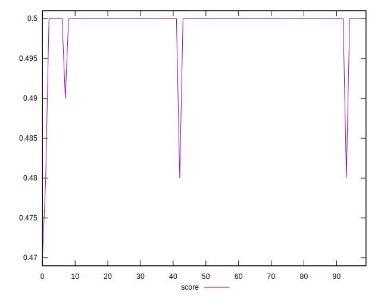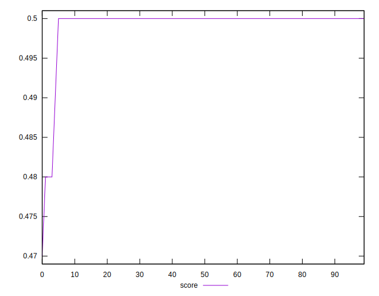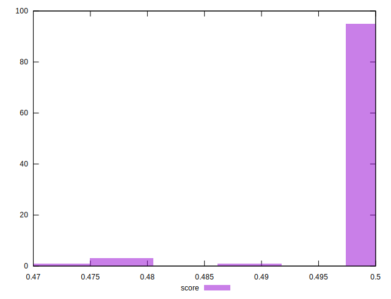
## Raw Estimate

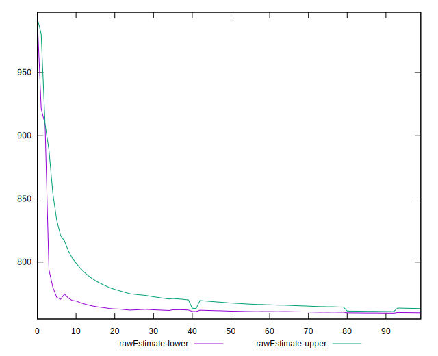
## Score Estimate

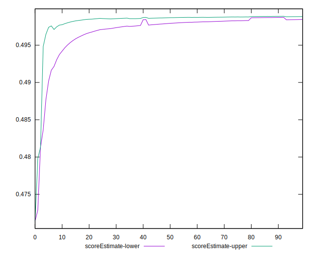
## P Score


```yaml
p90min: 0.48164705882352943
p90max: 0.49929411764705883
p90range: 0.017647058823529405
p90mean: 0.498647058823529
p90median: 0.4990588235294118
p90stdev: 0.001880924833729573
p90skewness: -7.97074916863553
p90eccentricity: 0.999999999999997
p90discretization: 5.222222222222222
outlandishness: 0.9976137880669943
confidence: 0.0015848394987254693
p90confidence: 0.0007604761535762334

```

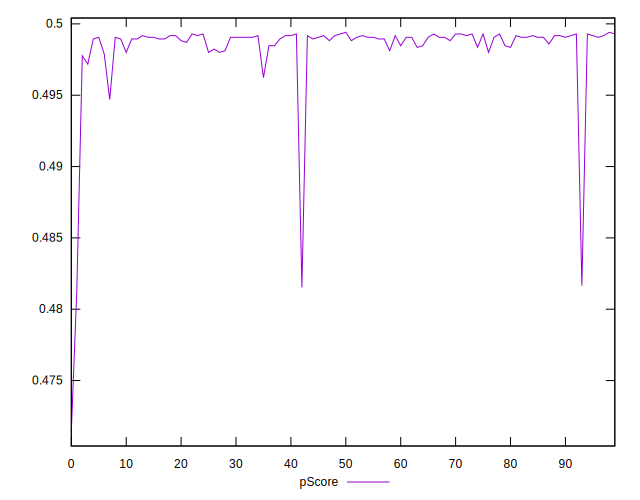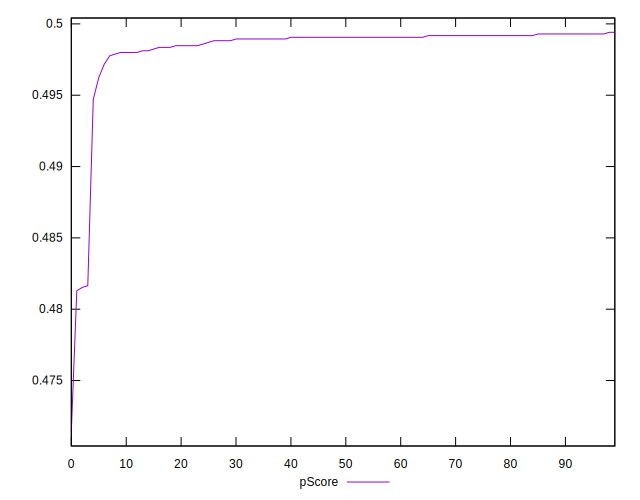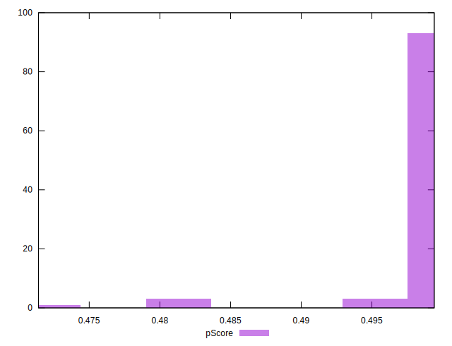
## Score Difference


```yaml
p90min: 0
p90max: 0
p90range: 0
p90mean: 0
p90median: 0
p90stdev: 0
p90skewness: .nan
p90eccentricity: .nan
p90discretization: 94
outlandishness: .inf
confidence: 2.165089820536967e-18
p90confidence: 0

```


## P Score Difference


```yaml
p90min: -0.0021176470588235574
p90max: 0.0014117647058823901
p90range: 0.0035294117647059475
p90mean: -0.00099874843554443
p90median: -0.0009411764705882231
p90stdev: 0.0005022938418311595
p90skewness: 1.4864614955049387
p90eccentricity: 1.000000000000001
p90discretization: 5.875
outlandishness: 0.9014050941891067
confidence: 0.0003547590078307413
p90confidence: 0.00020308227205623043

```

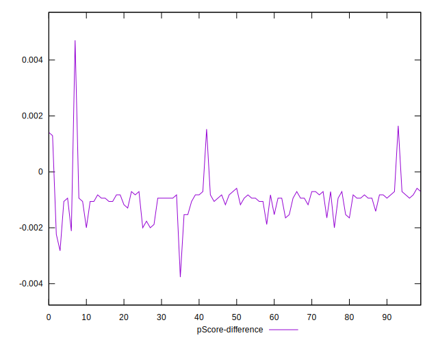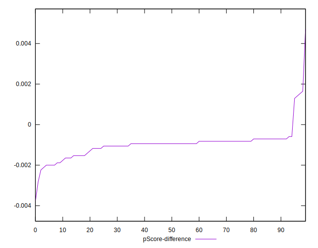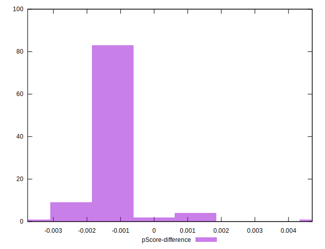