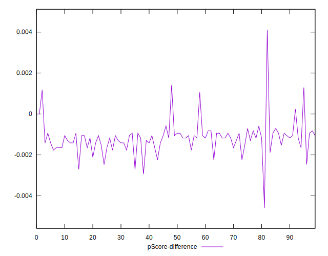

# //uses-rel-preload/samples/pages+cached

[→ Parent](../..)


## Raw


```yaml
p90min: 755
p90max: 909
p90range: 154
p90mean: 765.1702127659574
p90median: 760
p90stdev: 22.035096906966647
p90skewness: 5.897566526472192
p90eccentricity: 1.0000000000000004
p90discretization: 4.476190476190476
outlandishness: 0.9715316334913695
confidence: 44.180214172189515
p90confidence: 8.9090034003447

```


## Score


```yaml
p90min: 0.48
p90max: 0.5
p90range: 0.020000000000000018
p90mean: 0.499468085106383
p90median: 0.5
p90stdev: 0.0030482018684881733
p90skewness: -5.856608956366543
p90eccentricity: 0.9999999999999987
p90discretization: 31.333333333333332
outlandishness: 1.0381244405248367
confidence: 0.02755625720994637
p90confidence: 0.0012324175802790494

```


## Raw Estimate


## Score Estimate


## P Score


```yaml
p90min: 0.4812941176470588
p90max: 0.49941176470588233
p90range: 0.018117647058823516
p90mean: 0.49821526908635805
p90median: 0.4988235294117647
p90stdev: 0.002592364341996078
p90skewness: -5.897566526472024
p90eccentricity: 0.9999999999999989
p90discretization: 4.476190476190476
outlandishness: 1.0386057030207847
confidence: 0.027608167889400816
p90confidence: 0.0010481180470993771

```


## Score Difference


```yaml
p90min: 0
p90max: 0
p90range: 0
p90mean: 0
p90median: 0
p90stdev: 0
p90skewness: .nan
p90eccentricity: .nan
p90discretization: 94
outlandishness: .nan
confidence: 0
p90confidence: 0

```


## P Score Difference


```yaml
p90min: -0.002705882352941169
p90max: 0.0011764705882353343
p90range: 0.0038823529411765034
p90mean: -0.0011964956195244013
p90median: -0.0011764705882352788
p90stdev: 0.0005871424887578735
p90skewness: 0.9800912768155937
p90eccentricity: 1.0000000000000004
p90discretization: 4.7
outlandishness: 0.9380206163232425
confidence: 0.00037256980104820184
p90confidence: 0.00023738740296517372

```

