# //uses-rel-preload/samples/pages

[→ Parent](../..)


## Raw


```yaml
p90min: 830
p90max: 848
p90range: 18
p90mean: 838.031914893617
p90median: 838
p90stdev: 4.103584648996573
p90skewness: 0.09074511223243828
p90eccentricity: 0.9999999999999994
p90discretization: 4.947368421052632
outlandishness: 0.9610285966343931
confidence: 46.04266763936501
p90confidence: 1.65911907471368

```

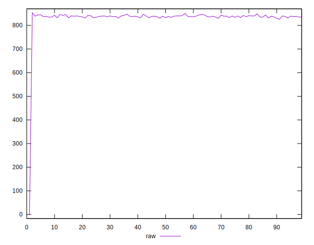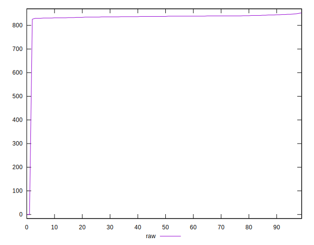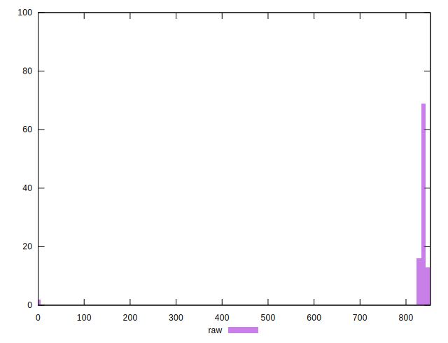
## Score


```yaml
p90min: 0.49
p90max: 0.49
p90range: 0
p90mean: 0.4900000000000001
p90median: 0.49
p90stdev: 1.1102230246251565e-16
p90skewness: -1
p90eccentricity: 1
p90discretization: 94
outlandishness: 1.042065972511454
confidence: 0.027988285699231983
p90confidence: 4.488739370326686e-17

```

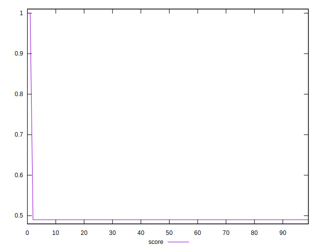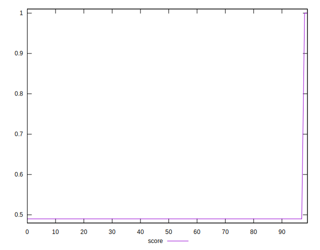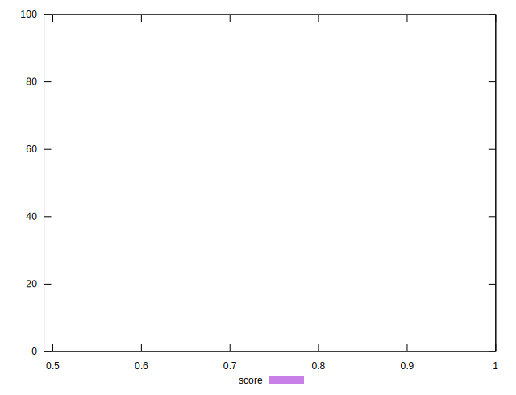
## Raw Estimate

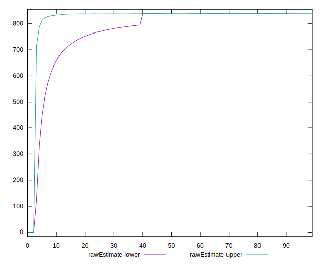
## Score Estimate

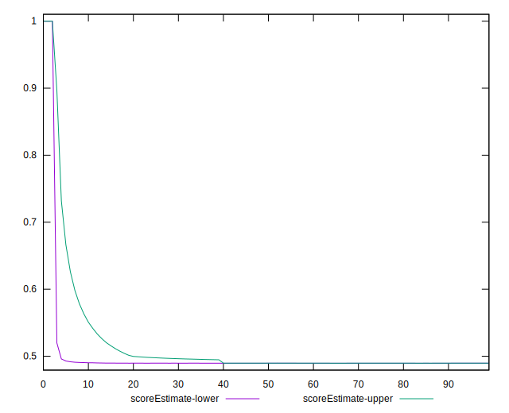
## P Score


```yaml
p90min: 0.4884705882352941
p90max: 0.49058823529411766
p90range: 0.0021176470588235574
p90mean: 0.4896433041301631
p90median: 0.48964705882352944
p90stdev: 0.00048277466458783376
p90skewness: -0.09074511223423198
p90eccentricity: 1.0000000000000002
p90discretization: 4.947368421052632
outlandishness: 1.0419948585442738
confidence: 0.028010478860423075
p90confidence: 0.00019519047937808067

```

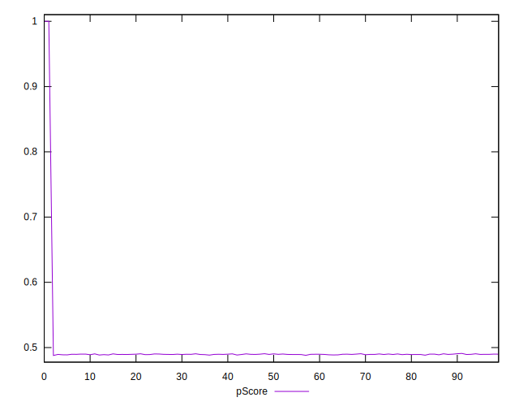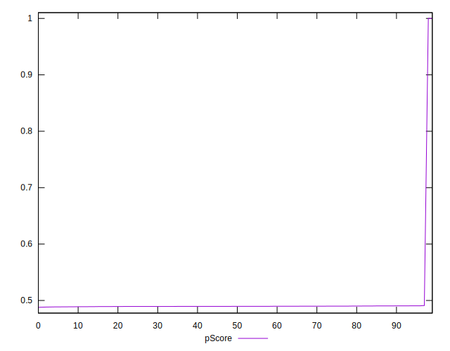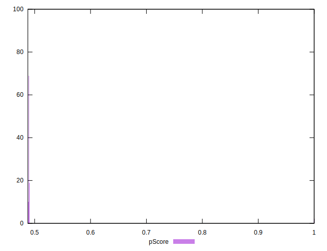
## Score Difference


```yaml
p90min: 0
p90max: 0
p90range: 0
p90mean: 0
p90median: 0
p90stdev: 0
p90skewness: .nan
p90eccentricity: .nan
p90discretization: 94
outlandishness: .nan
confidence: 0
p90confidence: 0

```


## P Score Difference


```yaml
p90min: -0.0015294117647058902
p90max: 0.0005882352941176672
p90range: 0.0021176470588235574
p90mean: -0.0003692115143929779
p90median: -0.0003529411764705559
p90stdev: 0.0004654288711610226
p90skewness: -0.18905571260273638
p90eccentricity: 0.9999999999999997
p90discretization: 4.947368421052632
outlandishness: 1.0658637586900312
confidence: 0.00021895720309217118
p90confidence: 0.00018817740685683935

```

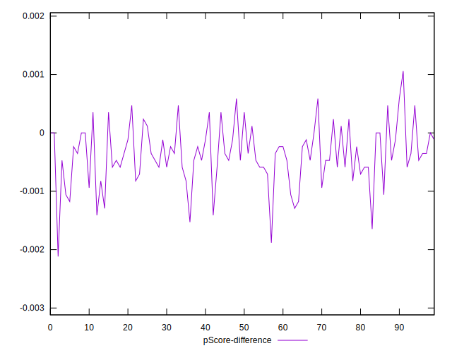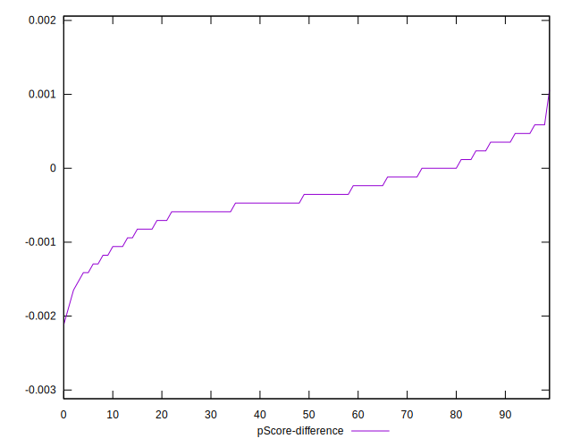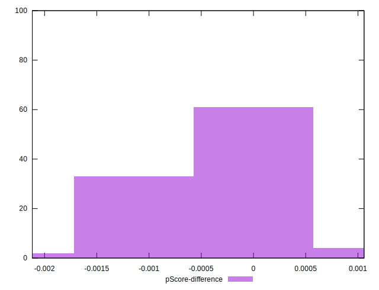