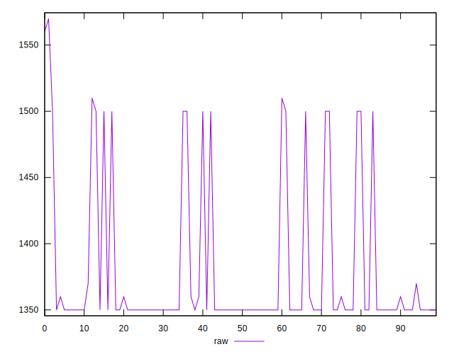

# //uses-text-compression/samples/pages+cached+noadtech+nomedia+nocss

[→ Parent](../..)


## Raw


```yaml
p90min: 1350
p90max: 1510
p90range: 160
p90mean: 1376.8085106382978
p90median: 1350
p90stdev: 56.214118881394825
p90skewness: 1.73931641659827
p90eccentricity: 0.9999999999999992
p90discretization: 18.8
outlandishness: 1.0062436825152965
confidence: 24.35341811042301
p90confidence: 22.727913490745316

```


## Score


```yaml
p90min: 0.41
p90max: 0.43
p90range: 0.020000000000000018
p90mean: 0.4265957446808509
p90median: 0.43
p90stdev: 0.007516392226661997
p90skewness: -1.7550294029239883
p90eccentricity: 1.000000000000003
p90discretization: 47
outlandishness: 0.9972089327802683
confidence: 0.0032796470386222323
p90confidence: 0.003038950279564457

```


## Raw Estimate


## Score Estimate


## P Score


```yaml
p90min: 0.41058823529411764
p90max: 0.4294117647058824
p90range: 0.01882352941176474
p90mean: 0.4262578222778475
p90median: 0.4294117647058824
p90stdev: 0.006613425750752344
p90skewness: -1.7393164165983623
p90eccentricity: 1.000000000000002
p90discretization: 18.8
outlandishness: 0.9976325028103605
confidence: 0.0028651080129909494
p90confidence: 0.0026738721753818066

```


## Score Difference


```yaml
p90min: 0
p90max: 5.551115123125783e-17
p90range: 5.551115123125783e-17
p90mean: 8.267618268485208e-18
p90median: 0
p90stdev: 1.9763387771098395e-17
p90skewness: 1.9721272054017511
p90eccentricity: 0.9999999999999997
p90discretization: 47
outlandishness: 1.3028591836734695
confidence: 8.173758983819137e-18
p90confidence: 7.990529363153346e-18

```


## P Score Difference


```yaml
p90min: -0.001764705882352946
p90max: 0.001764705882352946
p90range: 0.003529411764705892
p90mean: -0.00028785982478094825
p90median: -0.0005882352941176117
p90stdev: 0.0009231083311432111
p90skewness: 1.3677385611621078
p90eccentricity: 1.0000000000000027
p90discretization: 23.5
outlandishness: 0.7366117202268281
confidence: 0.00046367455009559014
p90confidence: 0.00037322165161167436

```

