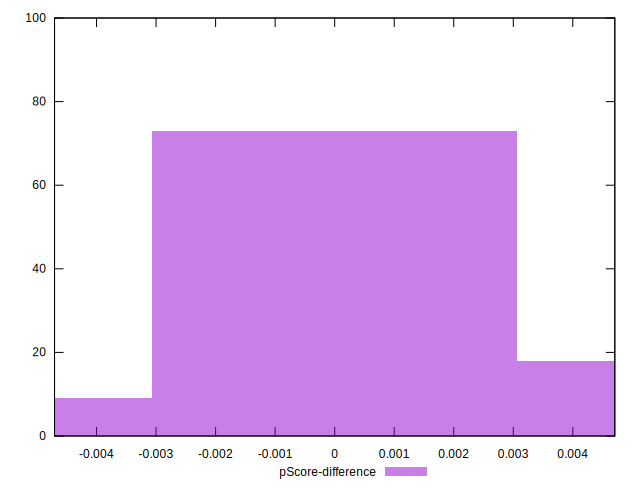

# //uses-text-compression/samples/pages+cached+noadtech+nomedia

[→ Parent](../..)


## Raw


```yaml
p90min: 2480
p90max: 2750
p90range: 270
p90mean: 2565.531914893617
p90median: 2550
p90stdev: 49.5858812540166
p90skewness: 2.4992389234401693
p90eccentricity: 1.0000000000000029
p90discretization: 7.230769230769231
outlandishness: 1.0009887996263764
confidence: 24.92087847819872
p90confidence: 20.048052729981624

```


## Score


```yaml
p90min: 0.26
p90max: 0.3
p90range: 0.03999999999999998
p90mean: 0.28723404255319107
p90median: 0.29
p90stdev: 0.006904247123228901
p90skewness: -1.901590938594698
p90eccentricity: 0.9999999999999994
p90discretization: 18.8
outlandishness: 0.9976754265569274
confidence: 0.0034035721264114843
p90confidence: 0.0027914540769829474

```


## Raw Estimate


## Score Estimate


## P Score


```yaml
p90min: 0.2647058823529412
p90max: 0.29647058823529415
p90range: 0.03176470588235297
p90mean: 0.2864080100125159
p90median: 0.28823529411764703
p90stdev: 0.0058336330887078375
p90skewness: -2.499238923440362
p90eccentricity: 0.9999999999999983
p90discretization: 7.230769230769231
outlandishness: 0.9989584954109617
confidence: 0.0029318680562586694
p90confidence: 0.002358594438821369

```


## Score Difference


```yaml
p90min: 0
p90max: 0
p90range: 0
p90mean: 0
p90median: 0
p90stdev: 0
p90skewness: .nan
p90eccentricity: .nan
p90discretization: 94
outlandishness: .nan
confidence: 0
p90confidence: 0

```


## P Score Difference


```yaml
p90min: -0.004117647058823559
p90max: 0.004705882352941171
p90range: 0.00882352941176473
p90mean: -0.0006946182728410615
p90median: -0.001764705882352946
p90stdev: 0.0024941406207726435
p90skewness: 1.2259596806620896
p90eccentricity: 1
p90discretization: 6.266666666666667
outlandishness: 0.8520454183913666
confidence: 0.0010455884727408006
p90confidence: 0.001008405243925935

```

