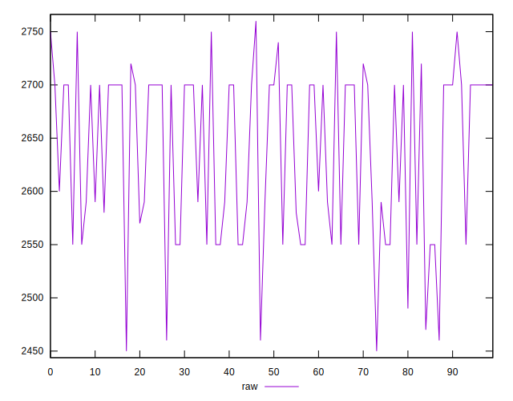
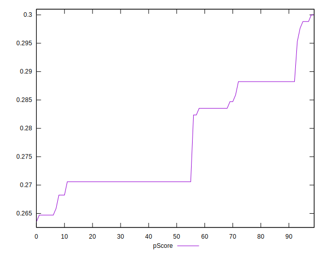
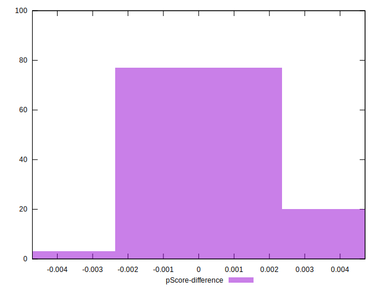

# //uses-text-compression/samples/pages+cached+noadtech

[→ Parent](../..)


## Raw


```yaml
p90min: 2460
p90max: 2750
p90range: 290
p90mean: 2640.9574468085107
p90median: 2700
p90stdev: 77.77585290827017
p90skewness: -0.4882445550516863
p90eccentricity: 1.0000000000000002
p90discretization: 7.833333333333333
outlandishness: 0.9982911636860236
confidence: 33.070139569777766
p90confidence: 31.44553168746983

```


## Score


```yaml
p90min: 0.26
p90max: 0.3
p90range: 0.03999999999999998
p90mean: 0.2771276595744678
p90median: 0.27
p90stdev: 0.010065988702803176
p90skewness: 0.5976659055237388
p90eccentricity: 1.0000000000000007
p90discretization: 18.8
outlandishness: 1.0012441487321375
confidence: 0.004288874143293522
p90confidence: 0.004069776863688407

```


## Raw Estimate


## Score Estimate


## P Score


```yaml
p90min: 0.2647058823529412
p90max: 0.2988235294117647
p90range: 0.03411764705882353
p90mean: 0.27753441802252826
p90median: 0.27058823529411763
p90stdev: 0.009150100342149425
p90skewness: 0.4882445550516479
p90eccentricity: 1.0000000000000002
p90discretization: 7.833333333333333
outlandishness: 1.001914782688998
confidence: 0.0038906046552679694
p90confidence: 0.003699474316172918

```


## Score Difference


```yaml
p90min: 0
p90max: 0
p90range: 0
p90mean: 0
p90median: 0
p90stdev: 0
p90skewness: .nan
p90eccentricity: .nan
p90discretization: 94
outlandishness: .nan
confidence: 0
p90confidence: 0

```


## P Score Difference


```yaml
p90min: -0.002352941176470613
p90max: 0.004705882352941171
p90range: 0.007058823529411784
p90mean: 0.0005193992490612995
p90median: 0.0005882352941176117
p90stdev: 0.0019183364144421046
p90skewness: 0.5754534625995268
p90eccentricity: 0.9999999999999999
p90discretization: 8.545454545454545
outlandishness: 0.9266961823196417
confidence: 0.0008487088779391782
p90confidence: 0.0007756020185173964

```

