# //uses-webp-images/samples/pages+cached+noadtech

[→ Parent](../..)


## Raw


```yaml
p90min: 450
p90max: 610
p90range: 160
p90mean: 465.4255319148936
p90median: 450
p90stdev: 43.55639273541049
p90skewness: 2.929283910646182
p90eccentricity: 1.0000000000000033
p90discretization: 18.8
outlandishness: 1.011093453844898
confidence: 20.52635387626677
p90confidence: 17.610272041228765

```

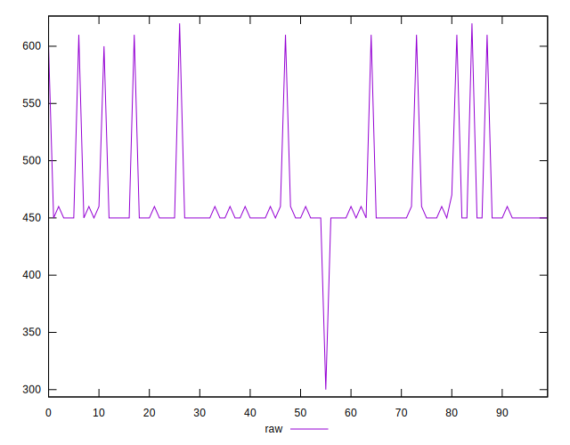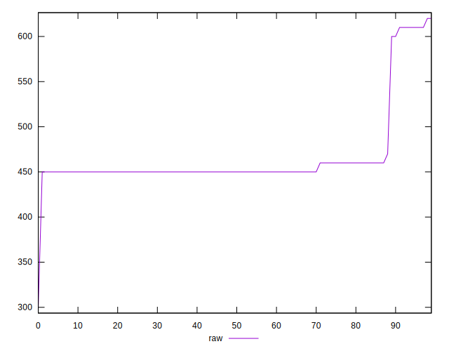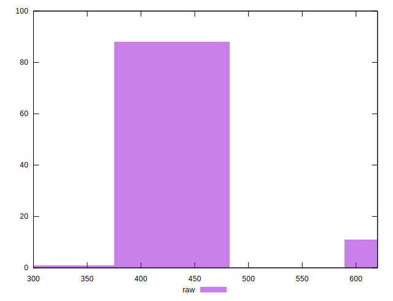
## Score


```yaml
p90min: 0.58
p90max: 0.67
p90range: 0.09000000000000008
p90mean: 0.6604255319148942
p90median: 0.67
p90stdev: 0.024836267819162223
p90skewness: -2.848470793915523
p90eccentricity: 0.9999999999999987
p90discretization: 31.333333333333332
outlandishness: 0.9953854903819649
confidence: 0.01167974096703184
p90confidence: 0.010041543969013904

```

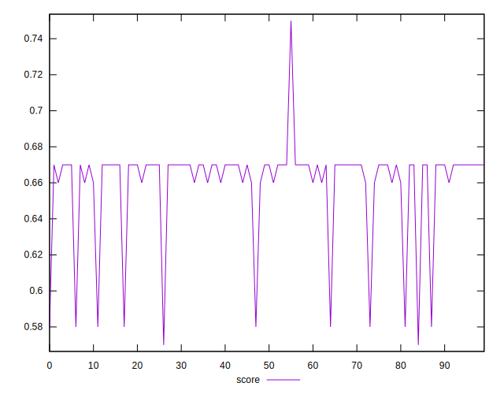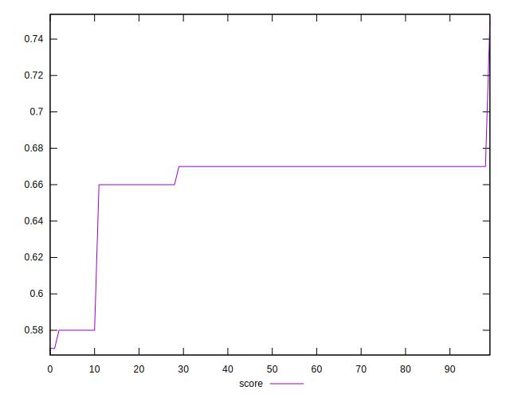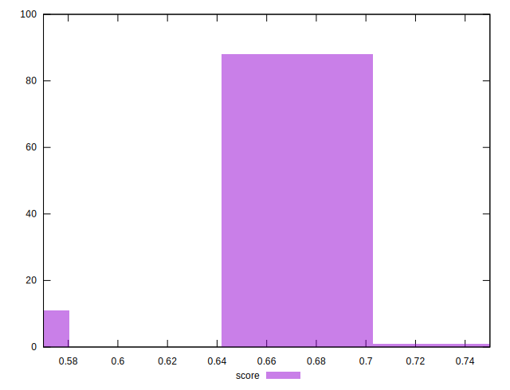
## Raw Estimate

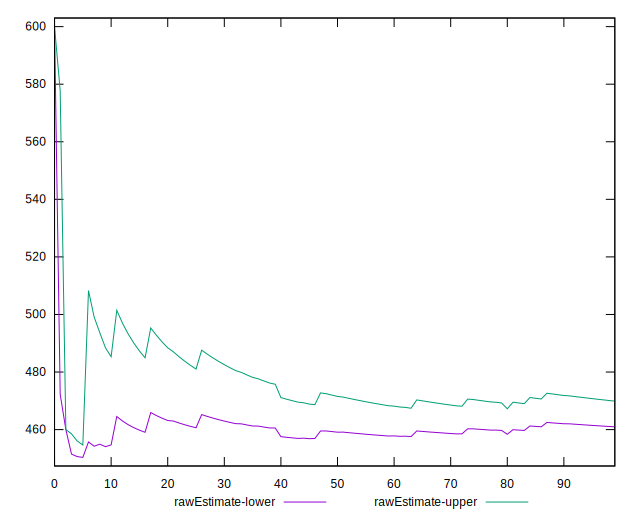
## Score Estimate

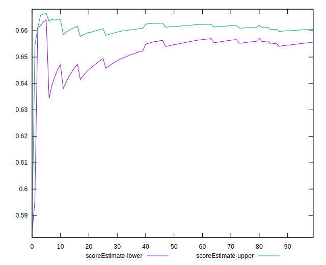
## P Score


```yaml
p90min: 0.5777777777777777
p90max: 0.6666666666666666
p90range: 0.0888888888888889
p90mean: 0.6580969267139473
p90median: 0.6666666666666666
p90stdev: 0.02419799596411694
p90skewness: -2.9292839106461037
p90eccentricity: 0.9999999999999994
p90discretization: 18.8
outlandishness: 0.995658068659343
confidence: 0.011403529931259326
p90confidence: 0.009783484467349316

```

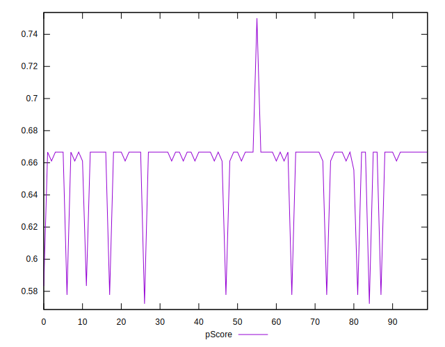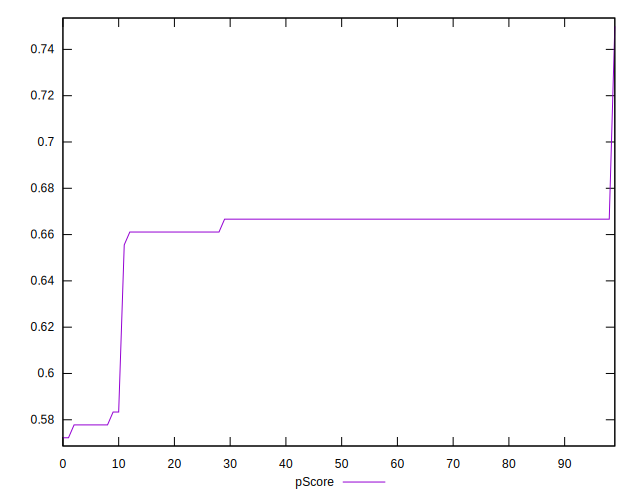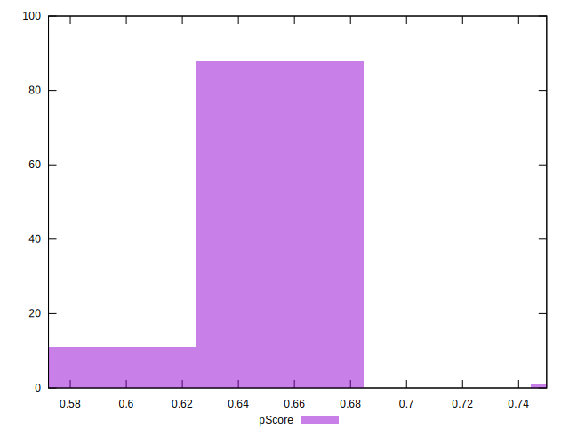
## Score Difference


```yaml
p90min: 0
p90max: 0
p90range: 0
p90mean: 0
p90median: 0
p90stdev: 0
p90skewness: .nan
p90eccentricity: .nan
p90discretization: 94
outlandishness: .inf
confidence: 6.092792000602807e-18
p90confidence: 0

```

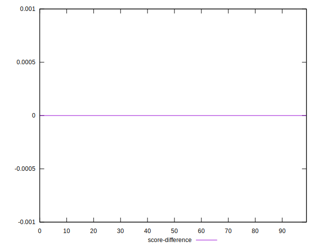
## P Score Difference


```yaml
p90min: -0.0033333333333334103
p90max: 0.0022222222222222365
p90range: 0.005555555555555647
p90mean: -0.002352245862884226
p90median: -0.0033333333333334103
p90stdev: 0.0017743494053926536
p90skewness: 1.429738755031431
p90eccentricity: 0.9999999999999992
p90discretization: 18.8
outlandishness: 0.9014500542915579
confidence: 0.0007705499707525181
p90confidence: 0.0007173866742126724

```

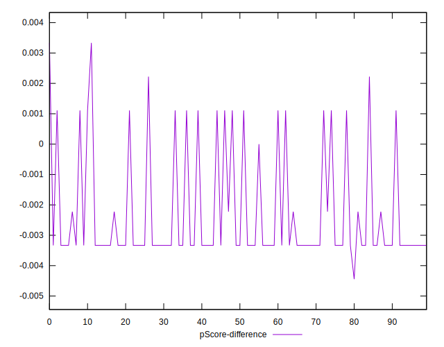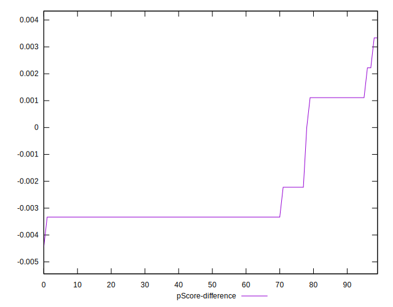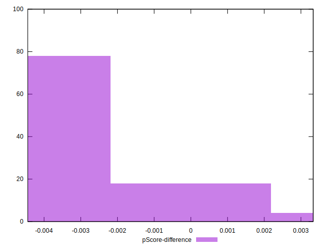