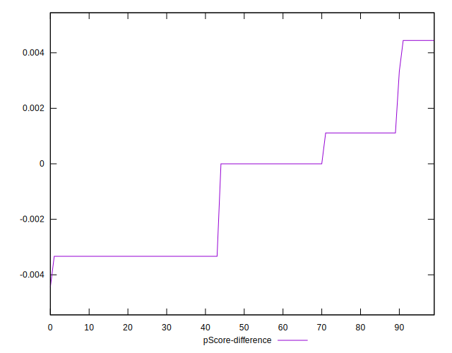

# //uses-webp-images/samples/pages+cached

[→ Parent](../..)


## Raw


```yaml
p90min: 300
p90max: 460
p90range: 160
p90mean: 398.51063829787233
p90median: 450
p90stdev: 71.32421400792228
p90skewness: -0.5631482202872947
p90eccentricity: 1.0000000000000002
p90discretization: 13.428571428571429
outlandishness: 0.9964367090263785
confidence: 28.389481254825395
p90confidence: 28.837071504895217

```


## Score


```yaml
p90min: 0.66
p90max: 0.75
p90range: 0.08999999999999997
p90mean: 0.6961702127659577
p90median: 0.67
p90stdev: 0.038290779485037264
p90skewness: 0.5523217346902507
p90eccentricity: 0.9999999999999994
p90discretization: 13.428571428571429
outlandishness: 1.0009476571700462
confidence: 0.01529651126134581
p90confidence: 0.015481333532333729

```


## Raw Estimate


## Score Estimate


## P Score


```yaml
p90min: 0.6611111111111111
p90max: 0.75
p90range: 0.0888888888888889
p90mean: 0.6952718676122931
p90median: 0.6666666666666666
p90stdev: 0.03962456333773462
p90skewness: 0.5631482202873309
p90eccentricity: 0.9999999999999997
p90discretization: 13.428571428571429
outlandishness: 1.0011359905756199
confidence: 0.015771934030458543
p90confidence: 0.01602059528049735

```


## Score Difference


```yaml
p90min: 0
p90max: 0
p90range: 0
p90mean: 0
p90median: 0
p90stdev: 0
p90skewness: .nan
p90eccentricity: .nan
p90discretization: 94
outlandishness: .nan
confidence: 0
p90confidence: 0

```


## P Score Difference


```yaml
p90min: -0.0033333333333334103
p90max: 0.004444444444444473
p90range: 0.007777777777777883
p90mean: -0.0009101654846336093
p90median: 0
p90stdev: 0.0023762393443264233
p90skewness: 0.46896370888277794
p90eccentricity: 1.000000000000001
p90discretization: 13.428571428571429
outlandishness: 0.8382948220610598
confidence: 0.0009920067610370766
p90confidence: 0.000960736614321122

```

