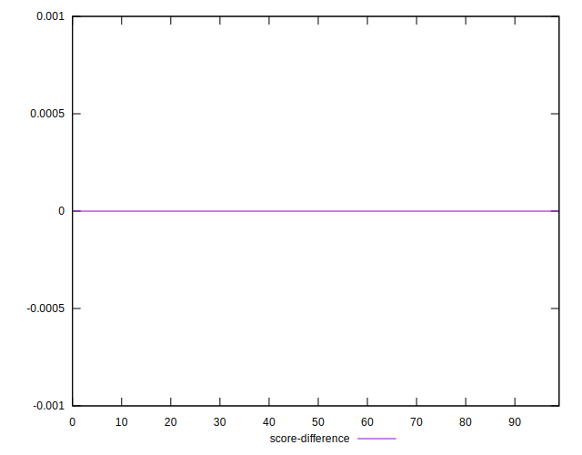

# //uses-webp-images/samples/pages

[→ Parent](../..)


## Raw


```yaml
p90min: 300
p90max: 500
p90range: 200
p90mean: 422.5531914893617
p90median: 450
p90stdev: 57.388859661250066
p90skewness: -1.4691888966162705
p90eccentricity: 0.9999999999999982
p90discretization: 7.833333333333333
outlandishness: 1.0073346489119708
confidence: 26.161488844901445
p90confidence: 23.202872581982398

```


## Score


```yaml
p90min: 0.64
p90max: 0.75
p90range: 0.10999999999999999
p90mean: 0.684255319148937
p90median: 0.67
p90stdev: 0.03068332979038949
p90skewness: 1.4432434487221946
p90eccentricity: 0.9999999999999988
p90discretization: 11.75
outlandishness: 0.9969178015395658
confidence: 0.014240510795893911
p90confidence: 0.012405567835286105

```


## Raw Estimate


## Score Estimate


## P Score


```yaml
p90min: 0.6388888888888888
p90max: 0.75
p90range: 0.11111111111111116
p90mean: 0.6819148936170207
p90median: 0.6666666666666666
p90stdev: 0.03188269981180557
p90skewness: 1.4691888966163424
p90eccentricity: 1.0000000000000007
p90discretization: 7.833333333333333
outlandishness: 0.9974812205816953
confidence: 0.014534160469389698
p90confidence: 0.01289048476776799

```


## Score Difference


```yaml
p90min: 0
p90max: 0
p90range: 0
p90mean: 0
p90median: 0
p90stdev: 0
p90skewness: .nan
p90eccentricity: .nan
p90discretization: 94
outlandishness: .inf
confidence: 4.330179641073934e-18
p90confidence: 0

```


## P Score Difference


```yaml
p90min: -0.0033333333333334103
p90max: 0.0033333333333334103
p90range: 0.006666666666666821
p90mean: -0.002316784869976413
p90median: -0.0033333333333334103
p90stdev: 0.0017876467683602768
p90skewness: 1.5791225555555772
p90eccentricity: 0.9999999999999994
p90discretization: 9.4
outlandishness: 0.8567580279050415
confidence: 0.0008200679184532259
p90confidence: 0.0007227629270330862

```

