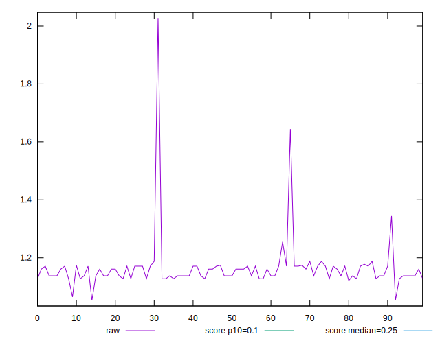
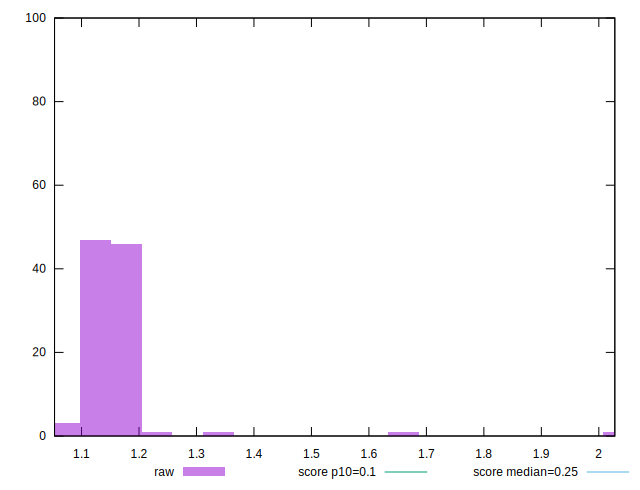
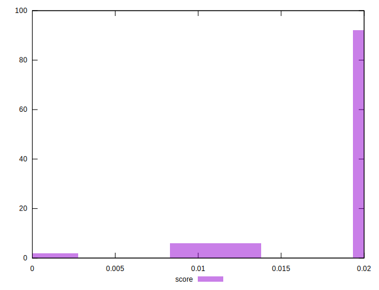
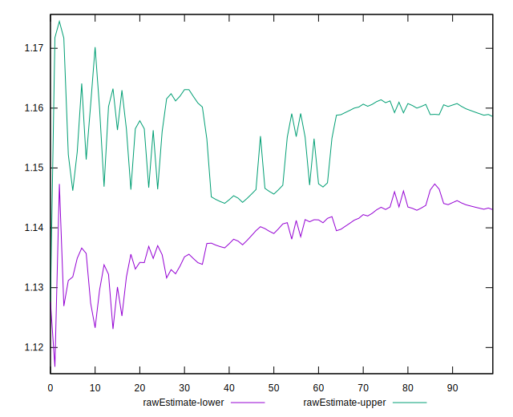
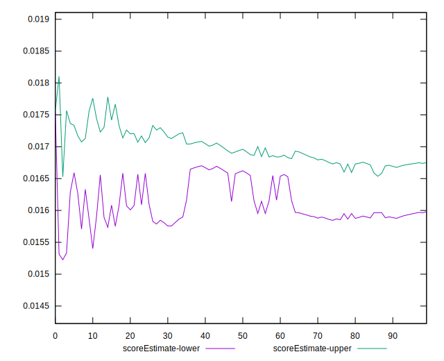
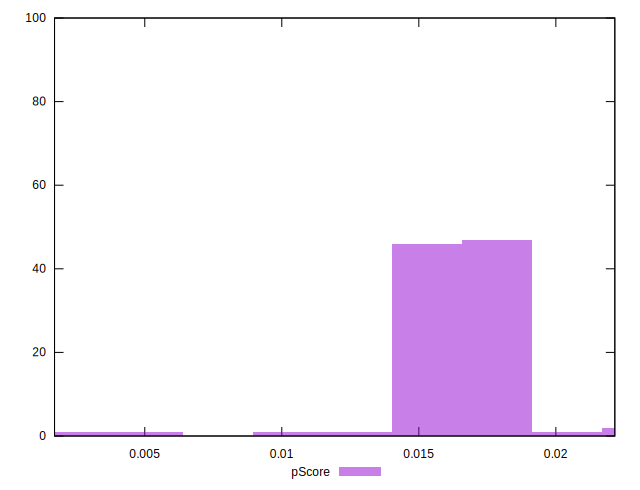
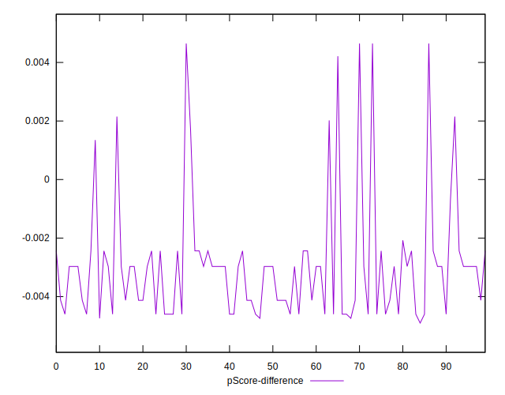
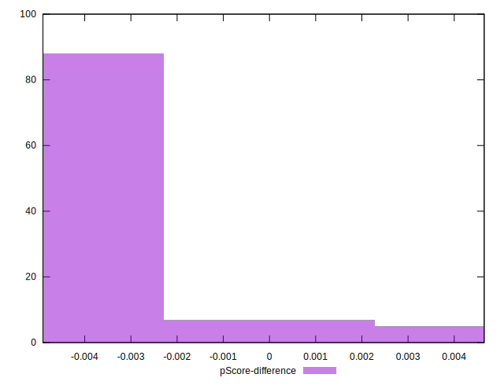

# //cumulative-layout-shift/samples/pages+cached+noadtech

[→ Parent](../..)


## Raw


```yaml
p90min: 1.121005854288737
p90max: 1.254915256076389
p90range: 0.1339094017876521
p90mean: 1.15261683790058
median: 1.1493086454603407
p90stdev: 0.021757450071361272
mad: 0.021671926710340683
stdevBySn: 0.03968436026475714
p90skewness: 1.0866025275796987
p90eccentricity: 1
p90discretization: 10.444444444444445
outlandishness: 1.0221831573312572
confidence: 0.0411187351027421
p90confidence: 0.008796748091781877

```


## Score


```yaml
p90min: 0.01
p90max: 0.02
p90range: 0.01
p90mean: 0.019468085106382992
median: 0.02
p90stdev: 0.002244151394652017
mad: 0
stdevBySn: 0
p90skewness: -3.9819818903758444
p90eccentricity: 1.0000000000000022
p90discretization: 47
outlandishness: 0.952490668577742
confidence: 0.0014133501288643754
p90confidence: 0.0009073321751320301

```


## Raw Estimate


## Score Estimate


## P Score


```yaml
p90min: 0.012019729808344648
p90max: 0.017922802277053063
p90range: 0.005903072468708415
p90mean: 0.016315189626411774
median: 0.01645152645613024
p90stdev: 0.0010373120851484075
mad: 0.0010526425509995718
stdevBySn: 0.0019455169567049679
p90skewness: -0.7159415093990013
p90eccentricity: 1.0000000000000022
p90discretization: 10.444444444444445
outlandishness: 0.9792749211790216
confidence: 0.0009605725904720023
p90confidence: 0.00041939533703089975

```


## Score Difference


```yaml
p90min: 0
p90max: 0
p90range: 0
p90mean: 0
median: 0
p90stdev: 0
mad: 0
stdevBySn: 0
p90skewness: .nan
p90eccentricity: .nan
p90discretization: 94
outlandishness: .nan
confidence: 0
p90confidence: 0

```


## P Score Difference


```yaml
p90min: -0.004742450509566603
p90max: 0.00464798855058913
p90range: 0.009390439060155733
p90mean: -0.003032243344274018
median: -0.002969792133184806
p90stdev: 0.0018559222981937393
mad: 0.0011573628213699116
stdevBySn: 0.0019455169567049679
p90skewness: 2.218430029934039
p90eccentricity: 1.0000000000000007
p90discretization: 7.230769230769231
outlandishness: 0.886363404379766
confidence: 0.0008825852434111576
p90confidence: 0.0007503673859567202

```

