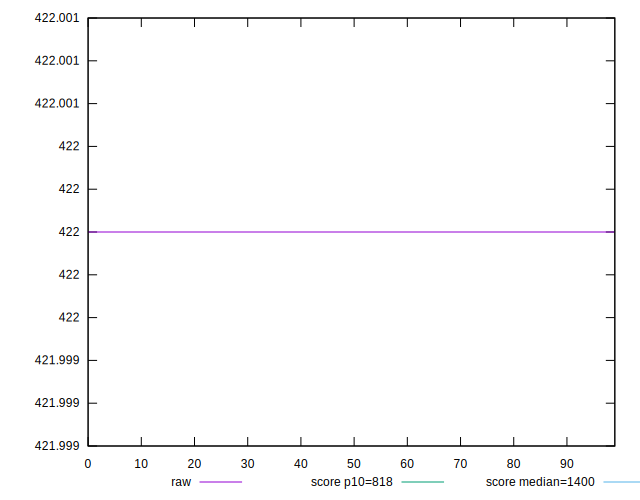
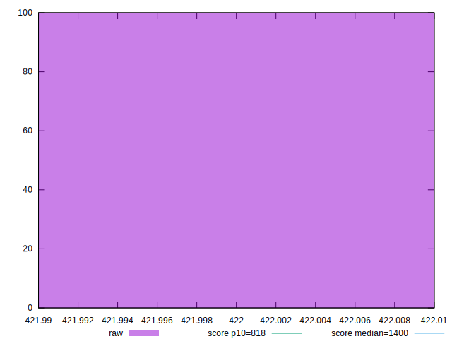
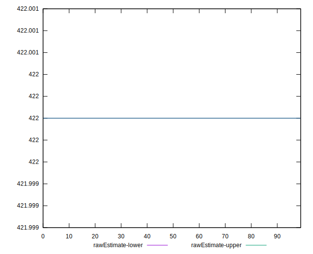
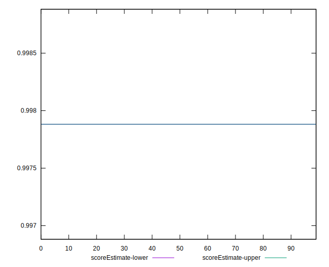
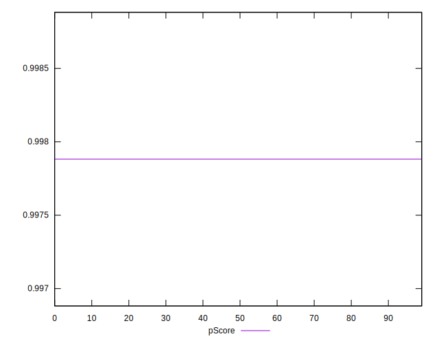
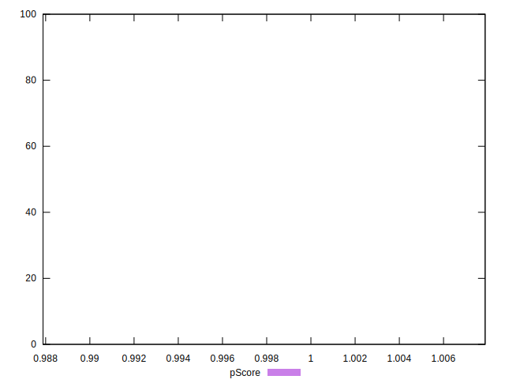
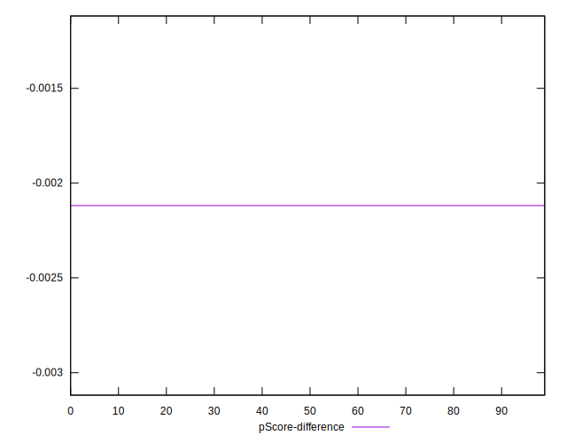
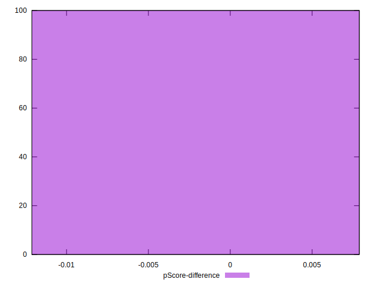

# //dom-size/samples/pages+cached

[→ Parent](../..)


## Raw


```yaml
p90min: 422
p90max: 422
p90range: 0
p90mean: 422
median: 422
p90stdev: 0
mad: 0
stdevBySn: 0
p90skewness: .nan
p90eccentricity: .nan
p90discretization: 94
outlandishness: 1
confidence: 0
p90confidence: 0

```


## Score


```yaml
p90min: 1
p90max: 1
p90range: 0
p90mean: 1
median: 1
p90stdev: 0
mad: 0
stdevBySn: 0
p90skewness: .nan
p90eccentricity: .nan
p90discretization: 94
outlandishness: 1
confidence: 0
p90confidence: 0

```


## Raw Estimate


## Score Estimate


## P Score


```yaml
p90min: 0.9978817385378554
p90max: 0.9978817385378554
p90range: 0
p90mean: 0.9978817385378561
median: 0.9978817385378554
p90stdev: 6.661338147750939e-16
mad: 0
stdevBySn: 0
p90skewness: -1
p90eccentricity: 1
p90discretization: 94
outlandishness: 1
confidence: 2.61119657168692e-16
p90confidence: 2.6932436221960113e-16

```


## Score Difference


```yaml
p90min: 0
p90max: 0
p90range: 0
p90mean: 0
median: 0
p90stdev: 0
mad: 0
stdevBySn: 0
p90skewness: .nan
p90eccentricity: .nan
p90discretization: 94
outlandishness: .nan
confidence: 0
p90confidence: 0

```


## P Score Difference


```yaml
p90min: -0.002118261462144555
p90max: -0.002118261462144555
p90range: 0
p90mean: -0.002118261462144555
median: -0.002118261462144555
p90stdev: 0
mad: 0
stdevBySn: 0
p90skewness: .nan
p90eccentricity: .nan
p90discretization: 94
outlandishness: 1
confidence: 0
p90confidence: 0

```

