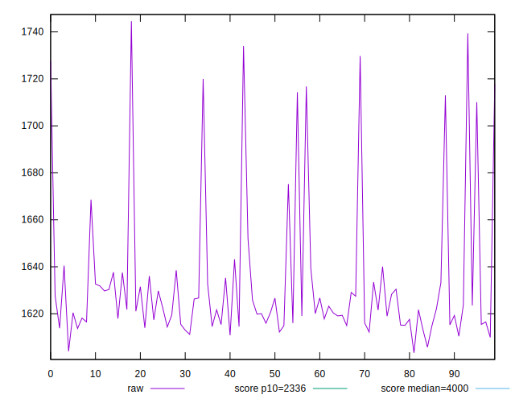
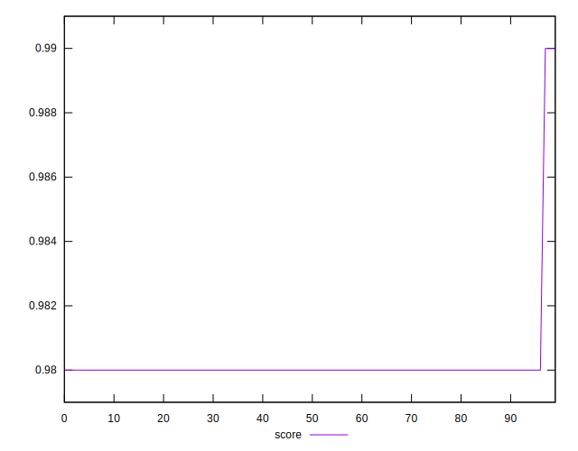
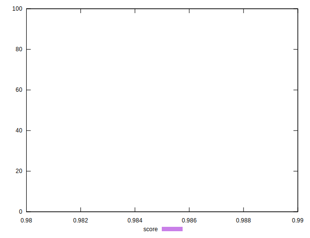
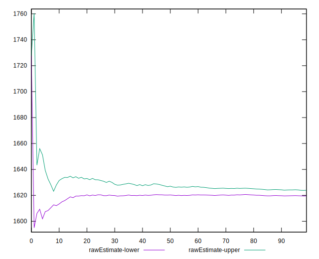
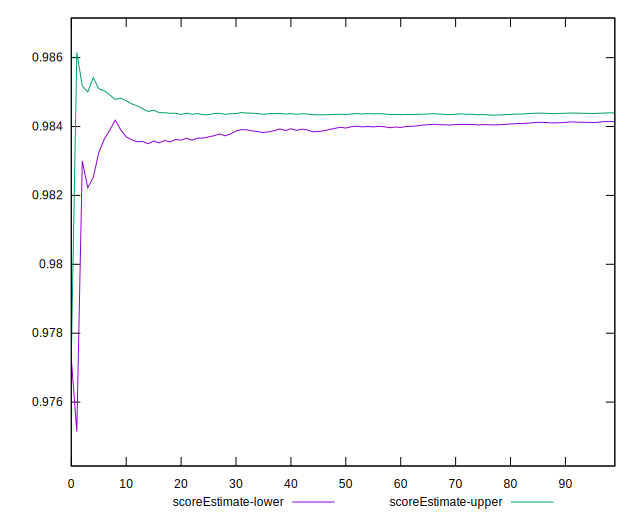
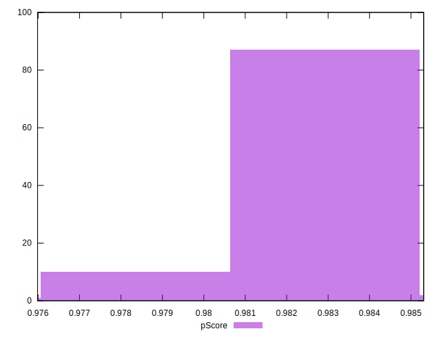
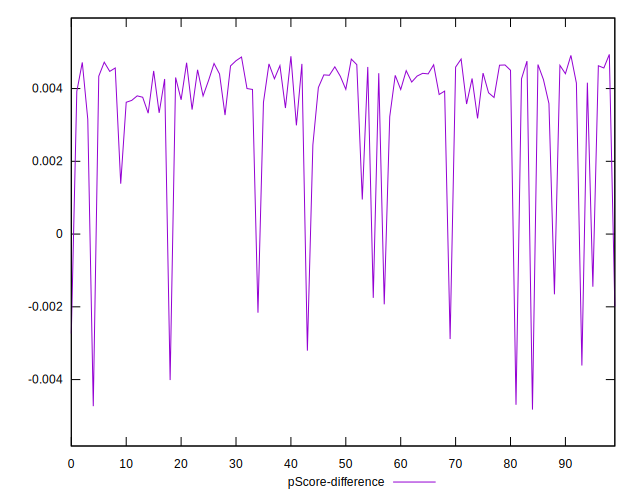
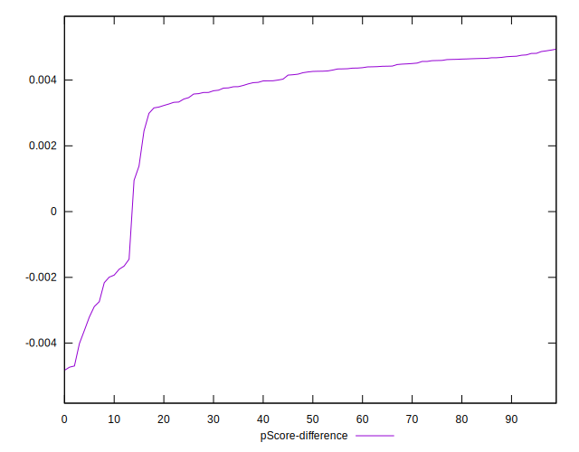
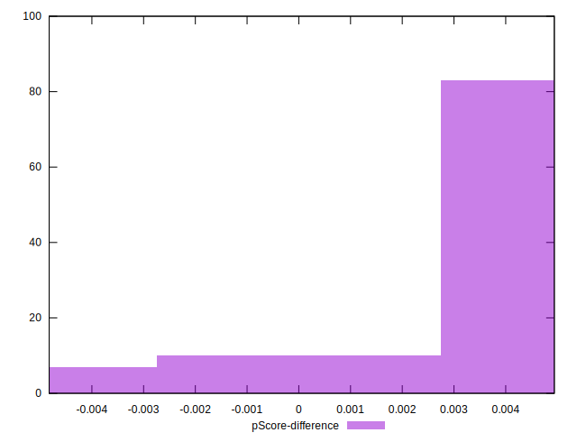

# //first-contentful-paint/samples/pages+cached+noadtech+nomedia+nocss

[→ Parent](../..)


## Raw


```yaml
p90min: 1609.9473
p90max: 1729.747
p90range: 119.79970000000003
p90mean: 1631.894794148937
median: 1621.610325
p90stdev: 28.711766792787195
mad: 7.04910000000018
stdevBySn: 11.187273745000434
p90skewness: 2.3591127781201227
p90eccentricity: 1.0000000000000002
p90discretization: 1
outlandishness: 1.00294016274585
confidence: 13.227081297392427
p90confidence: 11.608445792946489

```


## Score


```yaml
p90min: 0.98
p90max: 0.98
p90range: 0
p90mean: 0.9800000000000002
median: 0.98
p90stdev: 2.220446049250313e-16
mad: 0
stdevBySn: 0
p90skewness: -1
p90eccentricity: 1
p90discretization: 94
outlandishness: 1.0006123386089132
confidence: 0.0006686896191274365
p90confidence: 8.977478740653372e-17

```


## Raw Estimate


## Score Estimate


## P Score


```yaml
p90min: 0.9771131422989212
p90max: 0.9849392941941479
p90range: 0.00782615189522673
p90mean: 0.983606749584116
median: 0.9842733888149724
p90stdev: 0.0018579606283229179
mad: 0.0004048530595744948
stdevBySn: 0.0006406103745674311
p90skewness: -2.4510587195357214
p90eccentricity: 1.0000000000000002
p90discretization: 1
outlandishness: 0.9996599812572757
confidence: 0.0008645244281363513
p90confidence: 0.0007511915025979379

```


## Score Difference


```yaml
p90min: 0
p90max: 0
p90range: 0
p90mean: 0
median: 0
p90stdev: 0
mad: 0
stdevBySn: 0
p90skewness: .nan
p90eccentricity: .nan
p90discretization: 94
outlandishness: .nan
confidence: 0
p90confidence: 0

```


## P Score Difference


```yaml
p90min: -0.00401284546750813
p90max: 0.004866918849843915
p90range: 0.008879764317352046
p90mean: 0.0033347080848041394
median: 0.004254180092744808
p90stdev: 0.002233727159127779
mad: 0.0004206628530440959
stdevBySn: 0.0006635186966960715
p90skewness: -2.1330943166075396
p90eccentricity: 0.9999999999999988
p90discretization: 1
outlandishness: 0.8863575064543677
confidence: 0.001013732488537675
p90confidence: 0.0009031175556037599

```

