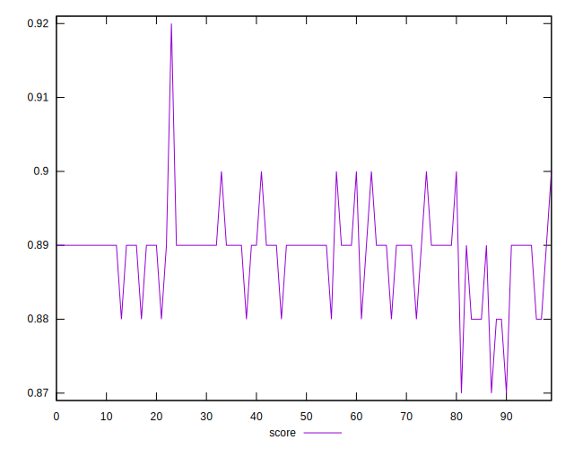
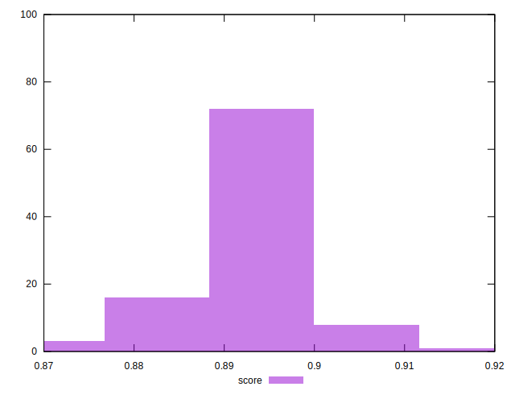
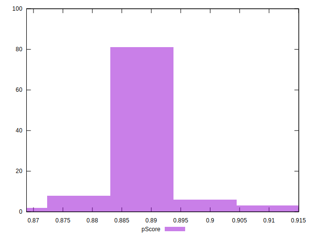

# //first-contentful-paint/samples/pages+cached+noadtech+nomedia

[→ Parent](../..)


## Raw


```yaml
p90min: 2313.4725
p90max: 2443.8225
p90range: 130.35000000000036
p90mean: 2399.5595968085104
median: 2401.660125
p90stdev: 23.331826066704657
mad: 10.052999999999656
stdevBySn: 18.691321649999672
p90skewness: -1.3089122825835304
p90eccentricity: 1.0000000000000002
p90discretization: 1
outlandishness: 0.9994002467071877
confidence: 13.173431242986908
p90confidence: 9.433283576747263

```


## Score


```yaml
p90min: 0.88
p90max: 0.9
p90range: 0.020000000000000018
p90mean: 0.8889361702127663
median: 0.89
p90stdev: 0.004719377236769969
mad: 0
stdevBySn: 0
p90skewness: -0.3243811490573091
p90eccentricity: 0.9999999999999997
p90discretization: 31.333333333333332
outlandishness: 0.9999186230055492
confidence: 0.002593973644879193
p90confidence: 0.0019080899905913296

```


## Raw Estimate


## Score Estimate


## P Score


```yaml
p90min: 0.8798095661137249
p90max: 0.903992380027704
p90range: 0.02418281391397914
p90mean: 0.8882684625552617
median: 0.8879126705910575
p90stdev: 0.004350018870744887
mad: 0.001893260976929767
stdevBySn: 0.003525348215306426
p90skewness: 1.2152504315894432
p90eccentricity: 0.9999999999999999
p90discretization: 1
outlandishness: 1.0002061206197848
confidence: 0.002447494548095991
p90confidence: 0.001758754820759476

```


## Score Difference


```yaml
p90min: 0
p90max: 0
p90range: 0
p90mean: 0
median: 0
p90stdev: 0
mad: 0
stdevBySn: 0
p90skewness: .nan
p90eccentricity: .nan
p90discretization: 94
outlandishness: .nan
confidence: 0
p90confidence: 0

```


## P Score Difference


```yaml
p90min: -0.004498228907307111
p90max: 0.004655744175141363
p90range: 0.009153973082448474
p90mean: -0.0005734111824993017
median: -0.0008604991865374667
p90stdev: 0.002478035799478873
mad: 0.00211555365419297
stdevBySn: 0.002761018143357396
p90skewness: 0.42502554063685116
p90eccentricity: 0.9999999999999992
p90discretization: 1
outlandishness: 0.886850221800173
confidence: 0.0010475144474997515
p90confidence: 0.001001893908474409

```

