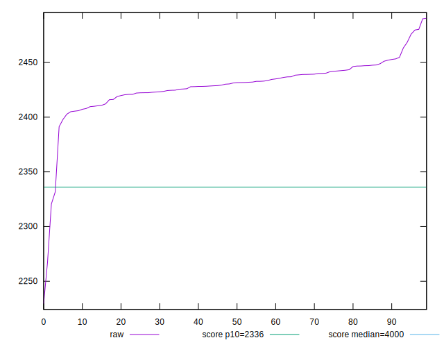
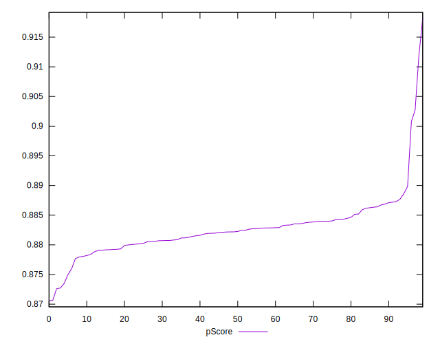

# //first-contentful-paint/samples/pages+cached+noadtech

[→ Parent](../..)


## Raw


```yaml
p90min: 2331.705
p90max: 2479.665
p90range: 147.96000000000004
p90mean: 2430.4703457446817
median: 2431.4025
p90stdev: 18.792575469107756
mad: 9.719250000000102
stdevBySn: 16.417629749999612
p90skewness: -1.2703145531578166
p90eccentricity: 1.0000000000000002
p90discretization: 1
outlandishness: 0.9974918869505807
confidence: 13.637960216646634
p90confidence: 7.598020533441932

```


## Score


```yaml
p90min: 0.87
p90max: 0.9
p90range: 0.030000000000000027
p90mean: 0.8814893617021277
median: 0.88
p90stdev: 0.004602831415485947
mad: 0
stdevBySn: 0
p90skewness: 1.1772563459416898
p90eccentricity: 0.9999999999999994
p90discretization: 23.5
outlandishness: 1.0011589163159271
confidence: 0.0027718076486993614
p90confidence: 0.0018609693846553036

```


## Raw Estimate


## Score Estimate


## P Score


```yaml
p90min: 0.8727199345700497
p90max: 0.9007673164263813
p90range: 0.0280473818563316
p90mean: 0.882377936040875
median: 0.8822235238159402
p90stdev: 0.0035997157059034063
mad: 0.0018808007584869002
stdevBySn: 0.003159842898149303
p90skewness: 1.1109795412842551
p90eccentricity: 1.0000000000000002
p90discretization: 1
outlandishness: 1.0011876585306485
confidence: 0.0025199713948866687
p90confidence: 0.0014553999739401378

```


## Score Difference


```yaml
p90min: 0
p90max: 0
p90range: 0
p90mean: 0
median: 0
p90stdev: 0
mad: 0
stdevBySn: 0
p90skewness: .nan
p90eccentricity: .nan
p90discretization: 94
outlandishness: .nan
confidence: 0
p90confidence: 0

```


## P Score Difference


```yaml
p90min: -0.004008720230658347
p90max: 0.004320240278603449
p90range: 0.008328960509261796
p90mean: 0.0009556437364699029
median: 0.0012211421595848537
p90stdev: 0.002290742894029733
mad: 0.0017915142331811351
stdevBySn: 0.00271041949297992
p90skewness: -0.49627750597015546
p90eccentricity: 1.0000000000000002
p90discretization: 1
outlandishness: 0.8904144668137774
confidence: 0.0009816613519996542
p90confidence: 0.0009261695702265804

```

