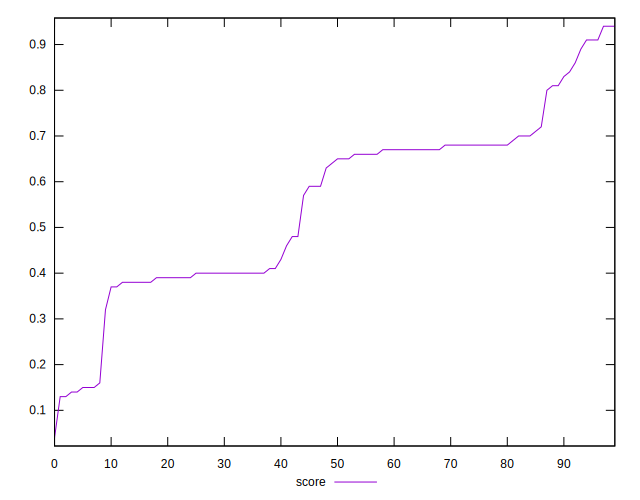
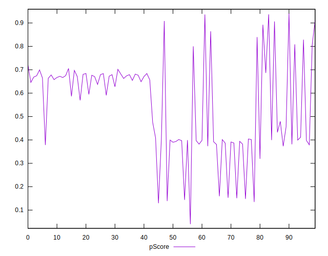
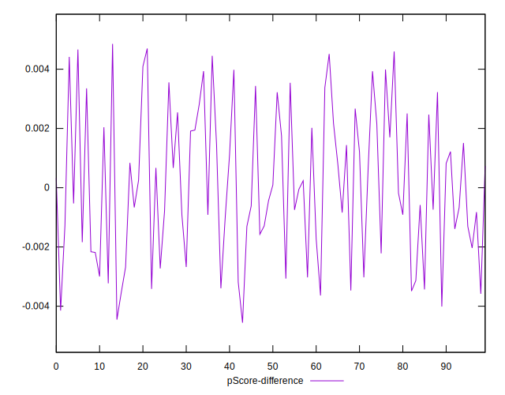

# //first-contentful-paint/samples/pages

[→ Parent](../..)


## Raw


```yaml
p90min: 2274.3289999999997
p90max: 6309.976499999999
p90range: 4035.647499999999
p90mean: 3855.744436170214
median: 3435.2810000000004
p90stdev: 897.965851420763
mad: 776.9949999999999
stdevBySn: 1020.3569560999998
p90skewness: 0.8070589119673378
p90eccentricity: 0.9999999999999989
p90discretization: 1
outlandishness: 1.0223473174485525
confidence: 425.61665652821085
p90confidence: 363.0563032001786

```


## Score


```yaml
p90min: 0.14
p90max: 0.91
p90range: 0.77
p90mean: 0.5532978723404253
median: 0.645
p90stdev: 0.18949197646446464
mad: 0.18999999999999997
stdevBySn: 0.24746450000000003
p90skewness: -0.2697331198489456
p90eccentricity: 1.0000000000000004
p90discretization: 3.032258064516129
outlandishness: 0.9927913500579897
confidence: 0.0826475794705569
p90confidence: 0.07661344398835906

```


## Raw Estimate


## Score Estimate


## P Score


```yaml
p90min: 0.13871090753470194
p90max: 0.9107359129067489
p90range: 0.772025005372047
p90mean: 0.5534468556304616
median: 0.6415637848162326
p90stdev: 0.18933932170919646
mad: 0.1926914505826865
stdevBySn: 0.24896914927105562
p90skewness: -0.2698225041027305
p90eccentricity: 1.0000000000000002
p90discretization: 1
outlandishness: 0.992688262813159
confidence: 0.08252420487084548
p90confidence: 0.07655172419018867

```


## Score Difference


```yaml
p90min: 0
p90max: 1.1102230246251565e-16
p90range: 1.1102230246251565e-16
p90mean: 8.267618268485208e-18
median: 0
p90stdev: 2.7999516632258353e-17
mad: 0
stdevBySn: 0
p90skewness: 3.233487759690639
p90eccentricity: 0.9999999999999971
p90discretization: 31.333333333333332
outlandishness: 1.8032653061224493
confidence: 1.2688134664576153e-17
p90confidence: 1.1320476144851076e-17

```


## P Score Difference


```yaml
p90min: -0.004012195752715386
p90max: 0.0045988017379345325
p90range: 0.008610997490649919
p90mean: 0.00011615238137905694
median: -0.00011982527907945448
p90stdev: 0.0024551048157298357
mad: 0.002118697870045941
stdevBySn: 0.003053191474805417
p90skewness: 0.12736409190833436
p90eccentricity: 1.0000000000000007
p90discretization: 1
outlandishness: 1.0640522058704318
confidence: 0.0010308919314419313
p90confidence: 0.0009926226893345088

```

