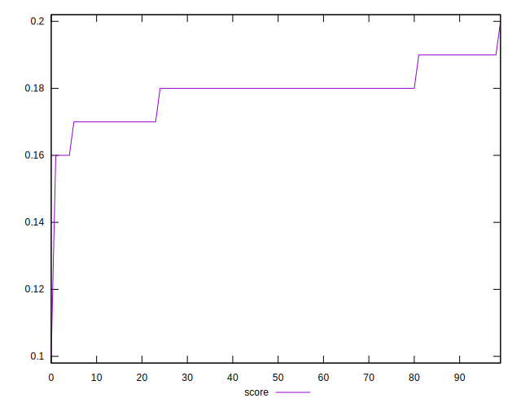

# //interactive/samples/pages+cached

[→ Parent](../..)


## Raw


```yaml
p90min: 11404.425
p90max: 12185.234999999999
p90range: 780.8099999999995
p90mean: 11688.646484042552
median: 11673.69325
p90stdev: 143.8248959385006
mad: 85.85850000000119
stdevBySn: 147.29683339999949
p90skewness: 0.6148856169517062
p90eccentricity: 0.9999999999999999
p90discretization: 1
outlandishness: 1.0043294299839016
confidence: 115.8718796440274
p90confidence: 58.14980040161362

```


## Score


```yaml
p90min: 0.16
p90max: 0.19
p90range: 0.03
p90mean: 0.179255319148936
median: 0.18
p90stdev: 0.0067223605438210925
mad: 0
stdevBySn: 0
p90skewness: -0.33167613486372155
p90eccentricity: 0.9999999999999994
p90discretization: 23.5
outlandishness: 0.991590455141808
confidence: 0.004271642470794707
p90confidence: 0.0027179155687901877

```


## Raw Estimate


## Score Estimate


## P Score


```yaml
p90min: 0.15873806157173787
p90max: 0.19202783503075005
p90range: 0.033289773459012184
p90mean: 0.1792916704409562
median: 0.17983868397631747
p90stdev: 0.0062214012510802665
mad: 0.003798003857336335
stdevBySn: 0.0064422328543179384
p90skewness: -0.49758248425704793
p90eccentricity: 1.0000000000000009
p90discretization: 1
outlandishness: 0.9910783916714874
confidence: 0.0042464713719947795
p90confidence: 0.002515372867875119

```


## Score Difference


```yaml
p90min: 0
p90max: 0
p90range: 0
p90mean: 0
median: 0
p90stdev: 0
mad: 0
stdevBySn: 0
p90skewness: .nan
p90eccentricity: .nan
p90discretization: 94
outlandishness: .nan
confidence: 0
p90confidence: 0

```


## P Score Difference


```yaml
p90min: -0.004339198110995646
p90max: 0.004679929678842509
p90range: 0.009019127789838155
p90mean: -0.00002143046058192945
median: -0.00016131602368252285
p90stdev: 0.0025789735939851155
mad: 0.002209871834728469
stdevBySn: 0.0030740961634454964
p90skewness: 0.09926974705614815
p90eccentricity: 1.0000000000000002
p90discretization: 1
outlandishness: 0.2136838188673399
confidence: 0.0010759952299284645
p90confidence: 0.0010427040378001892

```

