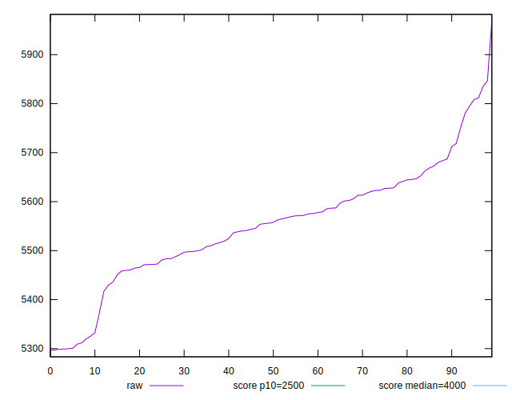

# //largest-contentful-paint/samples/pages+cached+noadtech+nomedia

[→ Parent](../..)


## Raw


```yaml
p90min: 5298.996599999999
p90max: 5811.6711
p90range: 512.674500000001
p90mean: 5549.22841329787
median: 5557.012500000001
p90stdev: 113.21740640641531
mad: 72.2937750000001
stdevBySn: 115.4262978549995
p90skewness: -0.18021876937669376
p90eccentricity: 1.0000000000000002
p90discretization: 1
outlandishness: 1.0008901933585688
confidence: 51.70879591568762
p90confidence: 45.774895518343016

```


## Score


```yaml
p90min: 0.15
p90max: 0.22
p90range: 0.07
p90mean: 0.1863829787234042
median: 0.185
p90stdev: 0.01549543953704947
mad: 0.0050000000000000044
stdevBySn: 0.011926000000000011
p90skewness: 0.34128371661100926
p90eccentricity: 1
p90discretization: 11.75
outlandishness: 0.9980374934842893
confidence: 0.006874530019987365
p90confidence: 0.0062649564968222885

```


## Raw Estimate


## Score Estimate


## P Score


```yaml
p90min: 0.15419223378437352
p90max: 0.22159816095643925
p90range: 0.06740592717206573
p90mean: 0.1865535255750805
median: 0.18500840407328806
p90stdev: 0.015039902824736858
mad: 0.009576078127122578
stdevBySn: 0.015206391034149098
p90skewness: 0.4033392143345799
p90eccentricity: 0.9999999999999997
p90discretization: 1
outlandishness: 0.9984713685711644
confidence: 0.0067804416617956295
p90confidence: 0.006080778585733012

```


## Score Difference


```yaml
p90min: 0
p90max: 0
p90range: 0
p90mean: 0
median: 0
p90stdev: 0
mad: 0
stdevBySn: 0
p90skewness: .nan
p90eccentricity: .nan
p90discretization: 94
outlandishness: .nan
confidence: 0
p90confidence: 0

```


## P Score Difference


```yaml
p90min: -0.004569785119819925
p90max: 0.004846233981988635
p90range: 0.00941601910180856
p90mean: 0.00022184029124267866
median: 0.0004363184749696658
p90stdev: 0.0027434340773612046
mad: 0.002641298568518191
stdevBySn: 0.0032295548627856866
p90skewness: -0.06766249890900876
p90eccentricity: 0.9999999999999999
p90discretization: 1
outlandishness: 0.90367353596172
confidence: 0.0011415951227205783
p90confidence: 0.00110919700634968

```

