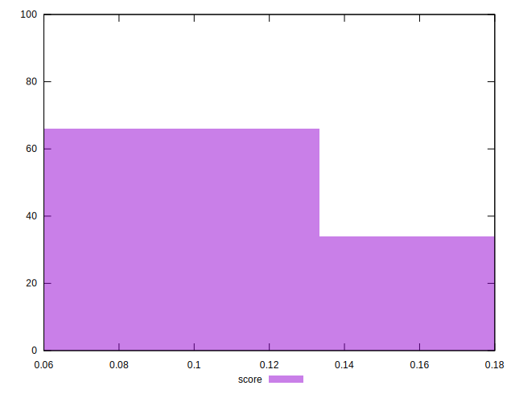
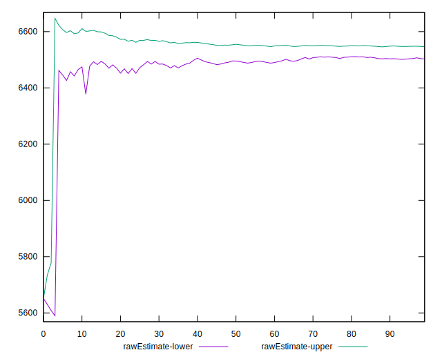
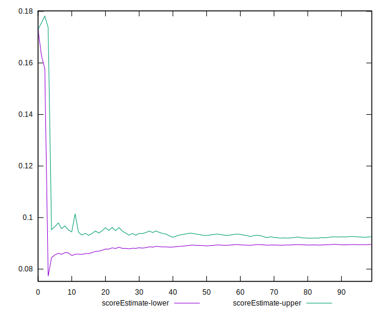
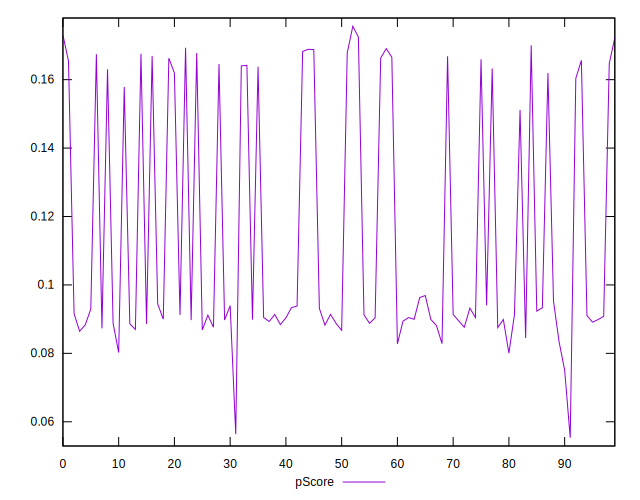
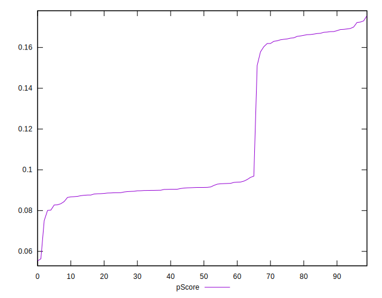
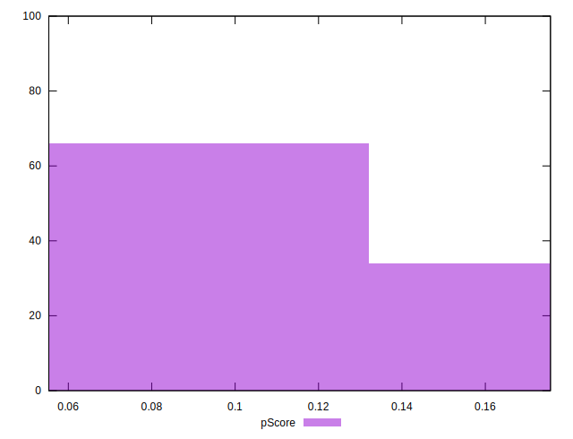
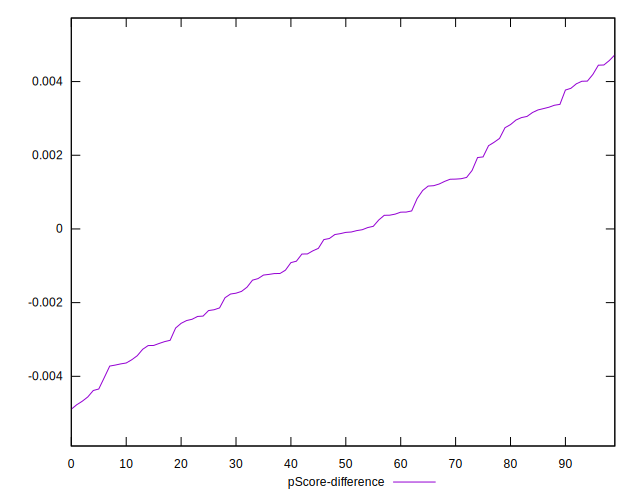
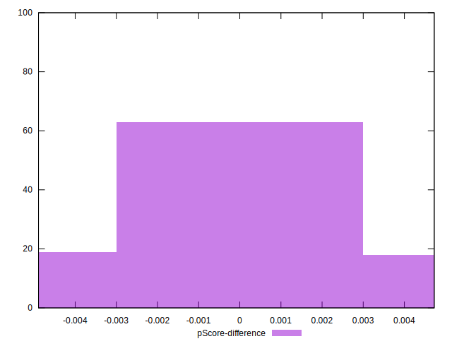

# //largest-contentful-paint/samples/pages+cached+noadtech

[→ Parent](../..)


## Raw


```yaml
p90min: 5657.423999999999
p90max: 6695.414999999999
p90range: 1037.991
p90mean: 6271.561944148938
median: 6520.566500000001
p90stdev: 393.4945256237484
mad: 58.66699999999901
stdevBySn: 110.90899739000139
p90skewness: -0.6954192451658574
p90eccentricity: 0.9999999999999994
p90discretization: 1
outlandishness: 1.0013534932961328
confidence: 164.42812027107624
p90confidence: 159.09365325689353

```


## Score


```yaml
p90min: 0.08
p90max: 0.17
p90range: 0.09000000000000001
p90mean: 0.11468085106382972
median: 0.09
p90stdev: 0.03613515196849638
mad: 0
stdevBySn: 0
p90skewness: 0.724372894842842
p90eccentricity: 1.0000000000000007
p90discretization: 15.666666666666666
outlandishness: 1.005573607415643
confidence: 0.014682733703822134
p90confidence: 0.01460979241972498

```


## Raw Estimate


## Score Estimate


## P Score


```yaml
p90min: 0.08007120445141747
p90max: 0.17226015170508047
p90range: 0.092188947253663
p90mean: 0.114676159171782
median: 0.09135782093031472
p90stdev: 0.035774153324451045
mad: 0.003959402204403301
stdevBySn: 0.007514553601497481
p90skewness: 0.717029207594281
p90eccentricity: 0.9999999999999997
p90discretization: 1
outlandishness: 1.003467293378502
confidence: 0.01462743220715984
p90confidence: 0.014463837166571413

```


## Score Difference


```yaml
p90min: 0
p90max: 0
p90range: 0
p90mean: 0
median: 0
p90stdev: 0
mad: 0
stdevBySn: 0
p90skewness: .nan
p90eccentricity: .nan
p90discretization: 94
outlandishness: .nan
confidence: 0
p90confidence: 0

```


## P Score Difference


```yaml
p90min: -0.0045597511700294635
p90max: 0.004444384295642659
p90range: 0.009004135465672122
p90mean: -0.00012690917990945772
median: -0.00011040929194922056
p90stdev: 0.002432930942546827
mad: 0.002093844548123641
stdevBySn: 0.002793037091593376
p90skewness: 0.09286638673402205
p90eccentricity: 0.9999999999999999
p90discretization: 1
outlandishness: 0.9733223575099078
confidence: 0.0010281194664413422
p90confidence: 0.0009836575773397539

```

