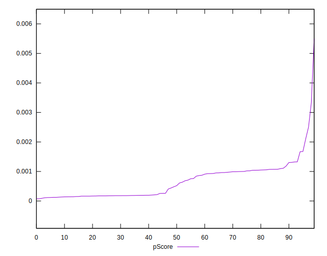
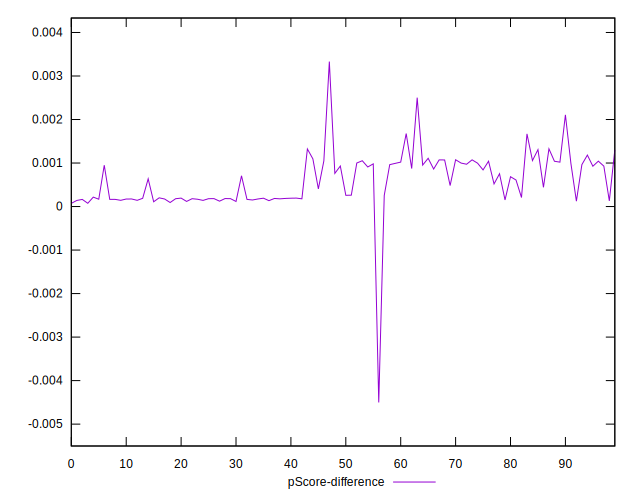

# //largest-contentful-paint/samples/pages

[→ Parent](../..)


## Raw


```yaml
p90min: 11424.7225
p90max: 15514.682999999999
p90range: 4089.9604999999992
p90mean: 13616.905670212765
median: 13369.336249999998
p90stdev: 1250.7318712158824
mad: 1304.869749999998
stdevBySn: 1661.8430793500008
p90skewness: 0.03737120140288957
p90eccentricity: 1.0000000000000004
p90discretization: 1
outlandishness: 0.9976700023878345
confidence: 539.491524467626
p90confidence: 505.6830265202451

```


## Score


```yaml
p90min: 0
p90max: 0
p90range: 0
p90mean: 0
median: 0
p90stdev: 0
mad: 0
stdevBySn: 0
p90skewness: .nan
p90eccentricity: .nan
p90discretization: 94
outlandishness: .inf
confidence: 0.0003900279083597571
p90confidence: 0

```


## Raw Estimate


## Score Estimate


## P Score


```yaml
p90min: 0.00010954204169189019
p90max: 0.0021075066746591986
p90range: 0.0019979646329673084
p90mean: 0.0006099994478786679
median: 0.0005009890216908508
p90stdev: 0.00046539728905366354
mad: 0.0003686027875209885
stdevBySn: 0.0005092048722940887
p90skewness: 0.5901932093635183
p90eccentricity: 1.0000000000000002
p90discretization: 1
outlandishness: 1.276233249756259
confidence: 0.00029190237794594074
p90confidence: 0.00018816463790451572

```


## Score Difference


```yaml
p90min: 0
p90max: 0
p90range: 0
p90mean: 0
median: 0
p90stdev: 0
mad: 0
stdevBySn: 0
p90skewness: .nan
p90eccentricity: .nan
p90discretization: 94
outlandishness: .nan
confidence: 0
p90confidence: 0

```


## P Score Difference


```yaml
p90min: 0.00009228514279940869
p90max: 0.0016773271715805893
p90range: 0.0015850420287811806
p90mean: 0.0005885609209439893
median: 0.0004615162524256311
p90stdev: 0.00044173488573925223
mad: 0.0003381833596574346
stdevBySn: 0.0005092048722940887
p90skewness: 0.4043243145695118
p90eccentricity: 0.9999999999999996
p90discretization: 1
outlandishness: 1.0018986419211744
confidence: 0.00029928483635361855
p90confidence: 0.00017859769874021511

```

