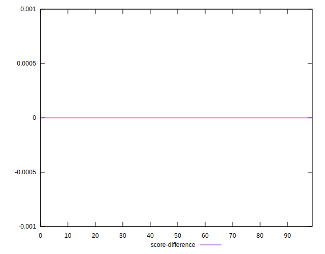
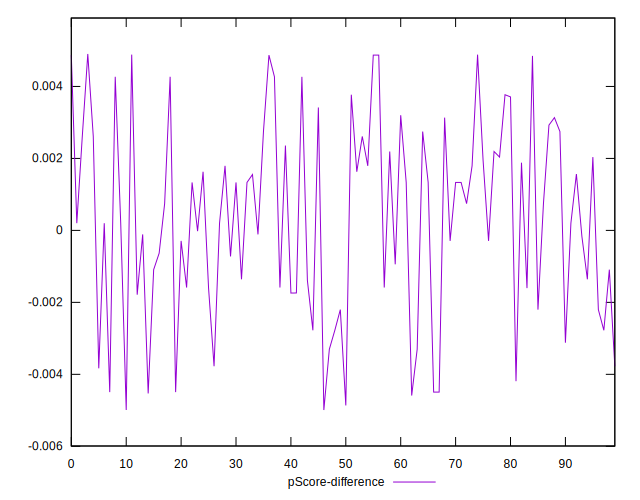

# //max-potential-fid/samples/pages+cached+noadtech+nomedia

[→ Parent](../..)


## Raw


```yaml
p90min: 40
p90max: 269
p90range: 229
p90mean: 216.6595744680851
median: 213.4999999999999
p90stdev: 24.530724630201057
mad: 10.499999999999886
stdevBySn: 16.696399999999866
p90skewness: -3.557722673312085
p90eccentricity: 0.9999999999999999
p90discretization: 1.3823529411764706
outlandishness: 0.9888654997663352
confidence: 18.56170747305102
p90confidence: 9.918009894219498

```


## Score


```yaml
p90min: 0.44
p90max: 1
p90range: 0.56
p90mean: 0.6089361702127658
median: 0.62
p90stdev: 0.06836180476911193
mad: 0.040000000000000036
stdevBySn: 0.05962999999999999
p90skewness: 1.370591888162968
p90eccentricity: 1.000000000000001
p90discretization: 4.086956521739131
outlandishness: 1.0041552509789962
confidence: 0.044663033820777714
p90confidence: 0.027639340716907174

```


## Raw Estimate


## Score Estimate


## P Score


```yaml
p90min: 0.44292601842693125
p90max: 0.999835543946386
p90range: 0.5569095255194547
p90mean: 0.6092340668992688
median: 0.6214542143787616
p90stdev: 0.06817559080677896
mad: 0.03695798785565052
stdevBySn: 0.05848581186687048
p90skewness: 1.3802221305030171
p90eccentricity: 1.0000000000000007
p90discretization: 1.3823529411764706
outlandishness: 1.004255660026966
confidence: 0.04458598699293535
p90confidence: 0.027564052605826006

```


## Score Difference


```yaml
p90min: 0
p90max: 5.551115123125783e-17
p90range: 5.551115123125783e-17
p90mean: 1.1810883240693154e-18
median: 0
p90stdev: 8.010530753054493e-18
mad: 0
stdevBySn: 0
p90skewness: 6.634888026970376
p90eccentricity: 0.9999999999999984
p90discretization: 47
outlandishness: 14.137600000000003
confidence: 7.953559784811412e-18
p90confidence: 3.2387352784895233e-18

```


## P Score Difference


```yaml
p90min: -0.004589242775370428
p90max: 0.004870350682723568
p90range: 0.009459593458093996
p90mean: 0.000351915514653011
median: 0.00047210883487386335
p90stdev: 0.002658633715196206
mad: 0.002139283345568288
stdevBySn: 0.003227515566454118
p90skewness: -0.17307200592610159
p90eccentricity: 1.0000000000000002
p90discretization: 1.4029850746268657
outlandishness: 0.8742045434084762
confidence: 0.0011159661335173202
p90confidence: 0.0010749113974382173

```

