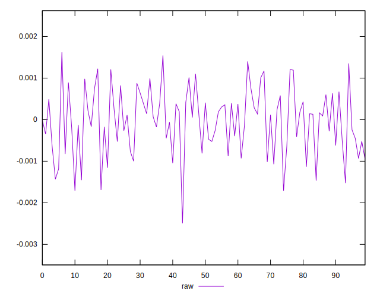

# //meta/pScore-difference/samples/pages+cached+noadtech+nomedia+nocss

[→ Parent](../..)


## Raw


```yaml
p90min: -0.0016937797401530453
p90max: 0.0013526921260294921
p90range: 0.0030464718661825374
p90mean: -0.000032650468887646105
median: 0.00009940301495376668
p90stdev: 0.0007344385504116551
mad: 0.0005608560600367796
stdevBySn: 0.0008026358213343844
p90skewness: -0.18960207557378525
p90eccentricity: 1.0000000000000002
p90discretization: 1
outlandishness: 1.8293723913349007
confidence: 0.0003271414646566272
p90confidence: 0.0002969406293326982

```

