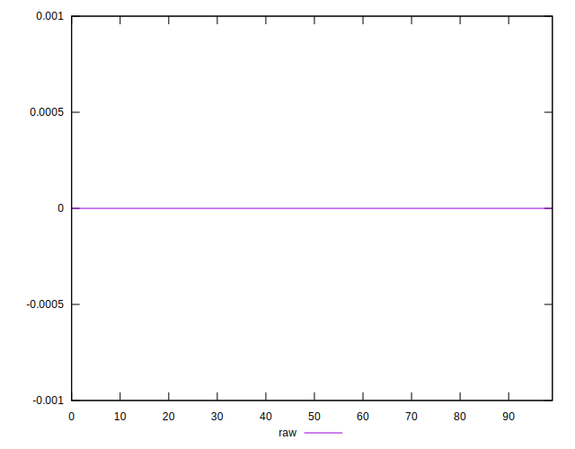

# //meta/score-difference/samples/pages+cached+noadtech+nomedia

[→ Parent](../..)


## Raw


```yaml
p90min: 0
p90max: 1.6653345369377347e-17
p90range: 1.6653345369377347e-17
p90mean: 3.543264972207946e-19
median: 0
p90stdev: 2.4031592259163542e-18
mad: 0
stdevBySn: 0
p90skewness: 6.634888026970316
p90eccentricity: 0.9999999999999942
p90discretization: 47
outlandishness: 7.093344444444446
confidence: 1.6587607810006138e-18
p90confidence: 9.716205835468596e-19

```

