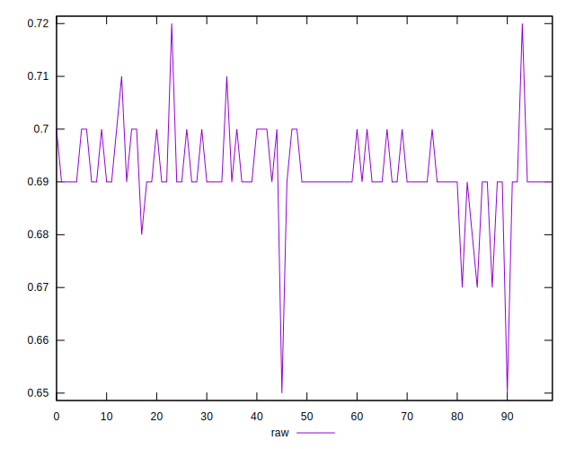

# //meta/score/samples/pages+cached+noadtech+nomedia

[→ Parent](../..)


## Raw


```yaml
p90min: 0.67
p90max: 0.71
p90range: 0.039999999999999925
p90mean: 0.6919148936170206
median: 0.69
p90stdev: 0.005884815611038004
mad: 0
stdevBySn: 0
p90skewness: -0.3842363011036528
p90eccentricity: 0.9999999999999987
p90discretization: 18.8
outlandishness: 0.9990899980180616
confidence: 0.003748402297322263
p90confidence: 0.002379288029024437

```

