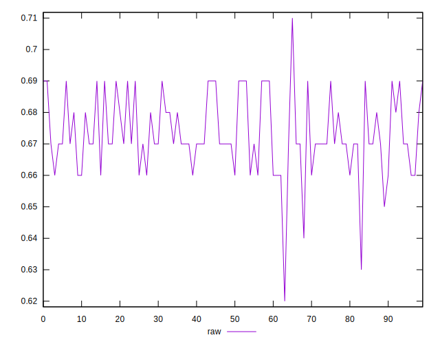
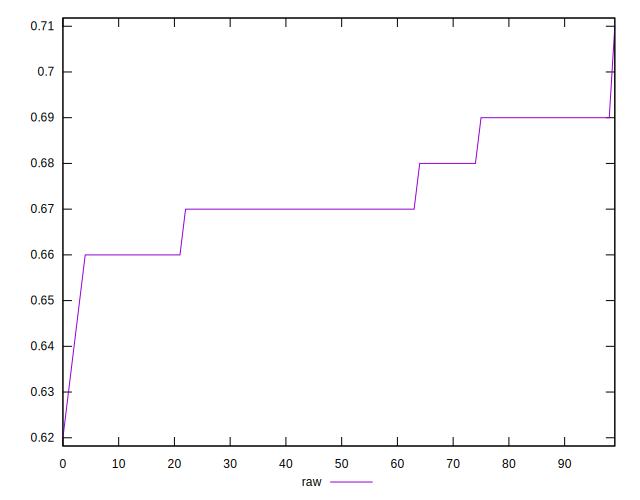
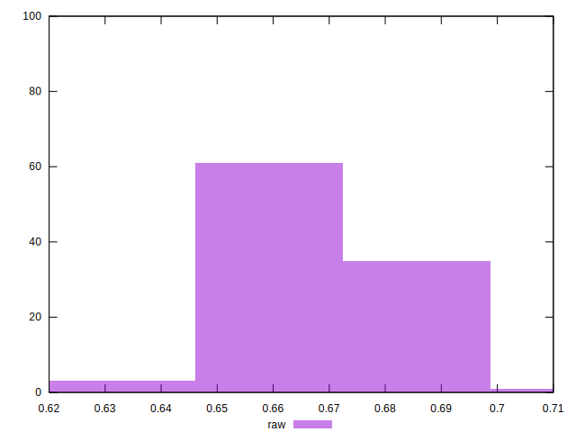

# //meta/score/samples/pages+cached+noadtech

[→ Parent](../..)


## Raw


```yaml
p90min: 0.65
p90max: 0.69
p90range: 0.039999999999999925
p90mean: 0.673723404255319
median: 0.67
p90stdev: 0.010717260144588717
mad: 0.010000000000000009
stdevBySn: 0.011926000000000011
p90skewness: 0.3071849062080836
p90eccentricity: 1.0000000000000004
p90discretization: 18.8
outlandishness: 0.998150232484998
confidence: 0.005337295385374441
p90confidence: 0.004333092224356521

```

