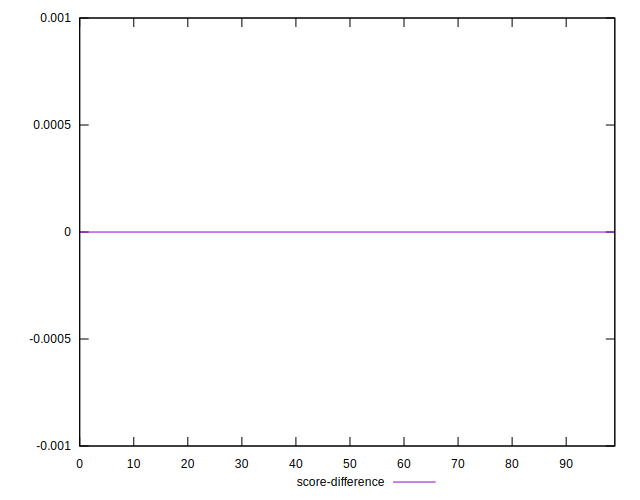
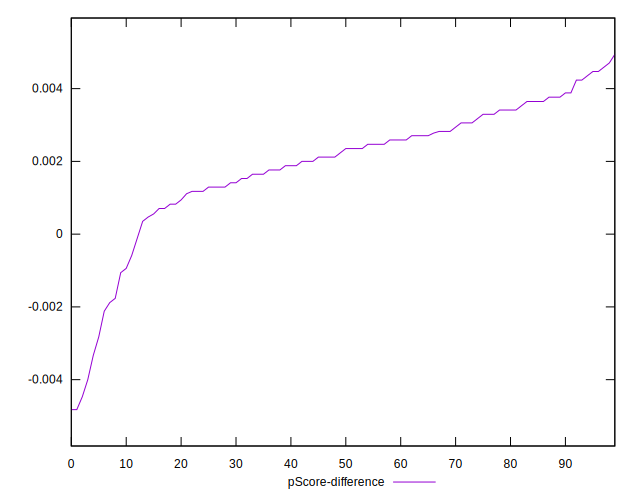

# //render-blocking-resources/samples/pages+cached+noadtech

[→ Parent](../..)


## Raw


```yaml
p90min: 655
p90max: 844
p90range: 189
p90mean: 811.3829787234042
median: 813.5
p90stdev: 20.500703871143383
mad: 8.5
stdevBySn: 13.1186
p90skewness: -4.710543336563848
p90eccentricity: 0.9999999999999994
p90discretization: 2.1363636363636362
outlandishness: 0.9902308727705113
confidence: 14.3926063448557
p90confidence: 8.288633413712475

```


## Score


```yaml
p90min: 0.49
p90max: 0.55
p90range: 0.06000000000000005
p90mean: 0.4911702127659576
median: 0.49
p90stdev: 0.006499817178889427
mad: 0
stdevBySn: 0
p90skewness: 8.015770447438976
p90eccentricity: 0.9999999999999982
p90discretization: 31.333333333333332
outlandishness: 1.0086911002172996
confidence: 0.0054331672311591925
p90confidence: 0.002627939127875443

```


## Raw Estimate


## Score Estimate


## P Score


```yaml
p90min: 0.4889411764705882
p90max: 0.5527777777777778
p90range: 0.0638366013071896
p90mean: 0.4932210401891252
median: 0.4925294117647059
p90stdev: 0.0063495833954314825
mad: 0.0010000000000000009
stdevBySn: 0.001543364705882333
p90skewness: 8.765768075051685
p90eccentricity: 0.9999999999999996
p90discretization: 2.1363636363636362
outlandishness: 1.0078225495807422
confidence: 0.005276868112213594
p90confidence: 0.002567198152089204

```


## Score Difference


```yaml
p90min: 0
p90max: 0
p90range: 0
p90mean: 0
median: 0
p90stdev: 0
mad: 0
stdevBySn: 0
p90skewness: .nan
p90eccentricity: .nan
p90discretization: 94
outlandishness: .inf
confidence: 4.330179641073933e-18
p90confidence: 0

```


## P Score Difference


```yaml
p90min: -0.0040000000000000036
p90max: 0.004470588235294115
p90range: 0.008470588235294119
p90mean: 0.0019630093172020666
median: 0.0022941176470588354
p90stdev: 0.0016865616534224284
mad: 0.0010000000000000009
stdevBySn: 0.0015433647058822999
p90skewness: -1.3120867801250733
p90eccentricity: 1.0000000000000009
p90discretization: 2.088888888888889
outlandishness: 0.884727080635203
confidence: 0.0008060314322139154
p90confidence: 0.0006818932346279305

```

