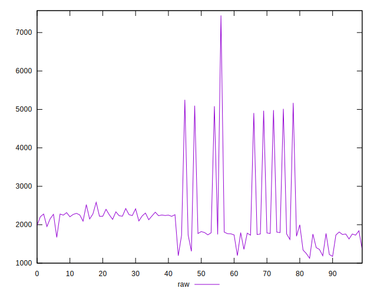
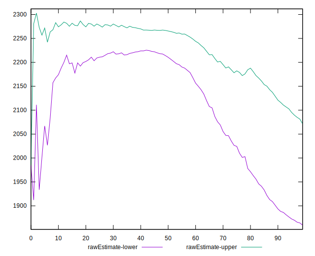

# //render-blocking-resources/samples/pages

[→ Parent](../..)


## Raw


```yaml
p90min: 1194
p90max: 5097
p90range: 3903
p90mean: 2138.1382978723404
median: 1991.5
p90stdev: 817.5466100456307
mad: 258.5
stdevBySn: 540.5459500000001
p90skewness: 2.613466308958544
p90eccentricity: 1.0000000000000002
p90discretization: 1.0444444444444445
outlandishness: 1.0813822673461222
confidence: 414.7936542046917
p90confidence: 330.54202391703734

```


## Score


```yaml
p90min: 0
p90max: 0.45
p90range: 0.45
p90mean: 0.3365957446808509
median: 0.35
p90stdev: 0.09557834250686895
mad: 0.030000000000000027
stdevBySn: 0.05962999999999999
p90skewness: -2.5939776165008266
p90eccentricity: 0.9999999999999984
p90discretization: 4.947368421052632
outlandishness: 0.9611930840156563
confidence: 0.043565903802498515
p90confidence: 0.03864325090051189

```


## Raw Estimate


## Score Estimate


## P Score


```yaml
p90min: 0
p90max: 0.44776470588235295
p90range: 0.44776470588235295
p90mean: 0.33693366708385486
median: 0.35394117647058826
p90stdev: 0.09531072462799269
mad: 0.030411764705882416
stdevBySn: 0.06359364117647061
p90skewness: -2.59474464064503
p90eccentricity: 0.9999999999999999
p90discretization: 1.0681818181818181
outlandishness: 0.9607371195828214
confidence: 0.04346004005823201
p90confidence: 0.03853505039642662

```


## Score Difference


```yaml
p90min: 0
p90max: 0
p90range: 0
p90mean: 0
median: 0
p90stdev: 0
mad: 0
stdevBySn: 0
p90skewness: .nan
p90eccentricity: .nan
p90discretization: 94
outlandishness: .inf
confidence: 3.0463960003014037e-18
p90confidence: 0

```


## P Score Difference


```yaml
p90min: -0.004588235294117671
p90max: 0.004705882352941226
p90range: 0.009294117647058897
p90mean: 0.00026408010012514513
median: 0.00023529411764705577
p90stdev: 0.0027784620978708887
mad: 0.002588235294117641
stdevBySn: 0.0032270352941177046
p90skewness: -0.07709269203536336
p90eccentricity: 0.9999999999999992
p90discretization: 1.492063492063492
outlandishness: 0.9174189708227549
confidence: 0.0011532035743472033
p90confidence: 0.0011233591747824157

```

