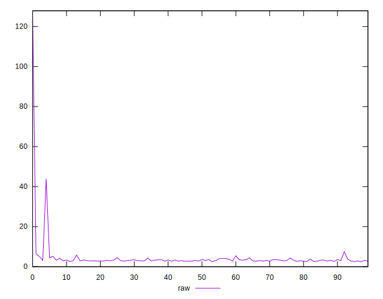
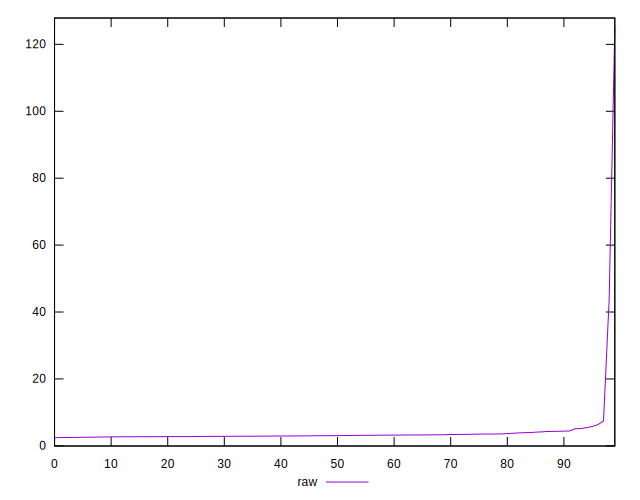
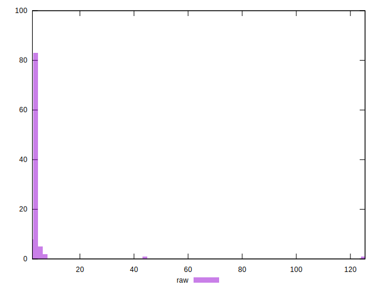
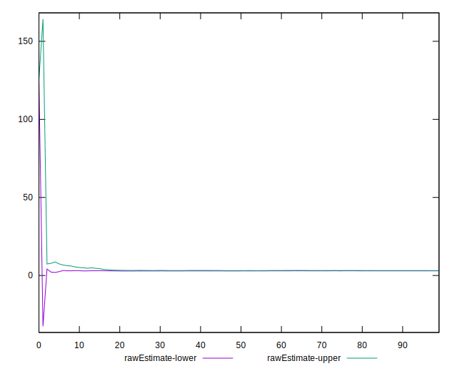

# //server-response-time/samples/pages+cached

[→ Parent](../..)


## Raw


```yaml
p90min: 2.5069999999999997
p90max: 6.321000000000001
p90range: 3.814000000000001
p90mean: 3.2733297872340423
median: 3.0454999999999997
p90stdev: 0.7146952093754443
mad: 0.29049999999999954
stdevBySn: 0.44006940000000055
p90skewness: 2.036575730948013
p90eccentricity: 0.9999999999999997
p90discretization: 1.010752688172043
outlandishness: 2.257159244838382
confidence: 5.013899919963689
p90confidence: 0.2889582050588954

```


## Score


```yaml
p90min: 1
p90max: 1
p90range: 0
p90mean: 1
median: 1
p90stdev: 0
mad: 0
stdevBySn: 0
p90skewness: .nan
p90eccentricity: .nan
p90discretization: 94
outlandishness: 1
confidence: 0
p90confidence: 0

```


## Raw Estimate


## Score Estimate


## P Score


```yaml
p90min: 1
p90max: 1
p90range: 0
p90mean: 1
median: 1
p90stdev: 0
mad: 0
stdevBySn: 0
p90skewness: .nan
p90eccentricity: .nan
p90discretization: 94
outlandishness: 1
confidence: 0
p90confidence: 0

```


## Score Difference


```yaml
p90min: 0
p90max: 0
p90range: 0
p90mean: 0
median: 0
p90stdev: 0
mad: 0
stdevBySn: 0
p90skewness: .nan
p90eccentricity: .nan
p90discretization: 94
outlandishness: .nan
confidence: 0
p90confidence: 0

```


## P Score Difference


```yaml
p90min: 0
p90max: 0
p90range: 0
p90mean: 0
median: 0
p90stdev: 0
mad: 0
stdevBySn: 0
p90skewness: .nan
p90eccentricity: .nan
p90discretization: 94
outlandishness: .nan
confidence: 0
p90confidence: 0

```

