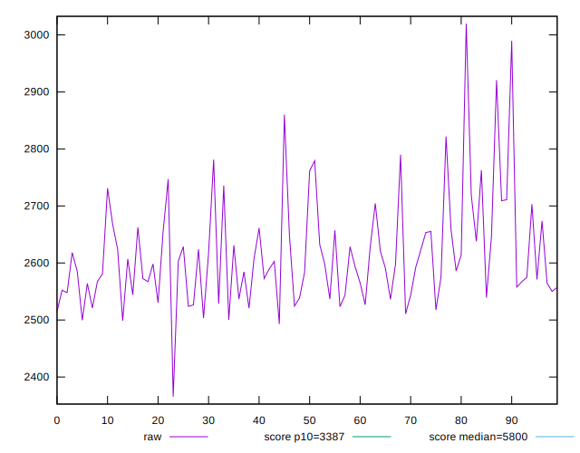
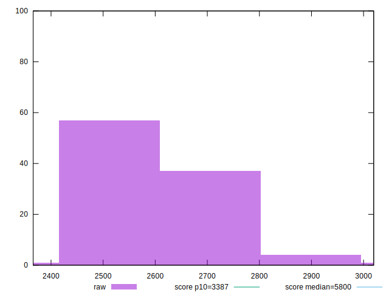
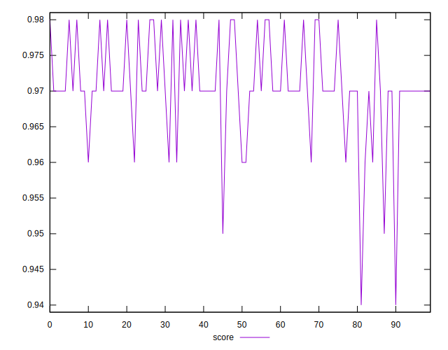
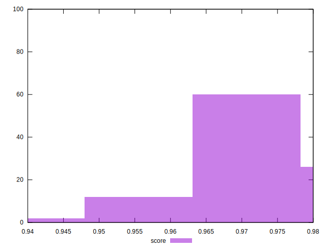
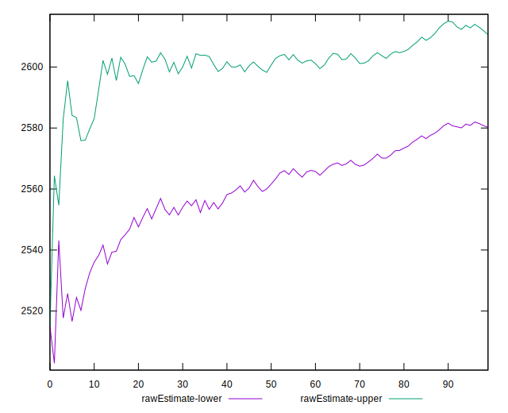
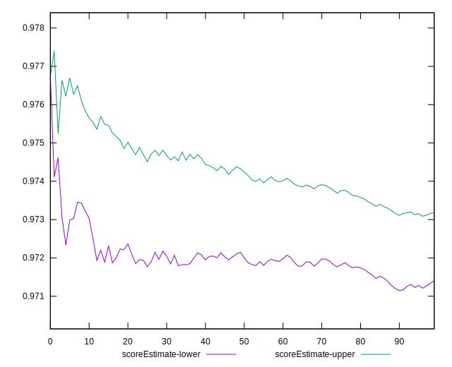
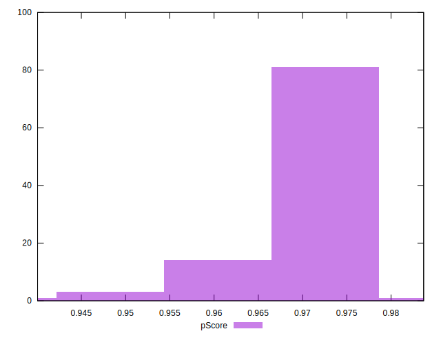
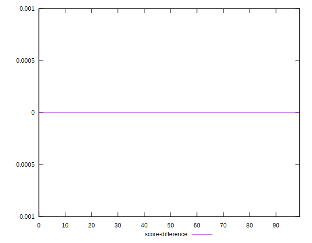
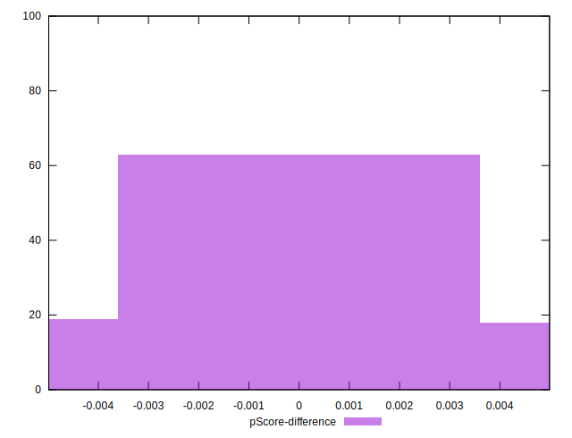

# //speed-index/samples/pages+cached+noadtech+nomedia

[→ Parent](../..)


## Raw


```yaml
p90min: 2499.5483620307155
p90max: 2860.0198375178975
p90range: 360.47147548718203
p90mean: 2609.6101441579417
median: 2592.8909047442644
p90stdev: 78.53891252642033
mad: 54.43528068068008
stdevBySn: 77.46769280106453
p90skewness: 0.9780062876339828
p90eccentricity: 0.9999999999999992
p90discretization: 1
outlandishness: 1.0048272584888112
confidence: 40.55392860107114
p90confidence: 31.754044092088126

```


## Score


```yaml
p90min: 0.95
p90max: 0.98
p90range: 0.030000000000000027
p90mean: 0.9711702127659566
median: 0.97
p90stdev: 0.006163789760370639
mad: 0
stdevBySn: 0
p90skewness: -0.34925882537914826
p90eccentricity: 0.9999999999999966
p90discretization: 23.5
outlandishness: 0.9988260649654701
confidence: 0.003077580359357569
p90confidence: 0.0024920799834009543

```


## Raw Estimate


## Score Estimate


## P Score


```yaml
p90min: 0.9539538150772511
p90max: 0.9775410961177027
p90range: 0.023587281040451602
p90mean: 0.9712136127841173
median: 0.9724491968895113
p90stdev: 0.004940609535859254
mad: 0.0030946332847987534
stdevBySn: 0.004482305030407003
p90skewness: -1.2232578912552965
p90eccentricity: 1.0000000000000002
p90discretization: 1
outlandishness: 0.9988404454113434
confidence: 0.0027091927499638905
p90confidence: 0.0019975363548698265

```


## Score Difference


```yaml
p90min: 0
p90max: 1.1102230246251565e-16
p90range: 1.1102230246251565e-16
p90mean: 1.1810883240693154e-18
median: 0
p90stdev: 1.139000331521095e-17
mad: 0
stdevBySn: 0
p90skewness: 9.539955591519906
p90eccentricity: 0.9999999999999999
p90discretization: 47
outlandishness: 14.137600000000003
confidence: 8.528132291650263e-18
p90confidence: 4.605088813249998e-18

```


## P Score Difference


```yaml
p90min: -0.004779063034976994
p90max: 0.004474685956919688
p90range: 0.009253748991896682
p90mean: 0.00005405293773977537
median: 0.0003020346770483684
p90stdev: 0.002928265300956073
mad: 0.002779165688988283
stdevBySn: 0.003513094204032228
p90skewness: -0.14730019263049832
p90eccentricity: 0.9999999999999999
p90discretization: 1
outlandishness: 0.8680901931428409
confidence: 0.0012074368842925358
p90confidence: 0.0011839260627477001

```

